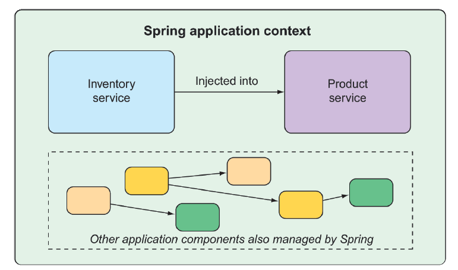

## 1.1 What is Spring?

I know you’re probably itching to start writing a Spring application, and I assure you that before this chapter ends, you’ll have developed a simple one. But first, let me set the stage with a few basic Spring concepts that will help you understand what makes Spring tick.

Any nontrivial application comprises many components, each responsible for its own piece of the overall application functionality, coordinating with the other application elements to get the job done. When the application is run, those components somehow need to be created and introduced to each other.

At its core, Spring offers a _container_, often referred to as the _Spring application context_, that creates and manages application components. These components, or _beans_, are wired together inside the Spring application context to make a complete application, much like bricks, mortar, timber, nails, plumbing, and wiring are bound together to make a house.

The act of wiring beans together is based on a pattern known as _dependency injection_ (DI). Rather than have components create and maintain the life cycle of other beans that they depend on, a dependency-injected application relies on a separate entity (the container) to create and maintain all components and inject those into the beans that need them. This is done typically through constructor arguments or property accessor methods.

For example, suppose that among an application’s many components, you will address two: an inventory service (for fetching inventory levels) and a product service (for providing basic product information). The product service depends on the inventory service to be able to provide a complete set of information about products. Figure 1.1 illustrates the relationships between these beans and the Spring application context.


**Figure 1.1 Application components are managed and injected into each other by the Spring application context.**

On top of its core container, Spring and a full portfolio of related libraries offer a web framework, a variety of data persistence options, a security framework, integration with other systems, runtime monitoring, microservice support, a reactive programming model, and many other features necessary for modern application development.

Historically, the way you would guide Spring’s application context to wire beans together was with one or more XML files that described the components and their relationship to other components.

For example, the following XML code declares two beans, an `InventoryService` bean and a `ProductService` bean, and wires the `InventoryService` bean into `ProductService` via a constructor argument:

```xml
<bean id="inventoryService"
      class="com.example.InventoryService" />

<bean id="productService"
      class="com.example.ProductService" />
  <constructor-arg ref="inventoryService" />
</bean>
```

In recent versions of Spring, however, a Java-based configuration is more common. The following Java-based configuration class is equivalent to the XML configuration:

```java
@Configuration
public class ServiceConfiguration {
  @Bean
  public InventoryService inventoryService() {
    return new InventoryService();
  }
  @Bean

  public ProductService productService() {
    return new ProductService(inventoryService());
  }
}
```

The `@Configuration` annotation indicates to Spring that this is a configuration class that will provide beans to the Spring application context.

The configuration’s methods are annotated with `@Bean`, indicating that the objects they return should be added as beans in the application context (where, by default, their respective bean IDs will be the same as the names of the methods that define them).

Java-based configuration offers several benefits over XML-based configuration, including greater type safety and improved refactorability. Even so, explicit configuration with either Java or XML is necessary only if Spring is unable to automatically configure the components.

Automatic configuration has its roots in the Spring techniques known as _autowiring_ and _component scanning_. With component scanning, Spring can automatically discover components from an application’s classpath and create them as beans in the Spring application context. With autowiring, Spring automatically injects the components with the other beans that they depend on.

More recently, with the introduction of Spring Boot, automatic configuration has gone well beyond component scanning and autowiring. Spring Boot is an extension of the Spring Framework that offers several productivity enhancements. The most well known of these enhancements is _autoconfiguration_, where Spring Boot can make reasonable guesses at what components need to be configured and wired together, based on entries in the classpath, environment variables, and other factors.

I’d like to show you some example code that demonstrates autoconfiguration, but I can’t. Autoconfiguration is much like the wind—you can see the effects of it, but there’s no code that I can show you and say “Look! Here’s an example of autoconfiguration!” Stuff happens, components are enabled, and functionality is provided without writing code. It’s this lack of code that’s essential to autoconfiguration and what makes it so wonderful.

Spring Boot autoconfiguration has dramatically reduced the amount of explicit configuration (whether with XML or Java) required to build an application. In fact, by the time you finish the example in this chapter, you’ll have a working Spring application that has only a single line of Spring configuration code!

Spring Boot enhances Spring development so much that it’s hard to imagine developing Spring applications without it. For that reason, this book treats Spring and Spring Boot as if they were one and the same. We’ll use Spring Boot as much as possible and explicit configuration only when necessary. And, because Spring XML configuration is the old-school way of working with Spring, we’ll focus primarily on Spring’s Java-based configuration.

But enough of this chitchat, yakety-yak, and flimflam. This book’s title includes the phrase _in action_, so let’s get moving, so you can start writing your first application with Spring.
