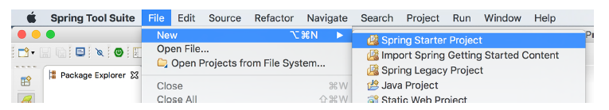
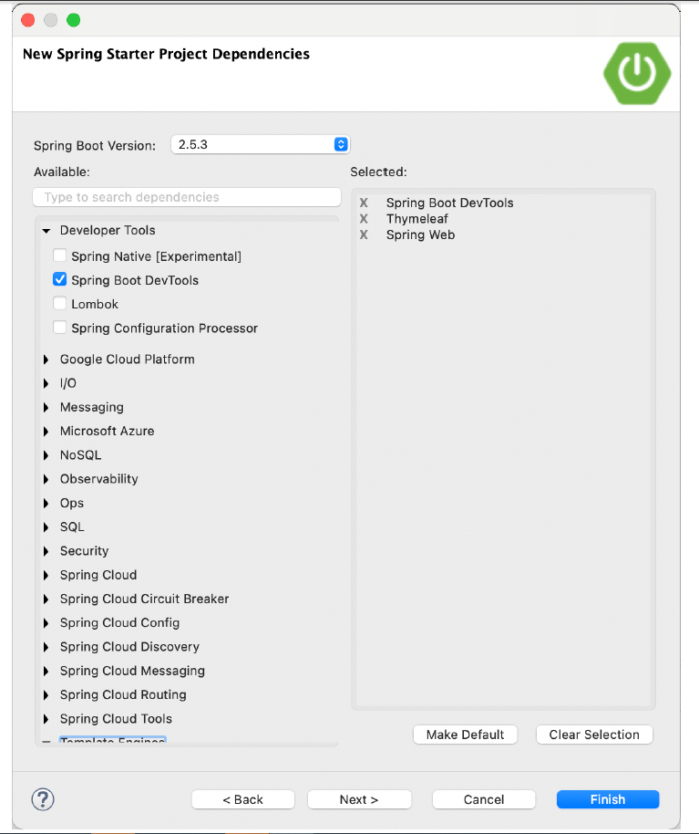
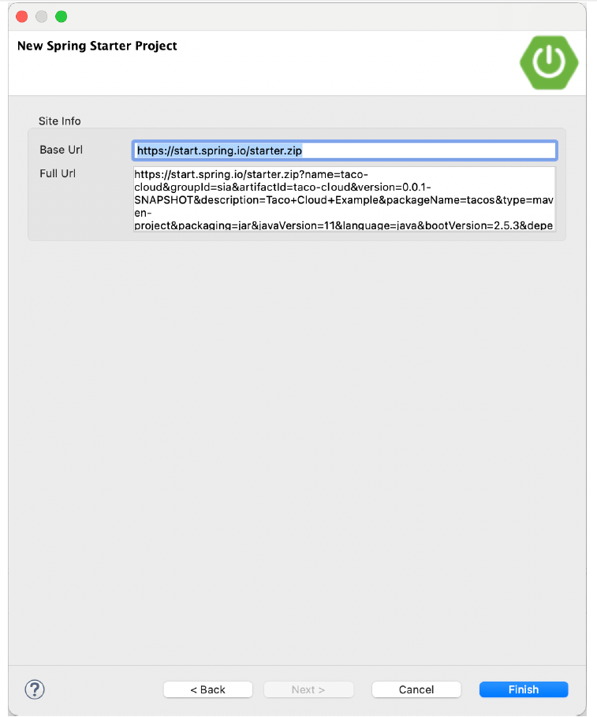

### 1.2.1 Initializing a Spring project with Spring Tool Suite

To get started with a new Spring project in Spring Tool Suite, go to the File menu and select New, and then select Spring Starter Project. Figure 1.2 shows the menu structure to look for.

**Figure 1.2 Starting a new project with the Initializr in Spring Tool Suite**

Once you select Spring Starter Project, a new project wizard dialog (figure 1.3) appears. The first page in the wizard asks you for some general project information, such as the project name, description, and other essential information. If you’re familiar with the contents of a Maven pom.xml file, you’ll recognize most of the fields as items that end up in a Maven build specification. For the Taco Cloud application, fill in the dialog as shown in figure 1.3, and then click Next.

**Figure 1.3 Specifying general project information for the Taco Cloud application**

The next page in the wizard lets you select dependencies to add to your project (see figure 1.4). Notice that near the top of the dialog, you can select on which version of Spring Boot you want to base your project. This defaults to the most current version available. It’s generally a good idea to leave it as is unless you need to target a different version.

As for the dependencies themselves, you can either expand the various sections and seek out the desired dependencies manually or search for them in the search box at the top of the Available list. For the Taco Cloud application, you’ll start with the dependencies shown in figure 1.4.

**Figure 1.4 Choosing starter dependencies**

At this point, you can click Finish to generate the project and add it to your workspace. But if you’re feeling slightly adventurous, click Next one more time to see the final page of the new starter project wizard, as shown in figure 1.5.

**Figure 1.5 Optionally specifying an alternate Initializr address**

By default, the new project wizard makes a call to the Spring Initializr at [http://start.spring.io](http://start.spring.io) to generate the project. Generally, there’s no need to override this default, which is why you could have clicked Finish on the second page of the wizard. But if for some reason you’re hosting your own clone of Initializr (perhaps a local copy on your own machine or a customized clone running inside your company firewall), then you’ll want to change the Base Url field to point to your Initializr instance before clicking Finish.

After you click Finish, the project is downloaded from the Initializr and loaded into your workspace. Wait a few moments for it to load and build, and then you’ll be ready to start developing application functionality. But first, let’s take a look at what the Initializr gave you.
