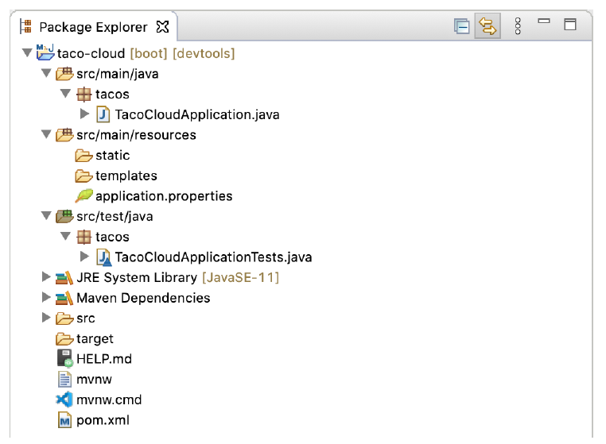

### 1.2.2 Examining the Spring project structure

After the project loads in the IDE, expand it to see what it contains. Figure 1.6 shows the expanded Taco Cloud project in Spring Tool Suite.


**Figure 1.6 The initial Spring project structure as shown in Spring Tool Suite**

You may recognize this as a typical Maven or Gradle project structure, where application source code is placed under src/main/java, test code is placed under src/test/java, and non-Java resources are placed under src/main/resources. Within that project structure, you’ll want to take note of the following items:

* `mvnw` and `mvnw.cmd` — These are Maven wrapper scripts. You can use these scripts to build your project, even if you don’t have Maven installed on your machine.
* `pom.xml` — This is the Maven build specification. We’ll look deeper into this in a moment.
* `TacoCloudApplication.java` — This is the Spring Boot main class that bootstraps the project. We’ll take a closer look at this class in a moment.
* `application.properties` — This file is initially empty but offers a place where you can specify configuration properties. We’ll tinker with this file a little in this chapter, but I’ll postpone a detailed explanation of configuration properties to chapter 6.
* `static` — This folder is where you can place any static content (images, stylesheets, JavaScript, and so forth) that you want to serve to the browser. It’s initially empty.
* `templates` — This folder is where you’ll place template files that will be used to render content to the browser. It’s initially empty, but you’ll add a Thymeleaf template soon.
* `TacoCloudApplicationTests.java` — This is a simple test class that ensures that the Spring application context loads successfully. You’ll add more tests to the mix as you develop the application.

As the Taco Cloud application grows, you’ll fill in this barebones project structure with Java code, images, stylesheets, tests, and other collateral that will make your project more complete. But in the meantime, let’s dig a little deeper into a few of the items that Spring Initializr provided.

#### EXPLORING THE BUILD SPECIFICATION

When you filled out the Initializr form, you specified that your project should be built with Maven. Therefore, the Spring Initializr gave you a pom.xml file already populated with the choices you made. The following listing shows the entire pom.xml file provided by the Initializr

**Listing 1.1 The initial Maven build specification**

```xml
<?xml version="1.0" encoding="UTF-8"?>
<project xmlns="http://maven.apache.org/POM/4.0.0"
  xmlns:xsi="http://www.w3.org/2001/XMLSchema-instance"
  xsi:schemaLocation="http://maven.apache.org/POM/4.0.0
    https://maven.apache.org/xsd/maven-4.0.0.xsd">
  <modelVersion>4.0.0</modelVersion>
  <parent>
    <groupId>org.springframework.boot</groupId>
    <artifactId>spring-boot-starter-parent</artifactId>
    <version>2.5.3</version>
    <relativePath />
  </parent>
  <groupId>sia</groupId>
  <artifactId>taco-cloud</artifactId>
  <version>0.0.1-SNAPSHOT</version>
  <name>taco-cloud</name>
  <description>Taco Cloud Example</description>

  <properties>
    <java.version>11</java.version>
  </properties>

  <dependencies>
    <dependency>
      <groupId>org.springframework.boot</groupId>
      <artifactId>spring-boot-starter-thymeleaf</artifactId>
    </dependency>

    <dependency>
      <groupId>org.springframework.boot</groupId>
      <artifactId>spring-boot-starter-web</artifactId>
    </dependency>

    <dependency>
      <groupId>org.springframework.boot</groupId>
      <artifactId>spring-boot-devtools</artifactId>
      <scope>runtime</scope>
      <optional>true</optional>
    </dependency>

    <dependency>
      <groupId>org.springframework.boot</groupId>
      <artifactId>spring-boot-starter-test</artifactId>
      <scope>test</scope>
      <exclusions>
        <exclusion>
          <groupId>org.junit.vintage</groupId>
          <artifactId>junit-vintage-engine</artifactId>
        </exclusion>
      </exclusions>
    </dependency>

  </dependencies>

  <build>
    <plugins>
      <plugin>
        <groupId>org.springframework.boot</groupId>
        <artifactId>spring-boot-maven-plugin</artifactId>
      </plugin>
    </plugins>
  </build>

  <repositories>
    <repository>
      <id>spring-milestones</id>
      <name>Spring Milestones</name>
      <url>https://repo.spring.io/milestone</url>
    </repository>
  </repositories>
  <pluginRepositories>
    <pluginRepository>
      <id>spring-milestones</id>
      <name>Spring Milestones</name>
      <url>https://repo.spring.io/milestone</url>
    </pluginRepository>
  </pluginRepositories>
</project>
```

The first thing to take note of is the `<parent>` element and, more specifically, its `<version>` child. This specifies that your project has `spring-boot-starter-parent` as its parent POM. Among other things, this parent POM provides dependency management for several libraries commonly used in Spring projects. For those libraries covered by the parent POM, you won’t have to specify a version, because it’s inherited from the parent. The version, 2.5.6, indicates that you’re using Spring Boot 2.5.6 and, thus, will inherit dependency management as defined by that version of Spring Boot. Among other things, Spring Boot’s dependency management for version 2.5.6 specifies that the underlying version of the core Spring Framework will be 5.3.12.

While we’re on the subject of dependencies, note that there are four dependencies declared under the  `<dependencies>` element. The first three should look somewhat familiar to you. They correspond directly to the `Spring Web`, `Thymeleaf`, and `Spring Boot DevTools` dependencies that you selected before clicking the Finish button in the Spring Tool Suite new project wizard. The other dependency is one that provides a lot of helpful testing capabilities. You didn’t have to check a box for it to be included because the Spring Initializr assumes (hopefully, correctly) that you’ll be writing tests.

You may also notice that all dependencies except for the DevTools dependency have the word _starter_ in their artifact ID. Spring Boot starter dependencies are special in that they typically don’t have any library code themselves but instead transitively pull in other libraries. These starter dependencies offer the following primary benefits:

* Your build file will be significantly smaller and easier to manage because you won’t need to declare a dependency on every library you might need.
* You’re able to think of your dependencies in terms of what capabilities they provide, rather than their library names. If you’re developing a web application, you’ll add the web starter dependency rather than a laundry list of individual libraries that enable you to write a web application.
* You’re freed from the burden of worrying about library versions. You can trust that the versions of the libraries brought in transitively will be compatible for a given version of Spring Boot. You need to worry only about which version of Spring Boot you’re using.

Finally, the build specification ends with the Spring Boot plugin. This plugin performs a few important functions, described next:

* It provides a Maven goal that enables you to run the application using Maven.
* It ensures that all dependency libraries are included within the executable JAR file and available on the runtime classpath.
* It produces a manifest file in the JAR file that denotes the bootstrap class (`TacoCloudApplication`, in your case) as the main class for the executable JAR.

Speaking of the bootstrap class, let’s open it up and take a closer look.

#### BOOTSTRAPPING THE APPLICATION

Because you’ll be running the application from an executable JAR, it’s important to have a main class that will be executed when that JAR file is run. You’ll also need at least a minimal amount of Spring configuration to bootstrap the application. That’s what you’ll find in the `TacoCloudApplication` class, shown in the following listing.

**Listing 1.2 The Taco Cloud bootstrap class**

```java
package tacos;

import org.springframework.boot.SpringApplication;
import org.springframework.boot.autoconfigure.SpringBootApplication;

@SpringBootApplication
public class TacoCloudApplication {

  public static void main(String[] args) {
    SpringApplication.run(TacoCloudApplication.class, args);
  }

}
```

Although there’s little code in `TacoCloudApplication`, what’s there packs quite a punch. One of the most powerful lines of code is also one of the shortest. The `@SpringBootApplication` annotation clearly signifies that this is a Spring Boot application. But there’s more to `@SpringBootApplication` than meets the eye.

`@SpringBootApplication` is a composite annotation that combines the following three annotations:

* `@SpringBootConfiguration` — Designates this class as a configuration class. Although there’s not much configuration in the class yet, you can add Javabased Spring Framework configuration to this class if you need to. This annotation is, in fact, a specialized form of the `@Configuration` annotation.
* `@EnableAutoConfiguration` — Enables Spring Boot automatic configuration. We’ll talk more about autoconfiguration later. For now, know that this annotation tells Spring Boot to automatically configure any components that it thinks you’ll need.
* `@ComponentScan` — Enables component scanning. This lets you declare other classes with annotations like `@Component`, `@Controller`, and `@Service` to have Spring automatically discover and register them as components in the Spring application context.

The other important piece of `TacoCloudApplication` is the `main()` method. This is the method that will be run when the JAR file is executed. For the most part, this method is boilerplate code; every Spring Boot application you write will have a method similar or identical to this one (class name differences notwithstanding).

The `main()` method calls a static `run()` method on the SpringApplication class, which performs the actual bootstrapping of the application, creating the Spring application context. The two parameters passed to the `run()` method are a configuration class and the command-line arguments. Although it’s not necessary that the configuration class passed to `run()` be the same as the bootstrap class, this is the most convenient and typical choice.

Chances are you won’t need to change anything in the bootstrap class. For simple applications, you might find it convenient to configure one or two other components in the bootstrap class, but for most applications, you’re better off creating a separate configuration class for anything that isn’t autoconfigured. You’ll define several configuration classes throughout the course of this book, so stay tuned for details.

#### TESTING THE APPLICATION

Testing is an important part of software development. You can always test your project manually by building it and then running it from the command line like this:

```bash
$ ./mvnw package
...
$ java -jar target/taco-cloud-0.0.1-SNAPSHOT.jar

```

Or, because we’re using Spring Boot, the Spring Boot Maven plugin makes it even easier, as shown next:

```bash
./mvnw spring-boot:run
```

But manual testing implies that there’s a human involved and thus potential for human error and inconsistent testing. Automated tests are more consistent and repeatable.

Recognizing this, the Spring Initializr gives you a test class to get started. The following listing shows the baseline test class.

**Listing 1.3 A baseline application test**

```java
package tacos;

import org.junit.jupiter.api.Test;
import org.springframework.boot.test.context.SpringBootTest;

@SpringBootTest
public class TacoCloudApplicationTests {

  @Test
  public void contextLoads() {
  }

}
```

There’s not much to be seen in `TacoCloudApplicationTests`: the one test method in the class is empty. Even so, this test class does perform an essential check to ensure that the Spring application context can be loaded successfully. If you make any changes that prevent the Spring application context from being created, this test fails, and you can react by fixing the problem.

The `@SpringBootTest` annotation tells JUnit to bootstrap the test with Spring Boot capabilities. Just like `@SpringBootApplication`, `@SpringBootTest` is a composite annotation, which is itself annotated with `@ExtendWith(SpringExtension.class)`, to add Spring testing capabilities to JUnit 5. For now, though, it’s enough to think of this as the test class equivalent of calling `SpringApplication.run()` in a `main()` method. Over the course of this book, you’ll see `@SpringBootTest` several times, and we’ll uncover some of its power.

Finally, there’s the test method itself. Although `@SpringBootTest` is tasked with loading the Spring application context for the test, it won’t have anything to do if there aren’t any test methods. Even without any assertions or code of any kind, this empty test method will prompt the two annotations to do their job and load the Spring application context. If there are any problems in doing so, the test fails.

To run this and any test classes from the command line, you can use the following Maven incantation:

```bash
./mvnw test
```

At this point, we’ve concluded our review of the code provided by the Spring Initializr. You’ve seen some of the boilerplate foundation that you can use to develop a Spring application, but you still haven’t written a single line of code. Now it’s time to fire up your IDE, dust off your keyboard, and add some custom code to the Taco Cloud application.
