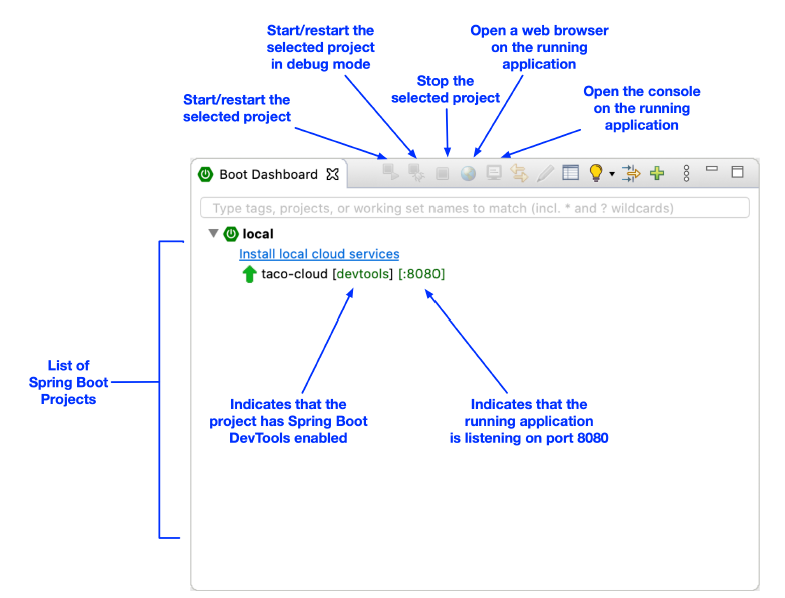

### 1.3.4 Building and running the application

Just as we have several ways to initialize a Spring application, we also have several ways to run one. If you like, you can flip over to the appendix to read about some of the more common ways to run a Spring Boot application.

Because you chose to use Spring Tool Suite to initialize and work on the project, you have a handy feature called the Spring Boot Dashboard available to help you run your application inside the IDE. The Spring Boot Dashboard appears as a tab, typically near the bottom left of the IDE window. Figure 1.7 shows an annotated screenshot of the Spring Boot Dashboard.

**Figure 1.7 Highlights of the Spring Boot Dashboard**

I don’t want to spend much time going over everything the Spring Boot Dashboard does, although figure 1.7 covers some of the most useful details. The important thing to know right now is how to use it to run the Taco Cloud application. Make sure `taco-cloud` application is highlighted in the list of projects (it’s the only application shown in figure 1.7), and then click the start button (the left-most button with both a green triangle and a red square). The application should start right up.

As the application starts, you’ll see some Spring ASCII art fly by in the console, followed by some log entries describing the steps as the application starts. Before the logging stops, you’ll see a log entry saying Tomcat started on port\(s\): 8080 \(http\), which means that you’re ready to point your web browser at the home page to see the fruits of your labor.

Wait a minute. Tomcat started? When did you deploy the application to a Tomcat web server?

Spring Boot applications tend to bring everything they need with them and don’t need to be deployed to some application server. You never deployed your application to Tomcat—Tomcat is a part of your application! (I’ll describe the details of how Tomcat became part of your application in section 1.3.6.)

Now that the application has started, point your web browser to [http://localhost:8080](http://localhost:8080) (or click the globe button in the Spring Boot Dashboard) and you should see something like figure 1.8. Your results may be different if you designed your own logo image, but it shouldn’t vary much from what you see in figure 1.8.

**Figure 1.8 The Taco Cloud home page**

It may not be much to look at. But this isn’t exactly a book on graphic design. The humble appearance of the home page is more than sufficient for now. And it provides you a solid start on getting to know Spring.

One thing I’ve glossed over up until now is DevTools. You selected it as a dependency when initializing your project. It appears as a dependency in the generated pom.xml file. And the Spring Boot Dashboard even shows that the project has DevTools enabled. But what is DevTools, and what does it do for you? Let’s take a quick survey of a couple of DevTools’s most useful features.
