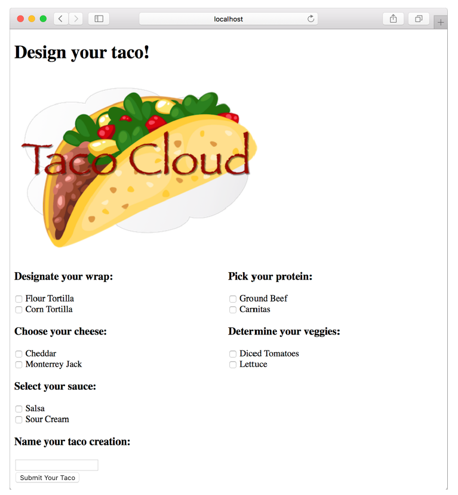

### 2.1.3 Designing the view

After the controller is finished with its work, it’s time for the view to get going. Spring offers several great options for defining views, including JavaServer Pages (JSP), Thymeleaf, FreeMarker, Mustache, and Groovy-based templates. For now, we’ll use Thymeleaf, the choice we made in chapter 1 when starting the project. We’ll consider a few of the other options in section 2.5.

We have already added Thymeleaf as a dependency in chapter 1. At run time, Spring Boot autoconfiguration sees that Thymeleaf is in the classpath and automatically creates the beans that support Thymeleaf views for Spring MVC.

View libraries such as Thymeleaf are designed to be decoupled from any particular web framework. As such, they’re unaware of Spring’s model abstraction and are unable to work with the data that the controller places in Model. But they can work with servlet request attributes. Therefore, before Spring hands the request over to a view, it copies the model data into request attributes that Thymeleaf and other viewtemplating options have ready access to.

Thymeleaf templates are just HTML with some additional element attributes that guide a template in rendering request data. For example, if there were a request attribute whose key is `"message"`, and you wanted it to be rendered into an HTML `<p>` tag by Thymeleaf, you’d write the following in your Thymeleaf template:

```html
<p th:text="${message}">placeholder message</p>
```

When the template is rendered into HTML, the body of the `<p>` element will be replaced with the value of the servlet request attribute whose key is `"message"`. The `th:text` attribute is a Thymeleaf namespace attribute that performs the replacement. The `${}` operator tells it to use the value of a request attribute (`"message"`, in this case).

Thymeleaf also offers another attribute, `th:each`, that iterates over a collection of elements, rendering the HTML once for each item in the collection. This attribute will come in handy as you design your view to list taco ingredients from the model. For example, to render just the list of `"wrap"` ingredients, you can use the following snippet of HTML:

```html
<h3>Designate your wrap:</h3>
<div th:each="ingredient : ${wrap}">
  <input th:field="*{ingredients}" type="checkbox"
      th:value="${ingredient.id}"/>
  <span th:text="${ingredient.name}">INGREDIENT</span><br/>
</div>
```

Here, you use the th:each attribute on the `<div>` tag to repeat rendering of the `<div>` once for each item in the collection found in the wrap request attribute. On each iteration, the ingredient item is bound to a Thymeleaf variable named `ingredient`.

Inside the `<div>` element are a check box `<input>` element and a `<span>` element to provide a label for the check box. The check box uses Thymeleaf’s `th:value` to set the rendered `<input>` element’s value attribute to the value found in the ingredient’s id property. The `th:field` attribute ultimately sets the `<input>` element’s name attribute and is used to remember whether or not the check box is checked. When we add validation later, this will ensure that the check box maintains its state should the form need to be redisplayed after a validation error. The `<span>` element uses `th:text` to replace the `"INGREDIENT"` placeholder text with the value of the ingredient’s name property

When rendered with actual model data, one iteration of that `<div>` loop might look like this:

```html
<div>
  <input name="ingredients" type="checkbox" value="FLTO" />
  <span>Flour Tortilla</span><br/>
</div>
```

Ultimately, the preceding Thymeleaf snippet is just part of a larger HTML form through which your taco artist users will submit their tasty creations. The complete Thymeleaf template, including all ingredient types and the form, is shown in the following listing.

**Listing 2.5 The complete design-a-taco page**

```html
<!DOCTYPE html>
<html xmlns="http://www.w3.org/1999/xhtml"
      xmlns:th="http://www.thymeleaf.org">
    <head>
        <title>Taco Cloud</title>
        <link rel="stylesheet" th:href="@{/styles.css}" />
    </head>
    
    <body>
        <h1>Design your taco!</h1>
        
        <form method="POST" th:object="${taco}">
            <div class="grid">
                <div class="ingredient-group" id="wraps">
                    <h3>Designate your wrap:</h3>
                    <div th:each="ingredient : ${wrap}">
                        <input name="ingredients" type="checkbox" th:value="${ingredient.id}"/>
                        <span th:text="${ingredient.name}">INGREDIENT</span><br/>
                    </div>
                </div>
                <div class="ingredient-group" id="proteins">
                    <h3>Pick your protein:</h3>
                    <div th:each="ingredient : ${protein}">
                        <input name="ingredients" type="checkbox" th:value="${ingredient.id}" />
                        <span th:text="${ingredient.name}">INGREDIENT</span><br/>
                    </div>
                </div>
                <div class="ingredient-group" id="cheeses">
                    <h3>Choose your cheese:</h3>
                    <div th:each="ingredient : ${cheese}">
                        <input name="ingredients" type="checkbox" th:value="${ingredient.id}"/>
                        <span th:text="${ingredient.name}">INGREDIENT</span><br/>
                    </div>
                </div>
                <div class="ingredient-group" id="veggies">
                    <h3>Determine your veggies:</h3>
                    <div th:each="ingredient : ${veggies}">
                        <input name="ingredients" type="checkbox" th:value="${ingredient.id}"/>
                        <span th:text="${ingredient.name}">INGREDIENT</span><br/>
                    </div>
                </div>
                <div class="ingredient-group" id="sauces">
                    <h3>Select your sauce:</h3>
                    <div th:each="ingredient : ${sauce}">
                        <input name="ingredients" type="checkbox" th:value="${ingredient.id}"/>
                        <span th:text="${ingredient.name}">INGREDIENT</span><br/>
                    </div>
                </div>
            </div>
            <div>
                <h3>Name your taco creation:</h3>
                <input type="text" th:field="*{name}"/><br/>
                <button>Submit your taco</button>
            </div>
        </form>
    </body>
</html>
```

As you can see, you repeat the `<div>` snippet for each of the types of ingredients, and you include a Submit button and field where the user can name their creation.

It’s also worth noting that the complete template includes the Taco Cloud logo image and a `<link>` reference to a stylesheet.2 In both cases, Thymeleaf’s `@{}` operator is used to produce a context-relative path to the static artifacts that these tags are referencing. As you learned in chapter 1, static content in a Spring Boot application is served from the /static directory at the root of the classpath.

Now that your controller and view are complete, you can fire up the application to see the fruits of your labor. We have many ways to run a Spring Boot application. In chapter 1, I showed you how to run the application by clicking the Start button in the Spring Boot Dashboard.

No matter how you fire up the Taco Cloud application, once it starts, point your browser to [http://localhost:8080/design](http://localhost:8080/design). You should see a page that looks something like figure 2.3.


**Figure 2.3 The rendered taco design page**

It’s looking good! A taco artist visiting your site is presented with a form containing a palette of taco ingredients from which they can create their masterpiece. But what happens when they click the Submit Your Taco button?

Your `DesignTacoController` isn’t yet ready to accept taco creations. If the design form is submitted, the user will be presented with an error. (Specifically, it will be an HTTP 405 error: Request Method “POST” Not Supported.) Let’s fix that by writing some more controller code that handles form submission.
