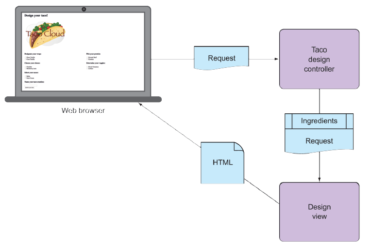

## 2.1 Displaying information

Fundamentally, Taco Cloud is a place where you can order tacos online. But more than that, Taco Cloud wants to enable its customers to express their creative side and design custom tacos from a rich palette of ingredients.

Therefore, the Taco Cloud web application needs a page that displays the selection of ingredients for taco artists to choose from. The ingredient choices may change at any time, so they shouldn’t be hardcoded into an HTML page. Rather, the list of available ingredients should be fetched from a database and handed over to the page to be displayed to the customer.

In a Spring web application, it’s a controller’s job to fetch and process data. And it’s a view’s job to render that data into HTML that will be displayed in the browser. You’re going to create the following components in support of the taco creation page:

* A domain class that defines the properties of a taco ingredient
* A Spring MVC controller class that fetches ingredient information and passes it along to the view
* A view template that renders a list of ingredients in the user’s browser

The relationship between these components is illustrated in figure 2.1.

**Figure 2.1 A typical Spring MVC request flow**

Because this chapter focuses on Spring’s web framework, we’ll defer any of the database stuff to chapter 3. For now, the controller is solely responsible for providing the ingredients to the view. In chapter 3, you’ll rework the controller to collaborate with a repository that fetches ingredients data from a database.

Before you write the controller and view, let’s hammer out the domain type that represents an ingredient. This will establish a foundation on which you can develop your web components.
