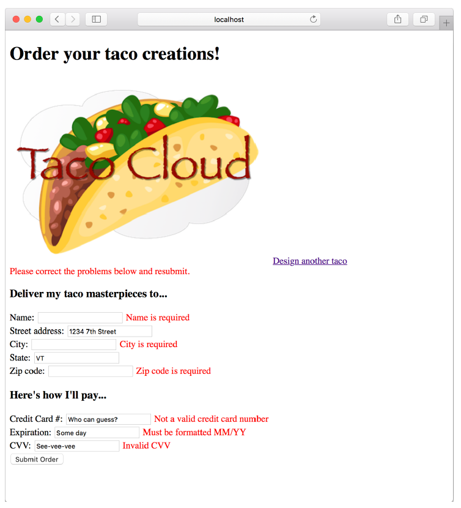

### 2.3.3 Displaying validation errors

Thymeleaf offers convenient access to the `Errors` object via the `fields` property and with its `th:errors` attribute. For example, to display validation errors on the credit card number field, you can add a `<span>` element that uses these error references to the order form template, as follows.

**Listing 2.15 Displaying validation errors**

```html
<<label for="ccNumber">Credit Card #: </label>
<input type="text" th:field="*{ccNumber}"/>
<span class="validationError"
      th:if="${#fields.hasErrors('ccNumber')}"
      th:errors="*{ccNumber}">CC Num Error</span>
```

Aside from a class attribute that can be used to style the error so that it catches the user’s attention, the `<span>` element uses a `th:if` attribute to decide whether to display the `<span>`. The fields property’s `hasErrors()` method checks whether there are any errors in the ccNumber field. If so, the `<span>` will be rendered.

The `th:errors` attribute references the `ccNumber` field and, assuming errors exist for that field, it will replace the placeholder content of the `<span>` element with the validation message.

If you were to sprinkle similar `<span>` tags around the order form for the other fields, you might see a form that looks like figure 2.5 when you submit invalid information. The errors indicate that the name, city, and ZIP code fields have been left blank and that all of the payment fields fail to meet the validation criteria.


**Figure 2.5 Validation errors displayed on the order form**

Now your Taco Cloud controllers not only display and capture input, but they also validate that the information meets some basic validation rules. Let’s step back and reconsider the `HomeController` from chapter 1, looking at an alternative implementation.
