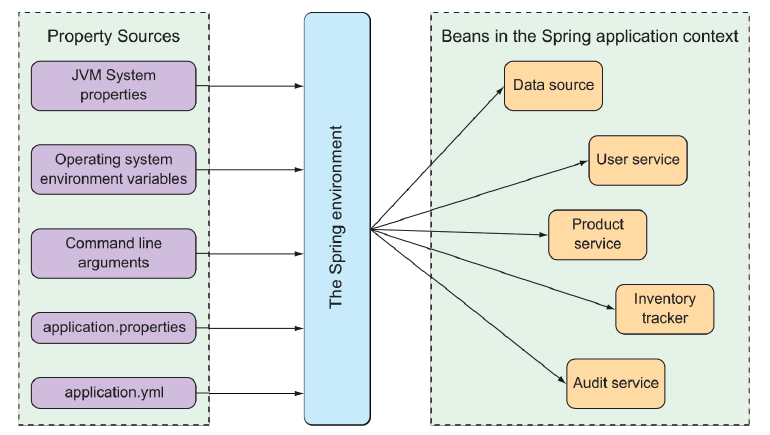

### 6.1.1 Understanding Spring's environment abstraction

The Spring environment abstraction is a one-stop shop for any configurable property. It abstracts the origins of properties so that beans needing those properties can consume them from Spring itself. The Spring environment pulls from several property sources, including the following:

* JVM system properties
* Operating system environment variables
* Command-line arguments
* Application property configuration files

It then aggregates those properties into a single source from which Spring beans can be injected. Figure 6.1 illustrates how properties from property sources flow through the Spring environment abstraction to Spring beans.


**Figure 6.1 The Spring environment pulls properties from property sources and makes them available to beans in the application context.**

The beans that are automatically configured by Spring Boot are all configurable by properties drawn from the Spring environment. As a simple example, suppose that you would like the application’s underlying servlet container to listen for requests on some port other than the default port of 8080. To do that, specify a different port by setting the server.port property in src/main/resources/application.properties like this:

```xml
server.port=9090
```

Personally, I prefer using YAML when setting configuration properties. Therefore, instead of using application.properties, I might set the `server.port` value in src/main/resources/application.yml like this:

```yaml
server:
  port: 9090
```

If you’d prefer to configure that property externally, you could also specify the port when starting the application using a command-line argument as follows:

```bash
java -jar tacocloud-0.0.5-SNAPSHOT.jar --server.port=9090
```

If you want the application to always start on a specific port, you could set it one time as an operating system environment variable, as shown next:

```bash
export SERVER_PORT=9090
```

Notice that when setting properties as environment variables, the naming style is slightly different to accommodate restrictions placed on environment variable names by the operating system. That’s OK. Spring is able to sort it out and interpret `SERVER_PORT` as `server.port` with no problems.

As I said, we have several ways of setting configuration properties. In fact, you could use one of several hundred configuration properties to tweak and adjust how Spring beans behave. You’ve already seen a few: `server.port` in this chapter, as well as `spring.datasource.name and spring.thymeleaf.cache` in earlier chapters.

It’s impossible to examine all of the available configuration properties in this chapter. Even so, let’s take a look at a few of the most useful configuration properties you might commonly encounter. We’ll start with a few properties that let you tweak the autoconfigured data source.
