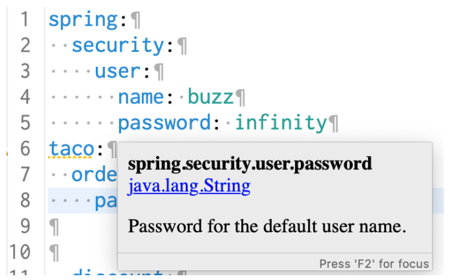

### 6.2.2 Declaring configuration property metadata

Depending on your IDE, you may have noticed that the `taco.orders.pageSize` entry in application.yml (or application.properties) has a warning saying something like Unknown Property ‘taco’. This warning appears because there’s missing metadata concerning the configuration property you just created. Figure 6.2 shows what this looks like when I hover over the taco portion of the property in the Spring Tool Suite.


**Figure 6.2 A warning for missing configuration property metadata**

Configuration property metadata is completely optional and doesn’t prevent configuration properties from working. But the metadata can be useful for providing some minimal documentation around the configuration properties, especially in the IDE. For example, when I hover over the `spring.security.user.password` property, I see what’s shown in figure 6.3. Although the hover help you get is minimal, it can be enough to help understand what the property is used for and how to use it.


**Figure 6.3 Hover documentation for configuration properties in the Spring Tool Suite**

To help those who might use the configuration properties that you define—which might even be you—it’s generally a good idea to create some metadata around those properties. At least it gets rid of those annoying yellow warnings in the IDE.

To create metadata for your custom configuration properties, you’ll need to create a file under the META-INF (e.g., in the project under src/main/resources/META-INF) named additional-spring-configuration-metadata.json.

#### QUICK-FIXING MISSING METADATA

If you’re using the Spring Tool Suite, there’s a quick-fix option for creating missing property metadata. Place your cursor on the line with the missing metadata warning and open the quick-fix pop-up with CMD-1 on Mac or Ctrl-1 on Windows and Linux (see figure 6.4).


**Figure 6.4 Creating configuration property metadata with the quick-fix pop-up in Spring Tool Suite**

Then select the “Create Metadata for …” option to add some metadata for the property. If it doesn’t already exist, this quick fix will create a file in META-INF/additionalspring-configuration-metadata.json and fill it in with some metadata for the `pageSize` property, as shown in the next code:

```json
{"properties": [{
  "name": "taco.orders.page-size",
  "type": "java.lang.String",
  "description": "A description for 'taco.orders.page-size'"
}]}
```

Notice that the property name referenced in the metadata is `taco.orders.page-size`, whereas the actual property name in application.yml is `pageSize`. Spring Boot’s flexible property naming allows for variations in property names such that `taco.orders.page-size` is equivalent to `taco.orders.pageSize`, so it doesn’t matter much which form you use.

The initial metadata written to `additional-spring-configuration-metadata.json` is a fine start, but you’ll probably want to edit it a little. Firstly, the `pageSize` property isn’t a `java.lang.String`, so you’ll want to change it to `java.lang.Integer`. And the `description` property should be changed to be more descriptive of what `pageSize` is for. The following JSON code sample shows what the metadata might look like after a few edits:

```json
{"properties": [{
  "name": "taco.orders.page-size",
  "type": "java.lang.Integer",
  "description": "Sets the maximum number of orders to display in a list."
}]}
```

With that metadata in place, the warnings should be gone. What’s more, if you hover over the `taco.orders.pageSize` property, you’ll see the description shown in figure 6.5.


**Figure 6.5 Hover help for custom configuration properties**

Also, as shown in figure 6.6, you get autocompletion help from the IDE, just like Spring-provided configuration properties.


**Figure 6.6 Configuration property metadata enables autocompletion of properties**

As you’ve seen, configuration properties are useful for tweaking both autoconfigured components as well as the details injected into your own application beans. But what if you need to configure different properties for different deployment environments? Let’s take a look at how to use Spring profiles to set up environment-specific configurations.
