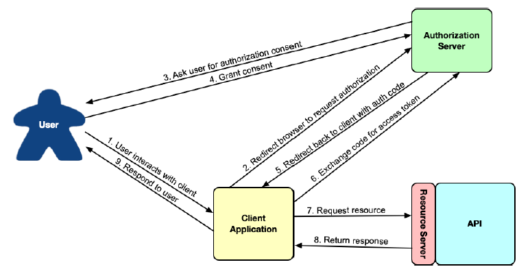

## 8.1 Introducing OAuth 2

Suppose that we want to create a new back-office application for managing the Taco Cloud application. More specifically, let’s say that we want this new application to be able to manage the ingredients available on the main Taco Cloud website.

Before we start writing code for the administrative application, we’ll need to add a handful of new endpoints to the Taco Cloud API to support ingredient management. The REST controller in the following listing offers three endpoints for listing, adding, and deleting ingredients.
**Listing 8.1 A controller to manage available ingredients**

```java
package tacos.web.api;

import org.springframework.beans.factory.annotation.Autowired;
import org.springframework.http.HttpStatus;
import org.springframework.web.bind.annotation.CrossOrigin;
import org.springframework.web.bind.annotation.DeleteMapping;
import org.springframework.web.bind.annotation.GetMapping;
import org.springframework.web.bind.annotation.PathVariable;
import org.springframework.web.bind.annotation.PostMapping;
import org.springframework.web.bind.annotation.RequestBody;
import org.springframework.web.bind.annotation.RequestMapping;
import org.springframework.web.bind.annotation.ResponseStatus;
import org.springframework.web.bind.annotation.RestController;

import tacos.Ingredient;
import tacos.data.IngredientRepository;

@RestController
@RequestMapping(path="/api/ingredients", produces="application/json")
@CrossOrigin(origins="*")
public class IngredientController {

  private IngredientRepository repo;

  @Autowired
  public IngredientController(IngredientRepository repo) {
    this.repo = repo;
  }

  @GetMapping
  public Iterable<Ingredient> allIngredients() {
    return repo.findAll();
  }

  @PostMapping
  @ResponseStatus(HttpStatus.CREATED)
  public Ingredient saveIngredient(@RequestBody Ingredient ingredient) {
    return repo.save(ingredient);
  }

  @DeleteMapping("/{id}")
  @ResponseStatus(HttpStatus.NO_CONTENT)
  public void deleteIngredient(@PathVariable("id") String ingredientId) {
    repo.deleteById(ingredientId);
  }
}
```

Great! Now all we need to do is get started on the administrative application, calling those endpoints on the main Taco Cloud application as needed to add and delete ingredients.

But wait—there’s no security around that API yet. If our backend application can make HTTP requests to add and delete ingredients, so can anyone else. Even using the curl command-line client, someone could add a new ingredient like this:

```bash
$ curl localhost:8080/ingredients \
  -H"Content-type: application/json" \
  -d'{"id":"FISH","name":"Stinky Fish", "type":"PROTEIN"}'
```

They could even use `curl` to delete existing ingredients as follows:

```bash
$ curl localhost:8080/ingredients/GRBF -X DELETE
```

This API is part of the main application and available to the world; in fact, the `GET` endpoint is used by the user interface of the main application in home.html. Therefore, it’s clear that we’ll need to secure at least the `POST` and `DELETE` endpoints.

One option is to use HTTP Basic authentication to secure the /ingredients endpoints. This could be done by adding `@PreAuthorize` to the handler methods like this:

```java
@PostMapping
@PreAuthorize("#{hasRole('ADMIN')}")
public Ingredient saveIngredient(@RequestBody Ingredient ingredient) {
  return repo.save(ingredient);
}

@DeleteMapping("/{id}")
@PreAuthorize("#{hasRole('ADMIN')}")
public void deleteIngredient(@PathVariable("id") String ingredientId) {
  repo.deleteById(ingredientId);
}
```

Or, the endpoints could be secured in the security configuration like this:

```java
@Override
protected void configure(HttpSecurity http) throws Exception {
  http
    .authorizeRequests()
      .antMatchers(HttpMethod.POST, "/ingredients").hasRole("ADMIN")
      .antMatchers(HttpMethod.DELETE, "/ingredients/**").hasRole("ADMIN")
      ...
}
```

>Whether or not to use the `“ROLE_”` prefix
>
>Authorities in Spring Security can take several forms, including roles, permissions, and (as we’ll see later) OAuth2 scopes. Roles, specifically, are a specialized form of authority that are prefixed with "ROLE_".
>When working with methods or SpEL expressions that deal directly with roles, such as `hasRole()`, the `"ROLE_"` prefix is inferred. Thus, a call to `hasRole("ADMIN")` is internally checking for an authority whose name is `"ROLE_ADMIN"`. You do not need to explicitly use the `"ROLE_"` prefix when calling these methods and functions (and, in fact, doing so will result in a double `"ROLE_"` prefix).
>Other Spring Security methods and functions that deal with authority more generically can also be used to check for roles. But in those cases, you must explicitly add the `"ROLE_"` prefix. For example, if you chose to use `hasAuthority()` instead of `hasRole()`, you’d need to pass in `"ROLE_ADMIN"` instead of `"ADMIN"`.

Either way, the ability to submit `POST` or `DELETE` requests to /ingredients will require that the submitter also provide credentials that have `"ROLE_ADMIN"` authority. For example, using `curl`, the credentials can be specified with the -u parameter, as shown here:

 ```java
$ curl localhost:8080/ingredients \
  -H"Content-type: application/json" \
  -d'{"id":"FISH","name":"Stinky Fish", "type":"PROTEIN"}' \
  -u admin:l3tm31n
 ```

Although HTTP Basic will lock down the API, it is rather . . . um . . . basic. It requires that the client and the API share common knowledge of the user credentials, possibly duplicating information. Moreover, although HTTP Basic credentials are Base64-encoded in the header of the request, if a hacker were to somehow intercept the request, the credentials could easily be obtained, decoded, and used for evil purposes. If that were to happen, the password would need to be changed, thus requiring an update and reauthentication in all clients.

What if instead of requiring that the admin user identify themselves on every request, the API just asks for some token that proves that they are authorized to access the resources? This would be roughly like a ticket to a sporting event. To enter the game, the person at the turnstiles doesn’t need to know who you are; they just need to know that you have a valid ticket. If so, then you are allowed access.

That’s roughly how OAuth 2 authorization works. Clients request an access token—analogous to a valet key—from an authorization server, with the express permission of a user. That token allows them to interact with an API on behalf of the user who authorized the client. At any point, the token could expire or be revoked, without requiring that the user’s password be changed. In such cases, the client would just need to request a new access token to be able to continue acting on the user’s behalf. This flow is illustrated in figure 8.1.


**Figure 8.1 The OAuth 2 authorization code flow** <br/>

OAuth 2 is a very rich security specification that offers a lot of ways to use it. The flow described in figure 8.1 is called `authorization code grant`. Other flows supported by the OAuth 2 specification include these:

* _Implicit grant_ — Like authorization code grant, implicit grant redirects the user’s browser to the authorization server to get user consent. But when redirecting back, rather than provide an authorization code in the request, the access token is granted implicitly in the request. Although originally designed for JavaScript clients running in a browser, this flow is not generally recommended anymore, and authorization code grant is preferred.
* _User credentials (or password) grant_ — In this flow, no redirect takes place, and there may not even be a web browser involved. Instead, the client application obtains the user’s credentials and exchanges them directly for an access token. This flow seems suitable for clients that are not browser based, but modern applications often favor asking the user to go to a website in their browser and perform authorization code grant to avoid having to handle the user’s credentials.
* _Client credentials grant_ — This flow is like user credentials grant, except that instead of exchanging a user’s credentials for an access token, the client exchanges its own credentials for an access token. However, the token granted is limited in scope to performing non-user-focused operations and can’t be used to act on behalf of a user.

For our purposes, we’re going to focus on the authorization code grant flow to obtain a JSON Web Token (JWT) access token. This will involve creating a handful of applications that work together, including the following:

* _The authorization server_ — An authorization server’s job is to obtain permission from a user on behalf of a client application. If the user grants permission, then the authorization server gives an access token to the client application that it can use to gain authenticated access to an API.
* _The resource server_ — A resource server is just another name for an API that is secured by OAuth 2. Although the resource server is part of the API itself, for the sake of discussion, the two are often treated as two distinct concepts. The resource server restricts access to its resources unless the request provides a valid access token with the necessary permission scope. For our purposes, the Taco Cloud API we started in chapter 7 will serve as our resource server, once we add a bit of security configuration to it.
* _The client application_ — The client application is an application that wants to consume an API but needs permission to do so. We’ll build a simple administrative application for Taco Cloud to be able to add new ingredients.
* _The user_ — This is the human who uses the client application and grants the application permission to access the resource server’s API on their behalf.

In the authorization code grant flow, a series of browser redirects between the client application and the authorization server occurs as the client obtains an access token. It starts with the client redirecting the user’s browser to the authorization server, asking for specific permissions (or “scope”). The authorization server then asks the user to log in and consent to the requested permissions. After the user has granted consent, the authorization server redirects the browser back to the client with a code that the client can then exchange for an access token. Once the client has the access token, it can then be used to interact with the resource server API by passing it in the `"Authorization"` header of every request.

Although we’re going to restrict our focus on a specific use of OAuth 2, you are encouraged to dig deeper into the subject by reading the OAuth 2 specification [https://oauth.net/2/](https://oauth.net/2/) or reading any one of the following books on the subject:

* _OAuth 2 in Action_: [https://www.manning.com/books/oauth-2-in-action]https://www.manning.com/books/oauth-2-in-action
* _Microservices Security in Action_: [https://www.manning.com/books/microservices-security-in-action]https://www.manning.com/books/microservices-security-in-action
* _API Security in Action_: [https://www.manning.com/books/api-security-in-action]https://www.manning.com/books/api-security-in-action

You might also want to have a look at a liveProject called “Protecting User Data with Spring Security and OAuth2”（[https://www.manning.com/liveproject/protecting-user-data-with-spring-security-and-oauth2](https://www.manning.com/liveproject/protecting-user-data-with-spring-security-and-oauth2)）.

For several years, a project called Spring Security for OAuth provided support for both OAuth 1.0a and OAuth 2. It was separate from Spring Security but developed by the same team. In recent years, however, the Spring Security team has absorbed the client and resource server components into Spring Security itself.

As for the authorization server, it was decided that it not be included in Spring Security. Instead, developers are encouraged to use authorization servers from various vendors such as Okta, Google, and others. But, due to demand from the developer community, the Spring Security team started a Spring Authorization Server project.2 This project is labeled as “experimental” and is intended to eventually be community driven, but it serves as a great way to get started with OAuth 2 without signing up for one of those other authorization server implementations.

Throughout the rest of this chapter, we’re going to see how to use OAuth 2 using Spring Security. Along the way, we’ll create two new projects, an authorization server project and a client project, and we’ll modify our existing Taco Cloud project such that its API acts as a resource server. We’ll start by creating an authorization server using the Spring Authorization Server project.
