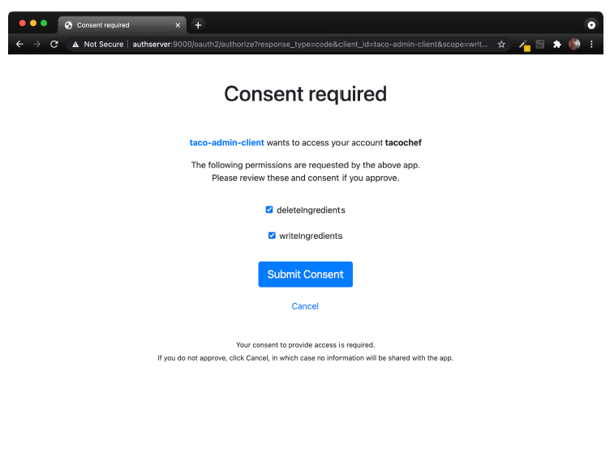
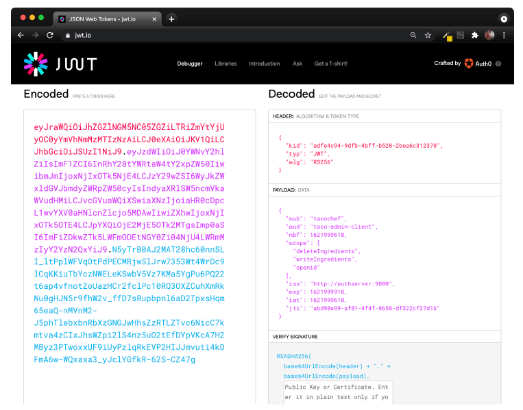

## 8.2 Creating an authorization server

An authorization server’s job is primarily to issue an access token on behalf of a user. As mentioned earlier, we have several authorization server implementations to choose from, but we’re going to use Spring Authorization Server for our project. Spring Authorization Server is experimental and doesn’t implement all of the OAuth 2 grant types, but it does implement the authorization code grant and client credentials grant.

The authorization server is a distinct application from any application that provides the API and is also distinct from the client. Therefore, to get started with Spring Authorization Server, you’ll want to create a new Spring Boot project, choosing (at least) the web and security starters. For our authorization server, users will be stored in a relational database using JPA, so be sure to add the JPA starter and H2 dependencies as well. And, if you’re using Lombok to handle getters, setters, constructors, and whatnot, then be sure to include it as well.

Spring Authorization Server isn’t (yet) available as a dependency from the Initializr. So once your project has been created, you’ll need to manually add the Spring Authorization Server dependency to your build. For example, here’s the Maven dependency you’ll need to include in your pom.xml file:

```xml
<dependency>
  <groupId>org.springframework.security.experimental</groupId>
  <artifactId>spring-security-oauth2-authorization-server</artifactId>
  <version>0.1.2</version>
</dependency>
```

Next, because we’ll be running this all on our development machines (at least for now), you’ll want to make sure that there’s not a port conflict between the main Taco Cloud application and the authorization server. Adding the following entry to the project’s application.yml file will make the authorization server available on port 9000:

```yaml
server:
  port: 9000
```

Now let’s dive into the essential security configuration that will be used by the authorization server. The next code listing shows a very simple Spring Security configuration class that enables form-based login and requires that all requests be authenticated.

**Listing 8.2 Essential security configuration for form-based login**

```java
package tacos.authorization;
import org.springframework.context.annotation.Bean;
import org.springframework.security.config.annotation.web.builders.
              HttpSecurity;
import org.springframework.security.config.annotation.web.configuration.
              EnableWebSecurity;
import org.springframework.security.core.userdetails.UserDetailsService;
import org.springframework.security.crypto.bcrypt.BCryptPasswordEncoder;
import org.springframework.security.crypto.password.PasswordEncoder;
import org.springframework.security.web.SecurityFilterChain;

import tacos.authorization.users.UserRepository;

@EnableWebSecurity
public class SecurityConfig {

  @Bean
  SecurityFilterChain defaultSecurityFilterChain(HttpSecurity http)
          throws Exception {
    return http
      .authorizeRequests(authorizeRequests ->
          authorizeRequests.anyRequest().authenticated()
      )

      .formLogin()

      .and().build();
  }

  @Bean
  UserDetailsService userDetailsService(UserRepository userRepo) {
    return username -> userRepo.findByUsername(username);
  }

  @Bean
  public PasswordEncoder passwordEncoder() {
    return new BCryptPasswordEncoder();
  }
}
```

Notice that the UserDetailsService bean works with a TacoUserRepository to look up users by their username. To get on with configuring the authorization server itself, we’ll skip over the specifics of TacoUserRepository, but suffice it to say that it looks a lot like some of the Spring Data–based repositories we’ve created since chapter 3.

The only thing worth noting about the TacoUserRepository is that (for convenience in testing) you could use it in a CommandLineRunner bean to prepopulate the database with a couple of test users as follows:

```java
@Bean
public ApplicationRunner dataLoader(
          UserRepository repo, PasswordEncoder encoder) {
  return args -> {
    repo.save(
      new User("habuma", encoder.encode("password"), "ROLE_ADMIN"));
    repo.save(
      new User("tacochef", encoder.encode("password"), "ROLE_ADMIN"));
  };
}
```

Now we can start applying configuration to enable an authorization server. The first step in configuring an authorization server is to create a new configuration class that imports some common configuration for an authorization server. The following code for AuthorizationServerConfig is a good start:

```java
@Configuration(proxyBeanMethods = false)
public class AuthorizationServerConfig {

  @Bean
  @Order(Ordered.HIGHEST_PRECEDENCE)
  public SecurityFilterChain authorizationServerSecurityFilterChain(HttpSecurity http)
    throws Exception {
    OAuth2AuthorizationServerConfiguration
        .applyDefaultSecurity(http);
    return http
        .formLogin(Customizer.withDefaults())
        .build();
  }

  ...
}
```

The authorizationServerSecurityFilterChain() bean method defines a SecurityFilterChain that sets up some default behavior for the OAuth 2 authorization server and a default form login page. The @Order annotation is given Ordered.HIGHEST_PRECEDENCE to ensure that if for some reason there are other beans of this type declared, this one takes precedence over the others.

For the most part, this is a boilerplate configuration. If you want, feel free to dive in a little deeper and customize the configuration. For now, we’re just going to go with the defaults.

One component that isn’t boilerplate, and thus not provided by OAuth2-AuthorizationServerConfiguration, is the client repository. A client repository is analogous to a user details service or user repository, except that instead of maintaining details about users, it maintains details about clients that might be asking for authorization on behalf of users. It is defined by the RegisteredClientRepository interface, which looks like this:

```java
public interface RegisteredClientRepository {

  @Nullable
  RegisteredClient findById(String id);

  @Nullable
  RegisteredClient findByClientId(String clientId);

}
```

In a production setting, you might write a custom implementations of RegisteredClientRepository to retrieve client details from a database or from some other source. But out of the box, Spring Authorization Server offers an in-memory implementation that is perfect for demonstration and testing purposes. You’re encouraged to implement RegisteredClientRepository however you see fit. But for our purposes, we’ll use the in-memory implementation to register a single client with the authorization server. Add the following bean method to AuthorizationServerConfig:

```java
@Bean
public RegisteredClientRepository registeredClientRepository(
        PasswordEncoder passwordEncoder) {
  RegisteredClient registeredClient =
    RegisteredClient.withId(UUID.randomUUID().toString())
      .clientId("taco-admin-client")
      .clientSecret(passwordEncoder.encode("secret"))
      .clientAuthenticationMethod(
            ClientAuthenticationMethod.BASIC)
      .authorizationGrantType(AuthorizationGrantType.AUTHORIZATION_CODE)
      .authorizationGrantType(AuthorizationGrantType.REFRESH_TOKEN)
      .redirectUri(
            "http://127.0.0.1:9090/login/oauth2/code/taco-admin-client")
      .scope("writeIngredients")
      .scope("deleteIngredients")
      .scope(OidcScopes.OPENID)
      .clientSettings(
            clientSettings -> clientSettings.requireUserConsent(true))
      .build();
  return new InMemoryRegisteredClientRepository(registeredClient);
}
```

As you can see, there are a lot of details that go into a RegisteredClient. But going from top to bottom, here’s how our client is defined:

* ID—A random, unique identifier.
* Client ID—Analogous to a username, but instead of a user, it is a client. In this case, "taco-admin-client".
* Client secret—Analogous to a password for the client. Here we’re using the word "secret" for the client secret.
* Authorization grant type—The OAuth 2 grant types that this client will support. In this case, we’re enabling authorization code and refresh token grants.
* Redirect URL—One or more registered URLs that the authorization server can redirect to after authorization has been granted. This adds another level of security, preventing some arbitrary application from receiving an authorization code that it could exchange for a token.
* Scope—One or more OAuth 2 scopes that this client is allowed to ask for. Here we are setting three scopes: "writeIngredients", "deleteIngredients", and the constant OidcScopes.OPENID, which resolves to "openid". The "openid" scope will be necessary later when we use the authorization server as a singlesign-on solution for the Taco Cloud admin application.
* Client settings—This is a lambda that allows us to customize the client settings. In this case, we’re requiring explicit user consent before granting the requested scope. Without this, the scope would be implicitly granted after the user logs in.

Finally, because our authorization server will be producing JWT tokens, the tokens will need to include a signature created using a JSON Web Key (JWK) as the signing key. Therefore, we’ll need a few beans to produce a JWK. Add the following bean method (and private helper methods) to AuthorizationServerConfig to handle that for us:

```java
@Bean
public JWKSource<SecurityContext> jwkSource() {
  RSAKey rsaKey = generateRsa();
  JWKSet jwkSet = new JWKSet(rsaKey);
  return (jwkSelector, securityContext) -> jwkSelector.select(jwkSet);
}
private static RSAKey generateRsa() {
  KeyPair keyPair = generateRsaKey();
  RSAPublicKey publicKey = (RSAPublicKey) keyPair.getPublic();
  RSAPrivateKey privateKey = (RSAPrivateKey) keyPair.getPrivate();
  return new RSAKey.Builder(publicKey)
    .privateKey(privateKey)
    .keyID(UUID.randomUUID().toString())
    .build();
}
private static KeyPair generateRsaKey() {
  try {
    KeyPairGenerator keyPairGenerator = KeyPairGenerator.getInstance("RSA");
    keyPairGenerator.initialize(2048);
    return keyPairGenerator.generateKeyPair();
  } catch (Exception e) {
    return null;
  }
}
@Bean
public JwtDecoder jwtDecoder(JWKSource<SecurityContext> jwkSource) {
  return OAuth2AuthorizationServerConfiguration.jwtDecoder(jwkSource);
}
```

There appears to be a lot going on here. But to summarize, the JWKSource creates RSA 2048-bit key pairs that will be used to sign the token. The token will be signed using the private key. The resource server can then verify that the token received in a request is valid by obtaining the public key from the authorization server. We’ll talk more about that when we create the resource server.

All of the pieces of our authorization server are now in place. All that’s left to do is start it up and try it out. Build and run the application, and you should have an authorization server listening on port 9000.

Because we don’t have a client yet, you can pretend to be a client using your web browser and the curl command-line tool. Start by pointing your web browser at <http://localhost:9000/oauth2/authorize?response_type=code&client_id=tacoadmin-client&redirect_uri=http://127.0.0.1:9090/login/oauth2/code/taco-admin-client&-scope=writeIngredients+deleteIngredients.4> You should see a login page that looks like figure 8.2.


**Figure 8.2 The authorization server login page**

After logging in (with “tacochef” and “password,” or some username-password combination in the database under TacoUserRepository), you’ll be asked to consent to the requested scopes on a page that looks like figure 8.3.


**Figure 8.3 The authorization server consent page**

After granting consent, the browser will be redirected back to the client URL. We don’t have a client yet, so there’s probably nothing there and you’ll receive an error. But that’s OK—we’re pretending to be the client, so we’ll obtain the authorization code from the URL ourselves.

Look in the browser’s address bar, and you’ll see that the URL has a code parameter. Copy the entire value of that parameter, and use it in the following curl command line in place of $code:

```bash
$ curl localhost:9000/oauth2/token \
  -H"Content-type: application/x-www-form-urlencoded" \
  -d"grant_type=authorization_code" \
  -d"redirect_uri=http://127.0.0.1:9090/login/oauth2/code/taco-admin-client" \
  -d"code=$code" \
  -u taco-admin-client:secret
```

Here we’re exchanging the authorization code we received for an access token. The payload body is in “application/x-www-form-urlencoded” format and sends the grant type ("authorization_code"), the redirect URI (for additional security), and the authorization code itself. If all goes well, then you’ll receive a JSON response that (when formatted) looks like this:

```json
{
  "access_token":"eyJraWQ...",
  "refresh_token":"HOzHA5s...",
  "scope":"deleteIngredients writeIngredients",
  "token_type":"Bearer",
  "expires_in":"299"
}
```

The "access_token" property contains the access token that a client can use to make requests to the API. In reality, it is much longer than shown here. Likewise, the "refresh_token" has been abbreviated here to save space. But the access token can now be sent on requests to the resource server to gain access to resources requiring either the "writeIngredients" or "deleteIngredients" scope. The access token will expire in 299 seconds (or just less than 5 minutes), so we’ll have to move quickly if we’re going to use it. But if it expires, then we can use the refresh token to obtain a new access token without going through the authorization flow all over again.

So, how can we use the access token? Presumably, we’ll send it in a request to the Taco Cloud API as part of the "Authorization" header—perhaps something like this:

```bash
$ curl localhost:8080/ingredients \
  -H"Content-type: application/json" \
  -H"Authorization: Bearer eyJraWQ..." \
  -d'{"id":"FISH","name":"Stinky Fish", "type":"PROTEIN"}'
```

At this point, the token achieves nothing for us. That’s because our Taco Cloud API hasn’t been enabled to be a resource server yet. But in lieu of an actual resource server and client API, we can still inspect the access token by copying it and pasting into the form at <https://jwt.io>. The result will look something like figure 8.4.


**Figure 8.4 Decoding a JWT token at jwt.io**

As you can see, the token is decoded into three parts: the header, the payload, and the signature. A closer look at the payload shows that this token was issued on behalf of the user named tacochef and the token has the "writeIngredients" and "deleteIngredients" scopes. Just what we asked for

After about 5 minutes, the access token will expire. You can still inspect it in the debugger at <https://jwti.io>, but if it were given in a real request to an API, it would be rejected. But you can request a new access token without going through the authorization code grant flow again. All you need to do is make a new request to the authorization server using the "refresh_token" grant and passing the refresh token as the value of the "refresh_token" parameter. Using curl, such a request will look like this:

```bash
$ curl localhost:9000/oauth2/token \
  -H"Content-type: application/x-www-form-urlencoded" \
  -d"grant_type=refresh_token&refresh_token=HOzHA5s..." \
  -u taco-admin-client:secret
```

The response to this request will be the same as the response from the request that exchanged the authorization code for an access token initially, only with a fresh new access token.

Although it’s fun to paste access tokens into [https://jwt.io](https://jwt.io), the real power and purpose of the access token is to gain access to an API. So let’s see how to enable a resource server on the Taco Cloud API.
