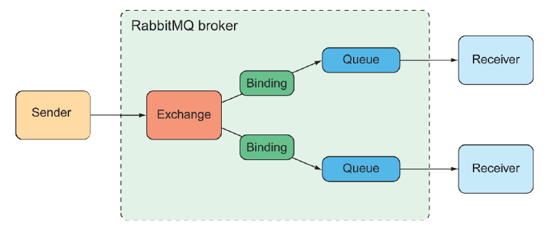

## 9.2 Working with RabbitMQ and AMQP

As arguably the most prominent implementation of AMQP, RabbitMQ offers a more advanced message-routing strategy than JMS. Whereas JMS messages are addressed with the name of a destination from which the receiver will retrieve them, AMQP messages are addressed with the name of an exchange and a routing key, which are decoupled from the queue to which the receiver is listening. This relationship between an exchange and queues is illustrated in figure 9.2.

**Figure 9.2 Messages sent to a RabbitMQ exchange are routed to one or more queues, based on routing keys and bindings.**  

When a message arrives at the RabbitMQ broker, it goes to the exchange for which it was addressed. The exchange is responsible for routing it to one or more queues, depending on the type of exchange, the binding between the exchange and queues, and the value of the message’s routing key.

There are several different kinds of exchanges, including the following:

* _Default_ —— A special exchange that’s automatically created by the broker. It routes messages to queues whose name is the same as the message’s routing key. All queues will automatically be bound to the default exchange.
* _Direct_ —— Routes messages to a queue whose binding key is the same as the message’s routing key.
* _Topic_ —— Routes a message to one or more queues where the binding key (which may contain wildcards) matches the message’s routing key.
* _Fanout_ —— Routes messages to all bound queues without regard for binding keys or routing keys.
* _Headers_ —— Similar to a topic exchange, except that routing is based on message header values rather than routing keys.
* _Dead letter_ —— A catchall for any messages that are undeliverable (meaning they don’t match any defined exchange-to-queue binding).

The simplest forms of exchanges are default and fanout—these roughly correspond to a JMS queue and topic. But the other exchanges allow you to define more flexible routing schemes.

The most important thing to understand is that messages are sent to exchanges with routing keys and they’re consumed from queues. How they get from an exchange to a queue depends on the binding definitions and what best suits your use cases.

Which exchange type you use and how you define the bindings from exchanges to queues has little bearing on how messages are sent and received in your Spring applications. Therefore, we’ll focus on how to write code that sends and receives messages with Rabbit.

>**NOTE**
>For a more detailed discussion on how best to bind queues to exchanges, see RabbitMQ in Depth by Gavin Roy (Manning, 2017) or RabbitMQ in Action by Alvaro Videla and Jason J. W. Williams (Manning, 2012).

