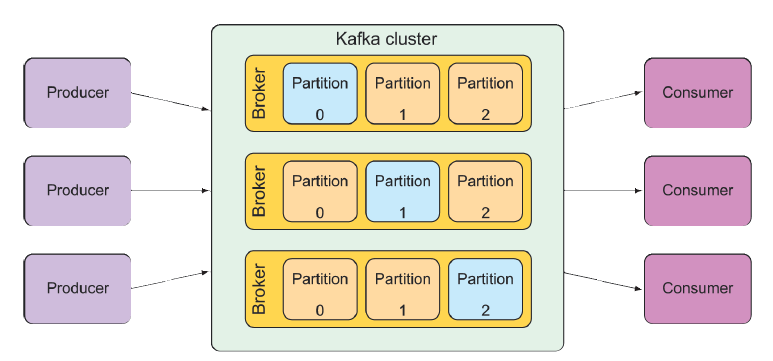

## 9.3 Messaging with Kafka

Apache is the newest messaging option we’re examining in this chapter. At a glance, Kafka is a message broker just like ActiveMQ, Artemis, or Rabbit. But Kafka has a few unique tricks up its sleeves.

Kafka is designed to run in a cluster, affording great scalability. And by partitioning its topics across all instances in the cluster, it’s very resilient. Whereas RabbitMQ deals primarily with queues in exchanges, Kafka utilizes topics only to offer pub/sub messaging.

Kafka topics are replicated across all brokers in the cluster. Each node in the cluster acts as a leader for one or more topics, being responsible for that topic’s data and replicating it to the other nodes in the cluster.

Going a step further, each topic can be split into multiple partitions. In that case,
each node in the cluster is the leader for one or more partitions of a topic, but not for
the entire topic. Responsibility for the topic is split across all nodes. Figure 9.3 illustrates how this works.

**Figure 9.3 Kafka A Kafka cluster is composed of multiple brokers, each acting as a leader for partitions of the topics.**

Due to Kafka’s unique architecture, I encourage you to read more about it in _Kafka in Action_ by Dylan Scott, Viktor Gamov, and Dave Klein (Manning, 2021). For our purposes, we’ll focus on how to send messages to and receive them from Kafka with Spring.
