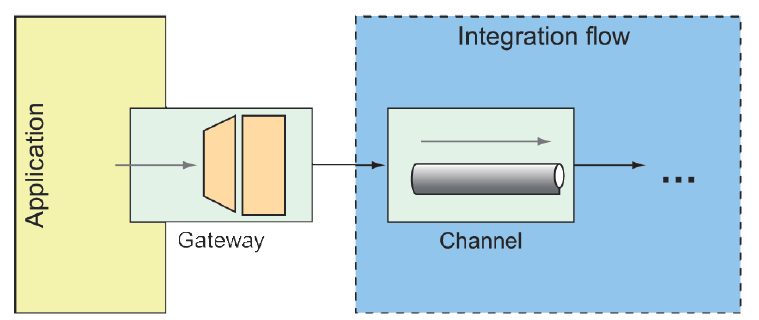

### 10.2.7 Gateways

Gateways are the means by which an application can submit data into an integration flow and, optionally, receive a response that’s the result of the flow. Implemented by Spring Integration, gateways are realized as interfaces that the application can call to send messages to the integration flow (see figure 10.8).



**Figure 10.8 Service gateways are interfaces through which an application can submit messages to an integration flow.** <br/>

You’ve already seen an example of a message gateway with `FileWriterGateway`. `FileWriterGateway` was a one-way gateway with a method accepting a `String` to write to a file, returning `void`. It’s just about as easy to write a two-way gateway. When writing the gateway interface, be sure that the method returns some value to publish into the integration flow.

As an example, imagine a gateway that fronts a simple integration flow that accepts a `String` and translates the given String to all uppercase. The gateway interface might look something like this:

```java
package sia6;
import org.springframework.integration.annotation.MessagingGateway;
import org.springframework.stereotype.Component;

@Component
@MessagingGateway(defaultRequestChannel="inChannel",
        defaultReplyChannel="outChannel")
public interface UpperCaseGateway {
  String uppercase(String in);
}
```

What’s amazing about this interface is that it’s not necessary to implement it. Spring Integration automatically provides an implementation at run time that sends and receives data through the specified channels.

When `uppercase()` is called, the given `String` is published to the integration flow into the channel named `inChannel`. Regardless of how the flow is defined or what it does, when data arrives in the channel named `outChannel`, it’s returned from the `uppercase()` method.

As for the uppercase integration flow, it’s a simplistic integration flow with only a single step to transform the `String` to uppercase. Here, it’s expressed in the Java DSL configuration:

```java
@Bean
public IntegrationFlow uppercaseFlow() {
  return IntegrationFlows
    .from("inChannel")
    .<String, String> transform(s -> s.toUpperCase())
    .channel("outChannel")
    .get();
}
```

As defined here, the flow starts with data coming into the channel named `inChannel`. The message payload is then transformed by the transformer, which is defined here as a lambda expression, to perform an uppercase operation. The resulting message is then published to the channel named `outChannel`, which is what you’ve declared as the reply channel for the `UpperCaseGateway` interface.

