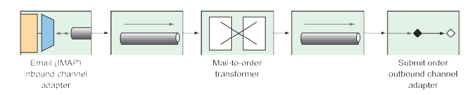

## 10.3 Creating an email integration flow

You’ve decided that Taco Cloud should enable its customers to submit their taco designs and place orders by email. You send out flyers and place takeout ads in newspapers inviting everyone to send in their taco orders by email. It’s a tremendous success! Unfortunately, it’s a bit too successful. There are so many emails coming in that you have to hire temporary help to do nothing more than read all the emails and submit order details into the ordering system.

In this section, you’ll implement an integration flow that polls the Taco Cloud inbox for taco order emails, parses the emails for order details, and submits the orders to Taco Cloud for handling. In short, the integration flow you’re going to need will use an inbound channel adapter from the email endpoint module to ingest emails from the Taco Cloud inbox into the integration flow.

The next step in the integration flow will parse the emails into order objects that are handed off to another handler to submit orders to Taco Cloud’s REST API, where they’ll be processed the same as any order. To start with, let’s define a simple configuration properties class to capture the specifics of how to handle Taco Cloud emails, as shown here:

```java
package tacos.email;

import org.springframework.boot.context.properties.ConfigurationProperties;
import org.springframework.stereotype.Component;
import lombok.Data;

@Data
@ConfigurationProperties(prefix="tacocloud.email")
@Component
public class EmailProperties {

  private String username;
  private String password;
  private String host;
  private String mailbox;
  private long pollRate = 30000;

  public String getImapUrl() {
    return String.format("imaps://%s:%s@%s/%s",
        this.username, this.password, this.host, this.mailbox);
  }
}
```

As you can see, `EmailProperties` captures properties that are used to produce an IMAP URL. The flow uses this URL to connect to the Taco Cloud email server and poll for emails. Among the properties captured are the email user’s username and password, as well as the hostname of the IMAP server, the mailbox to poll, and the rate at which the mailbox is polled (which defaults to every 30 seconds).

The `EmailProperties` class is annotated at the class level with `@ConfigurationProperties` with a prefix attribute set to `tacocloud.email`. This means that you can configure the details of consuming an email in the application.yml file like this:

```yaml
tacocloud:
  email:
    host: imap.tacocloud.com
    mailbox: INBOX
    username: taco-in-flow
    password: 1L0v3T4c0s
    poll-rate: 10000
```

Of course, the email server configuration shown here is fictional. You’ll need to tweak it to match the email server details that you’ll be using.

Also, you may get an “unknown property” warning in your IDE. That’s because the IDE is looking for metadata it needs to understand what those properties mean. The warnings won’t break the actual code, and you can ignore them if you want. Or you can make them go away by adding the following dependency to your build (also available as a Spring Initializr option called “Spring Configuration Processor”):

```xml
<dependency>
  <groupId>org.springframework.boot</groupId>
  <artifactId>spring-boot-configuration-processor</artifactId>
  <optional>true</optional>
</dependency>
```

This dependency includes support for automatically generating metadata for custom configuration properties such as the ones we’re using to configure the email server details.

Now let’s use `EmailProperties` to configure the integration flow. The flow you’re aiming to create will look a little like figure 10.10.


**Figure 10.10 An integration flow to accept taco orders by email**

You have the following two options when defining this flow:

* _Define it within the Taco Cloud application itself_. At the end of the flow, a service activator will call into the repositories you’ve defined to create the taco order.
* _Define it as a separate application_. At the end of the flow, a service activator will send a `POST` request to the Taco Cloud API to submit the taco order.

Whichever you choose has little bearing on the flow itself, aside from how the service activator is implemented. But because you’re going to need some types that represent tacos, orders, and ingredients, which are subtly different from those you’ve already defined in the main Taco Cloud application, you’ll proceed by defining the integration flow in a separate application to avoid any confusion with the existing domain types.

You also have the choice of defining the flow using either XML configuration, Java configuration, or the Java DSL. I rather like the elegance of the Java DSL, so that’s what you’ll use. Feel free to write the flow using one of the other configuration styles if you’re interested in a little extra challenge. For now, let’s take a look at the Java DSL configuration for the taco order email flow as shown next.。

** Listing 10.5 Defining an integration flow to accept emails and submit them as orders**
```java
package tacos.email;

import org.springframework.context.annotation.Bean;
import org.springframework.context.annotation.Configuration;
import org.springframework.integration.dsl.IntegrationFlow;
import org.springframework.integration.dsl.IntegrationFlows;
import org.springframework.integration.dsl.Pollers;
import org.springframework.integration.mail.dsl.Mail;

@Configuration
public class TacoOrderEmailIntegrationConfig {

  @Bean
  public IntegrationFlow tacoOrderEmailFlow(
    EmailProperties emailProps,
    EmailToOrderTransformer emailToOrderTransformer,
    OrderSubmitMessageHandler orderSubmitHandler) {

  return IntegrationFlows
    .from(Mail.imapInboundAdapter(emailProps.getImapUrl()),
      e -> e.poller(
        Pollers.fixedDelay(emailProps.getPollRate())))
    .transform(emailToOrderTransformer)
    .handle(orderSubmitHandler)
    .get();
  }
}
```

The taco order email flow, as defined in the `tacoOrderEmailFlow()` method, is composed of the following three distinct components:

* _An IMAP email inbound channel adapter_ — This channel adapter is created with the IMAP URL generated from the `getImapUrl()` method of `EmailProperties` and polls on a delay set in the `pollRate` property of `EmailProperties`. The emails coming in are handed off to a channel connecting it to the transformer.
* _A transformer that transforms an email into an order object_ — The transformer is implemented in `EmailToOrderTransformer`, which is injected into the `tacoOrderEmailFlow()` method. The orders resulting from the transformation are handed off to the final component through another channel.
* _A handler (acting as an outbound channel adapter)_ — The handler accepts an order object and submits it to Taco Cloud’s REST API.

The call to `Mail.imapInboundAdapter()` is made possible by including the `Email` endpoint module as a dependency in your project build. The Maven dependency looks like this:

```html
<dependency>
  <groupId>org.springframework.integration</groupId>
  <artifactId>spring-integration-mail</artifactId>
</dependency>
```

The `EmailToOrderTransformer` class is an implementation of Spring Integration’s `Transformer` interface, by way of extending `AbstractMailMessageTransformer` (shown in the following listing).

**Listing 10.6 Converting incoming emails to taco orders using an integration transformer**
```java
package tacos.email;

import java.io.IOException;
import java.util.ArrayList;
import java.util.List;
import javax.mail.Message;
import javax.mail.MessagingException;
import javax.mail.internet.InternetAddress;
import org.apache.commons.text.similarity.LevenshteinDistance;
import org.springframework.integration.mail.transformer
            .AbstractMailMessageTransformer;
import org.springframework.integration.support
            .AbstractIntegrationMessageBuilder;
import org.springframework.integration.support.MessageBuilder;
import org.springframework.stereotype.Component;

@Component
public class EmailToOrderTransformer
    extends AbstractMailMessageTransformer<EmailOrder> {

  private static final String SUBJECT_KEYWORDS = "TACO ORDER";

  @Override
  protected AbstractIntegrationMessageBuilder<EmailOrder>
        doTransform(Message mailMessage) throws Exception {
    EmailOrder tacoOrder = processPayload(mailMessage);
    return MessageBuilder.withPayload(tacoOrder);
  }

  private EmailOrder processPayload(Message mailMessage) {
  try {
    String subject = mailMessage.getSubject();
      if (subject.toUpperCase().contains(SUBJECT_KEYWORDS)) {
        String email =
          ((InternetAddress) mailMessage.getFrom()[0]).getAddress();
        String content = mailMessage.getContent().toString();
        return parseEmailToOrder(email, content);
      }
    } catch (MessagingException e) {
    } catch (IOException e) {}
    return null;
  }

  private EmailOrder parseEmailToOrder(String email, String content) {
    EmailOrder order = new EmailOrder(email);
    String[] lines = content.split("\\r?\\n");
    for (String line : lines) {
      if (line.trim().length() > 0 && line.contains(":")) {
        String[] lineSplit = line.split(":");
        String tacoName = lineSplit[0].trim();
        String ingredients = lineSplit[1].trim();
        String[] ingredientsSplit = ingredients.split(",");
        List<String> ingredientCodes = new ArrayList<>();
        for (String ingredientName : ingredientsSplit) {
          String code = lookupIngredientCode(ingredientName.trim());
          if (code != null) {
            ingredientCodes.add(code);
          }
        }
        Taco taco = new Taco(tacoName);
        taco.setIngredients(ingredientCodes);
        order.addTaco(taco);
      }
    }
    return order;
  }

  private String lookupIngredientCode(String ingredientName) {
    for (Ingredient ingredient : ALL_INGREDIENTS) {
      String ucIngredientName = ingredientName.toUpperCase();
      if (LevenshteinDistance.getDefaultInstance()
            .apply(ucIngredientName, ingredient.getName()) < 3 ||
          ucIngredientName.contains(ingredient.getName()) ||
          ingredient.getName().contains(ucIngredientName)) {
        return ingredient.getCode();
      }
    }
    return null;
  }
  private static Ingredient[] ALL_INGREDIENTS = new Ingredient[] {
    new Ingredient("FLTO", "FLOUR TORTILLA"),
    new Ingredient("COTO", "CORN TORTILLA"),
    new Ingredient("GRBF", "GROUND BEEF"),
    new Ingredient("CARN", "CARNITAS"),
    new Ingredient("TMTO", "TOMATOES"),
    new Ingredient("LETC", "LETTUCE"),
    new Ingredient("CHED", "CHEDDAR"),
    new Ingredient("JACK", "MONTERREY JACK"),
    new Ingredient("SLSA", "SALSA"),
    new Ingredient("SRCR", "SOUR CREAM")
  };
}
```

`AbstractMailMessageTransformer` is a convenient base class for handling messages whose payload is an email. It takes care of extracting the email information from the incoming message into a `Message` object that’s passed into the `doTransform()` method.

In the `doTransform()` method, you pass the `Message` to a `private` method named `processPayload()` to parse the email into an `EmailOrder` object. Although similar, the `EmailOrder` object in question isn’t the same as the `TacoOrder` object used in the main Taco Cloud application; it’s slightly simpler, as shown next:

```java
package tacos.email;
import java.util.ArrayList;
import java.util.List;
import lombok.Data;

@Data
public class EmailOrder {
  private final String email;
  private List<Taco> tacos = new ArrayList<>();

  public void addTaco(Taco taco) {
    this.tacos.add(taco);
  }
}
```

Rather than carry the customer’s entire delivery and billing information, this `EmailOrder` class carries only the customer’s email, obtained from the incoming email.

Parsing emails into taco orders is a nontrivial task. In fact, even a naive implementation involves several dozen lines of code. And those several dozen lines of code do nothing to further the discussion of Spring Integration and how to implement a transformer. Therefore, to save space, I’m leaving out the details of the `processPayload()` method.

The last thing that `EmailToOrderTransformer` does is return a `MessageBuilder` with a payload containing the `EmailOrder` object. The message that’s produced by the `MessageBuilder` is sent to the final component in the integration flow: a message handler that posts the order to Taco Cloud’s API. The `OrderSubmitMessageHandler`, as shown in the next listing, implements Spring Integration’s `GenericHandler` to handle messages with an `EmailOrder` payload.

**Listing 10.7 Posting orders to the Taco Cloud API via a message handler**

```java
package tacos.email;

import org.springframework.integration.handler.GenericHandler;
import org.springframework.messaging.MessageHeaders;
import org.springframework.stereotype.Component;
import org.springframework.web.client.RestTemplate;

@Component
public class OrderSubmitMessageHandler
    implements GenericHandler<EmailOrder> {

  private RestTemplate rest;
  private ApiProperties apiProps;

  public OrderSubmitMessageHandler(ApiProperties apiProps, RestTemplate rest) {
    this.apiProps = apiProps;
    this.rest = rest;
  }
  @Override
  public Object handle(EmailOrder order, MessageHeaders headers) {
    rest.postForObject(apiProps.getUrl(), order, String.class);
    return null;
  }
  }
```

To satisfy the requirements of the `GenericHandler` interface, `OrderSubmitMessageHandler` overrides the `handle()` method. This method receives the incoming `EmailOrder` object and uses an injected `RestTemplate` to submit the `EmailOrder` via a `POST` request to the URL captured in an injected `ApiProperties` object. Finally, the `handle()` method returns `null` to indicate that this handler marks the end of the flow.

`ApiProperties` is used to avoid hardcoding the URL in the call to `postForObject()`. It’s a configuration properties file that looks like this:

```java
@package tacos.email;

import org.springframework.boot.context.properties.ConfigurationProperties;
import org.springframework.stereotype.Component;
import lombok.Data;

@Data
@ConfigurationProperties(prefix = "tacocloud.api")
@Component
public class ApiProperties {
  private String url;
}
```

And in application.yml, the URL for the Taco Cloud API might be configured like this:

```yaml
tacocloud:
  api:
    url: http://localhost:8080/orders/fromEmail
```

To make `RestTemplate` available in the project so that it can be injected into `OrderSubmitMessageHandler`, you need to add the Spring Boot web starter to the project build like so:

```html
<dependency>
  <groupId>org.springframework.boot</groupId>
  <artifactId>spring-boot-starter-web</artifactId>
</dependency>
```

Although this makes `RestTemplate` available in the classpath, it also triggers autoconfiguration for Spring MVC. As a standalone Spring Integration flow, the application doesn’t need Spring MVC or even the embedded Tomcat that autoconfiguration provides. Therefore, you should disable Spring MVC autoconfiguration with the following entry in application.yml:

```yaml
spring:
  main:
  web-application-type: none
```

The `spring.main.web-application-type` property can be set to either `servlet`, `reactive`, or `none`. When Spring MVC is in the classpath, autoconfiguration sets its value to `servlet`. But here you override it to `none` so that Spring MVC and Tomcat won’t be autoconfigured. (We’ll talk more about what it means for an application to be a reactive web application in chapter 12.)


