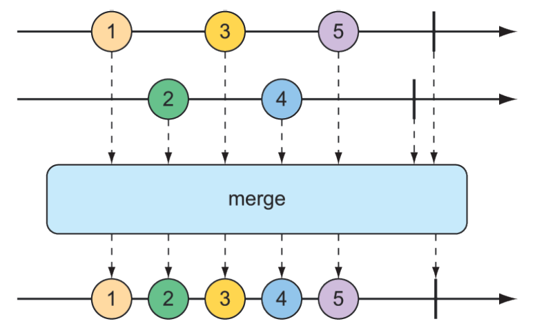
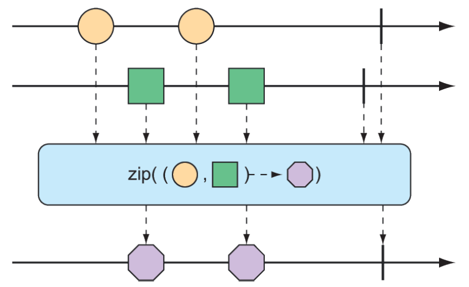
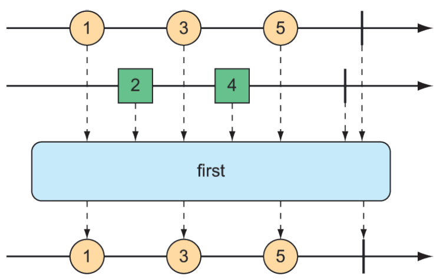

### 11.3.2 Combining reactive types

You may find yourself with two reactive types that you need to somehow merge together. Or, in other cases, you may need to split a Flux into more than one reactive type. In this section, we’ll examine operations that combine and split Reactor’s `Flux` and `Mono`.

#### MERGING REACTIVE TYPES

Suppose you have two `Flux` streams and need to create a single resulting `Flux` that will produce data as it becomes available from either of the upstream `Flux` streams. To merge one `Flux` with another, you can use the `mergeWith()` operation, as illustrated with the marble diagram in figure 11.6.


**Figure 11.6 Merging two `Flux` streams interleaves their messages into a new `Flux`.**

For example, suppose you have a `Flux` whose values are the names of TV and movie characters, and you have a second `Flux` whose values are the names of foods that those characters enjoy eating. The following test method shows how you could merge the two `Flux` objects with the `mergeWith()` method:

```java
@Test
public void mergeFluxes() {

  Flux<String> characterFlux = Flux
    .just("Garfield", "Kojak", "Barbossa")
    .delayElements(Duration.ofMillis(500));

  Flux<String> foodFlux = Flux
    .just("Lasagna", "Lollipops", "Apples")
    .delaySubscription(Duration.ofMillis(250))
    .delayElements(Duration.ofMillis(500));

  Flux<String> mergedFlux = characterFlux.mergeWith(foodFlux);

  StepVerifier.create(mergedFlux)
    .expectNext("Garfield")
    .expectNext("Lasagna")
    .expectNext("Kojak")
    .expectNext("Lollipops")
    .expectNext("Barbossa")
    .expectNext("Apples")
    .verifyComplete();
}
```

Normally, a `Flux` will publish data as quickly as it possibly can. Therefore, you use a `delayElements()` operation on both of the created `Flux` streams to slow them down a little—emitting an entry only every 500 ms. Furthermore, so that the food `Flux` starts streaming after the character Flux, you apply a `delaySubscription()` operation to the food `Flux` so that it won’t emit any data until 250 ms have passed following a subscription.

After merging the two `Flux` objects, a new merged `Flux` is created. When `StepVerifier` subscribes to the merged `Flux`, it will, in turn, subscribe to the two source `Flux` streams, starting the flow of data.

The order of items emitted from the merged `Flux` aligns with the timing of how they’re emitted from the sources. Because both `Flux` objects are set to emit at regular rates, the values will be interleaved through the merged `Flux`, resulting in a character, followed by a food, followed by a character, and so forth. If the timing of either `Flux` were to change, it’s possible that you might see two character items or two food items published one after the other.

Because `mergeWith()` can’t guarantee a perfect back and forth between its sources, you may want to consider the `zip()` operation instead. When two `Flux` objects are zipped together, it results in a new `Flux` that produces a tuple of items, where the tuple contains one item from each source Flux. Figure 11.7 illustrates how two Flux
objects can be zipped together.


**Figure 11.7 Zipping two `Flux` streams results in a `Flux` containing tuples of one element from each `Flux`.**

To see the zip() operation in action, consider the following test method, which zips the character Flux and the food Flux together:

```java
@Test
public void zipFluxes() {
  Flux<String> characterFlux = Flux
  .just("Garfield", "Kojak", "Barbossa");
  Flux<String> foodFlux = Flux
  .just("Lasagna", "Lollipops", "Apples");

  Flux<Tuple2<String, String>> zippedFlux =
  Flux.zip(characterFlux, foodFlux);

  StepVerifier.create(zippedFlux)
    .expectNextMatches(p ->
      p.getT1().equals("Garfield") &&
      p.getT2().equals("Lasagna"))
    .expectNextMatches(p ->
      p.getT1().equals("Kojak") &&
      p.getT2().equals("Lollipops"))
    .expectNextMatches(p ->
      p.getT1().equals("Barbossa") &&
      p.getT2().equals("Apples"))
    .verifyComplete();
}
```

Notice that unlike `mergeWith()`, the `zip()` operation is a static creation operation. The created `Flux` has a perfect alignment between characters and their favorite foods. Each item emitted from the zipped `Flux` is a `Tuple2` (a container object that carries two other objects) containing items from each source `Flux`, in the order that they’re published.

If you’d rather not work with a `Tuple2` and would rather work with some other type, you can provide a `Function` to `zip()` that produces any object you’d like, given the two items (as shown in the marble diagram in figure 11.8).


**Figure 11.8 An alternative form of the `zip()` operation results in a `Flux` of messages created from one element of each incoming `Flux`.**

For example, the following test method shows how to zip the character `Flux` with the food `Flux` so that it results in a `Flux` of `String` objects:

```java
@Test
public void zipFluxesToObject() {
  Flux<String> characterFlux = Flux
    .just("Garfield", "Kojak", "Barbossa");
  Flux<String> foodFlux = Flux
    .just("Lasagna", "Lollipops", "Apples");

  Flux<String> zippedFlux =
    Flux.zip(characterFlux, foodFlux, (c, f) -> c + " eats " + f);

  StepVerifier.create(zippedFlux)
    .expectNext("Garfield eats Lasagna")
    .expectNext("Kojak eats Lollipops")
    .expectNext("Barbossa eats Apples")
    .verifyComplete();
}
```

The `Function` given to `zip()` (given here as a lambda) simply concatenates the two items into a sentence to be emitted by the zipped `Flux`.

#### SELECTING THE FIRST REACTIVE TYPE TO PUBLISH

Suppose you have two `Flux` objects, and rather than merge them together, you merely want to create a new `Flux` that emits the values from the first `Flux` that produces a value. As shown in figure 11.9, the `firstWithSignal()` operation picks the first of two `Flux` objects and echoes the values it publishes.


**Figure 11.9 The first() operation chooses the first Flux to emit a message and thereafter produces messages only from that Flux.**

The following test method creates a fast Flux and a slow Flux (where “slow” means that it will not publish an item until 100 ms after subscription). Using firstWithSignal() it creates a new Flux that will publish values only from the first source Flux to publish a value.

```java
@Test
public void firstWithSignalFlux() {

  Flux<String> slowFlux = Flux.just("tortoise", "snail", "sloth")
      .delaySubscription(Duration.ofMillis(100));
  Flux<String> fastFlux = Flux.just("hare", "cheetah", "squirrel");

  Flux<String> firstFlux = Flux.firstWithSignal(slowFlux, fastFlux);

  StepVerifier.create(firstFlux)
    .expectNext("hare")
    .expectNext("cheetah")
    .expectNext("squirrel")
    .verifyComplete();
}
```

In this case, because the slow `Flux` won’t publish any values until 100 ms after the fast `Flux` has started publishing, the newly created `Flux` will simply ignore the slow `Flux` and publish values only from the fast `Flux`.
