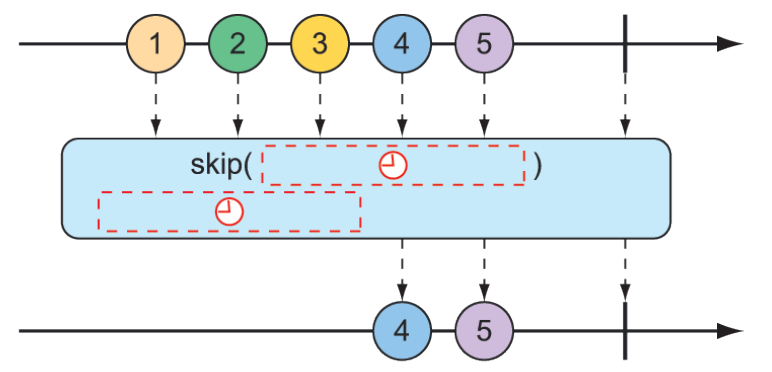
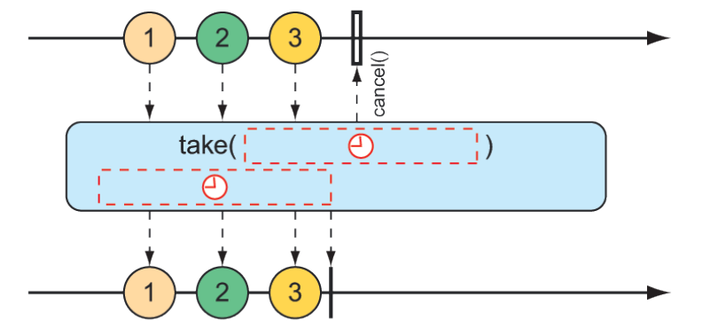
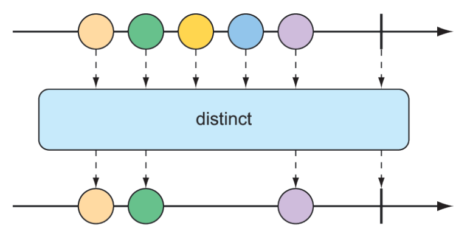
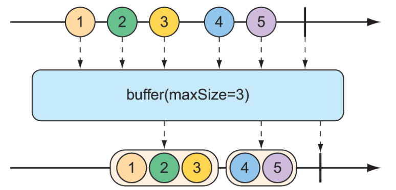

### 11.3.3 Transforming and filtering reactive streams

As data flows through a stream, you’ll likely need to filter out some values and modify other values. In this section, we’ll look at operations that transform and filter the data flowing through a reactive stream.

#### FILTERING DATA FROM REACTIVE TYPES

One of the most basic ways of filtering data as it flows from a `Flux` is to simply disregard the first so many entries. The `skip()` operation, illustrated in figure 11.10, does exactly that.


**Figure 11.10 The `skip()` operation skips a specified number of messages before passing the remaining messages on to the resulting `Flux`.**

Given a `Flux` with several entries, the `skip()` operation will create a new Flux that skips over a specified number of items before emitting the remaining items from the source `Flux`. The following test method shows how to use `skip()`:

```java
@Test
public void skipAFew() {
  Flux<String> countFlux = Flux.just(
    "one", "two", "skip a few", "ninety nine", "one hundred")
    .skip(3);

  StepVerifier.create(countFlux)
    .expectNext("ninety nine", "one hundred")
    .verifyComplete();
}
```

In this case, you have a `Flux` of five `String` items. Calling `skip(3)` on that `Flux` produces a new `Flux` that skips over the first three items and publishes only the last two items.

But maybe you don’t want to skip a specific number of items but instead need to skip the first so many items until some duration has passed. An alternate form of the `skip()` operation, illustrated in figure 11.11, produces a `Flux` that waits until some specified time has passed before emitting items from the source `Flux`.


**Figure 11.11 An alternative form of the `skip()` operation waits until some duration has passed before passing messages on to the resulting `Flux`.**

The test method that follows uses `skip()` to create a `Flux` that waits 4 seconds before emitting any values. Because that `Flux` was created from a `Flux` that has a 1-second delay between items (using `delayElements()`), only the last two items will be emitted.

```java
@Test
public void skipAFewSeconds() {
  Flux<String> countFlux = Flux.just(
    "one", "two", "skip a few", "ninety nine", "one hundred")
    .delayElements(Duration.ofSeconds(1))
    .skip(Duration.ofSeconds(4));

  StepVerifier.create(countFlux)
    .expectNext("ninety nine", "one hundred")
    .verifyComplete();
}
```

You’ve already seen an example of the `take()` operation, but in light of the `skip()` operation, `take()` can be thought of as the opposite of `skip()`. Whereas `skip()` skips the first few items, `take()` emits only the first so many items (as illustrated by the marble diagram in figure 11.12):

```java
@Test
public void take() {
  Flux<String> nationalParkFlux = Flux.just(
    "Yellowstone", "Yosemite", "Grand Canyon", "Zion", "Acadia")
    .take(3);
  StepVerifier.create(nationalParkFlux)
    .expectNext("Yellowstone", "Yosemite", "Grand Canyon")
    .verifyComplete();
}
```


**Figure 11.12 The `take()` operation passes only the first so many messages from the incoming `Flux` and then cancels the subscription.**

Like `skip()`, `take()` also has an alternative form that’s based on a duration rather than an item count. It will take and emit as many items as pass through the source `Flux` until some period of time has passed, after which the `Flux` completes. This is illustrated in figure 11.13.


**Figure 11.13 An alternative form of the `take()` operation passes messages on to the resulting `Flux` until some duration has passed.**

The following test method uses the alternative form of `take()` to emit as many items as it can in the first 3.5 seconds after subscription:

```java
@Test
public void takeForAwhile() {
  Flux<String> nationalParkFlux = Flux.just(
    "Yellowstone", "Yosemite", "Grand Canyon", "Zion", "Grand Teton")
    .delayElements(Duration.ofSeconds(1))
    .take(Duration.ofMillis(3500));

  StepVerifier.create(nationalParkFlux)
    .expectNext("Yellowstone", "Yosemite", "Grand Canyon")
    .verifyComplete();
}
```

The `skip()` and `take()` operations can be thought of as filter operations where the filter criteria are based on a count or a duration. For more general-purpose filtering of `Flux` values, you’ll find the `filter()` operation quite useful.

Given a `Predicate` that decides whether an item will pass through the `Flux`, the `filter()` operation lets you selectively publish based on whatever criteria you want. The marble diagram in figure 11.14 shows how `filter()` works.


**Figure 11.14 An incoming `Flux` can be filtered so that the resulting `Flux` receives only messages that match a given predicate.**

To see `filter()` in action, consider the following test method:

```java
@Test
public void filter() {
  Flux<String> nationalParkFlux = Flux.just(
    "Yellowstone", "Yosemite", "Grand Canyon", "Zion", "Grand Teton")
    .filter(np -> !np.contains(" "));

  StepVerifier.create(nationalParkFlux)
    .expectNext("Yellowstone", "Yosemite", "Zion")
    .verifyComplete();
}
```

Here, `filter()` is given a `Predicate` as a lambda that accepts only `String` values that don’t have any spaces. Consequently, `"Grand Canyon"` and `"Grand Teton"` are filtered out of the resulting `Flux`.

Perhaps the filtering you need is to filter out any items that you’ve already received. The `distinct()` operation, as illustrated in figure 11.15, results in a `Flux` that publishes only items from the source `Flux` that haven’t already been published.


**Figure 11.15 The `distinct()` operation filters out any duplicate messages.**

In the following test, only unique `String` values will be emitted from the distinct `Flux`:

```java
@Test
public void distinct() {
  Flux<String> animalFlux = Flux.just(
    "dog", "cat", "bird", "dog", "bird", "anteater")
    .distinct();

  StepVerifier.create(animalFlux)
    .expectNext("dog", "cat", "bird", "anteater")
    .verifyComplete();
}
```

Although `"dog"` and `"bird"` are each published twice from the source `Flux`, the distinct `Flux` publishes them only once.

#### MAPPING REACTIVE DATA

One of the most common operations you’ll use on either a `Flux` or a `Mono` is to transform published items to some other form or type. Reactor’s types offer `map()` and `flatMap()` operations for that purpose.

The `map()` operation creates a `Flux` that simply performs a transformation as prescribed by a given `Function` on each object it receives before republishing it. Figure 11.16 illustrates how the `map()` operation works.


**Figure 11.16 The `map()` operation performs a transformation of incoming messages into new messages on the resulting stream.**

In the following test method, a `Flux` of `String` values representing basketball players is mapped to a new `Flux` of `Player` objects:

```java
@Test
public void map() {
  Flux<Player> playerFlux = Flux
    .just("Michael Jordan", "Scottie Pippen", "Steve Kerr")
    .map(n -> {
      String[] split = n.split("\\s");
      return new Player(split[0], split[1]);
    });
  StepVerifier.create(playerFlux)
    .expectNext(new Player("Michael", "Jordan"))
    .expectNext(new Player("Scottie", "Pippen"))
    .expectNext(new Player("Steve", "Kerr"))
    .verifyComplete();
}

@Data
  private static class Player {
  private final String firstName;
  private final String lastName;
}
```

The `Functio`n given to `map()` (as a lambda) splits the incoming `String` at a space and uses the resulting `String` array to create a `Player` object. Although the `Flux` created with `just()` carried `String` objects, the Flux resulting from `map()` carries `Player` objects.

What’s important to understand about `map()` is that the mapping is performed synchronously, as each item is published by the source `Flux`. If you want to perform the mapping asynchronously, you should consider the `flatMap()` operation.

The `flatMap()` operation requires some thought and practice to acquire full proficiency. As shown in figure 11.17, instead of simply mapping one object to another, as in the case of `map()`, `flatMap()` maps each object to a new `Mono` or `Flux`. The results of the `Mono` or `Flux` are flattened into a new resulting `Flux`. When used along with `subscribeOn()`, `flatMap()` can unleash the asynchronous power of Reactor’s types.


**Figure 11.17 The flatMap() operation uses an intermediate Flux to perform a transformation, consequently allowing for asynchronous transformations.**

The following test method demonstrates the use of `flatMap()` and `subscribeOn()`:

```java
@Test
public void flatMap() {
  Flux<Player> playerFlux = Flux
    .just("Michael Jordan", "Scottie Pippen", "Steve Kerr")
    .flatMap(n -> Mono.just(n)
      .map(p -> {
        String[] split = p.split("\\s");
        return new Player(split[0], split[1]);
      })
      .subscribeOn(Schedulers.parallel())
    );

  List<Player> playerList = Arrays.asList(
    new Player("Michael", "Jordan"),
    new Player("Scottie", "Pippen"),
    new Player("Steve", "Kerr"));

  StepVerifier.create(playerFlux)
    .expectNextMatches(p -> playerList.contains(p))
    .expectNextMatches(p -> playerList.contains(p))
    .expectNextMatches(p -> playerList.contains(p))
    .verifyComplete();
}
```

Notice that flatMap() is given a lambda Function that transforms the incoming String into a Mono of type String. A map() operation is then applied to the Mono to transform the String into a Player. After the String is mapped to a Player on each internal Flux, they are published into a single Flux returned by flatMap(), thus completing the flattening of the results.

If you stopped right there, the resulting `Flux` would carry `Player` objects, produced synchronously in the same order as with the `map()` example. But the last thing you do with the `Mono` is call `subscribeOn()` to indicate that each subscription should take place in a parallel thread. Consequently, the mapping operations for multiple incoming `String` objects can be performed asynchronously and in parallel.

Although `subscribeOn()` is named similarly to `subscribe()`, they’re quite different. Whereas `subscribe()` is a verb, subscribing to a reactive flow and effectively kicking it off, `subscribeOn()` is more descriptive, specifying how a subscription should be handled concurrently. Reactor doesn’t force any particular concurrency model; it’s through `subscribeOn()` that you can specify the concurrency model, using one of the static methods from `Schedulers`, that you want to use. In this example, you used `parallel()`, which uses worker threads from a fixed pool (sized to the number of CPU cores). But `Schedulers` supports several concurrency models, such as those described in table 11.1.

**Table 11.1 Concurrency models for `Schedulers`**

| Schedulers method | Description |
| :--- | :--- |
| .immediate() | Executes the subscription in the current thread |
| .single() | Executes the subscription in a single, reusable thread. Reuses the same thread for all callers |
| .newSingle() | Executes the subscription in a per-call dedicated thread |
| .elastic() | Executes the subscription in a worker pulled from an unbounded, elastic pool. New worker threads are created as needed, and idle workers are disposed of (by default, after 60 seconds) |
| .parallel() | Executes the subscription in a worker pulled from a fixed-size pool, sized to the number of CPU cores. |

The upside to using `flatMap()` and `subscribeOn()` is that you can increase the throughput of the stream by splitting the work across multiple parallel threads. But because the work is being done in parallel, with no guarantees on which will finish first, there’s no way to know the order of items emitted in the resulting `Flux`. Therefore, `StepVerifier` is able to verify only that each item emitted exists in the expected list of `Player` objects and that there will be three such items before the `Flux` completes.

#### BUFFERING DATA ON A REACTIVE STREAM

In the course of processing the data flowing through a `Flux`, you might find it helpful to break the stream of data into bite-size chunks. The `buffer()` operation, shown in figure 11.18, can help with that.


**Figure 11.18 The `buffer()` operation results in a `Flux` of lists of a given maximum size that are collected from the incoming `Flux`.**

Given a `Flux` of `String` values, each containing the name of a fruit, you can create a new `Flux` of `List` collections, where each `List` has no more than a specified number of elements as follows:

```java
@Test
public void buffer() {
  Flux<String> fruitFlux = Flux.just(
    "apple", "orange", "banana", "kiwi", "strawberry");

  Flux<List<String>> bufferedFlux = fruitFlux.buffer(3);

  StepVerifier
    .create(bufferedFlux)
    .expectNext(Arrays.asList("apple", "orange", "banana"))
    .expectNext(Arrays.asList("kiwi", "strawberry"))
    .verifyComplete();
}
```

In this case, the `Flux` of `String` elements is buffered into a new `Flux` of `List` collections containing no more than three items each. Consequently, the original `Flux` that emits five `String` values will be converted to a `Flux` that emits two List collections, one containing three fruits and the other with two fruits.

So what? Buffering values from a reactive `Flux` into nonreactive `List` collections seems counterproductive. But when you combine `buffer()` with `flatMap()`, it enables each of the `List` collections to be processed in parallel, as shown next:

```java
@Test
public void bufferAndFlatMap() throws Exception {
  Flux.just(
    "apple", "orange", "banana", "kiwi", "strawberry")
    .buffer(3)
    .flatMap(x ->
      Flux.fromIterable(x)
        .map(y -> y.toUpperCase())
        .subscribeOn(Schedulers.parallel())
        .log()
    ).subscribe();
}
```

In this new example, you still buffer a `Flux` of five `String` values into a new `Flux` of `List` collections. But then you apply `flatMap()` to that `Flux` of `List` collections. This takes each `List` buffer and creates a new `Flux` from its elements, and then applies a `map()` operation on it. Consequently, each buffered `List` is further processed in parallel in individual threads.

To prove that it works, I’ve also included a `log()` operation to be applied to each sub-Flux. The `log()` operation simply logs all Reactive Streams events, so that you can see what’s really happening. As a result, the following entries are written to the log (with the time component removed for brevity’s sake):

```text
[main] INFO reactor.Flux.SubscribeOn.1 - onSubscribe(FluxSubscribeOn.SubscribeOnSubscriber)
[main] INFO reactor.Flux.SubscribeOn.1 - request(32)
[main] INFO reactor.Flux.SubscribeOn.2 - onSubscribe(FluxSubscribeOn.SubscribeOnSubscriber)
[main] INFO reactor.Flux.SubscribeOn.2 - request(32)
[parallel-1] INFO reactor.Flux.SubscribeOn.1 - onNext(APPLE)
[parallel-2] INFO reactor.Flux.SubscribeOn.2 - onNext(KIWI)
[parallel-1] INFO reactor.Flux.SubscribeOn.1 - onNext(ORANGE)
[parallel-2] INFO reactor.Flux.SubscribeOn.2 - onNext(STRAWBERRY)
[parallel-1] INFO reactor.Flux.SubscribeOn.1 - onNext(BANANA)
[parallel-1] INFO reactor.Flux.SubscribeOn.1 - onComplete()
[parallel-2] INFO reactor.Flux.SubscribeOn.2 - onComplete()
```

As the log entries clearly show, the fruits in the first buffer (apple, orange, and banana) are handled in the `parallel-1` thread. Meanwhile, the fruits in the second buffer (kiwi and strawberry) are processed in the `parallel-2` thread. As is apparent by the fact that the log entries from each buffer are woven together, the two buffers are processed in parallel.

If, for some reason, you need to collect everything that a `Flux` emits into a `List`, you can call `buffer()` with no arguments as follows:

```java
Flux<List<List>> bufferedFlux = fruitFlux.buffer();
```

This results in a new `Flux` that emits a `List` that contains all the items published by the source `Flux`. You can achieve the same thing with the `collectList()` operation, illustrated by the marble diagram in figure 11.19.


**Figure 11.19 The `collectList()` operation results in a `Mono` containing a list of all messages emitted by the incoming `Flux`.**

Rather than produce a `Flux` that publishes a `List`, `collectList()` produces a `Mono` that publishes a `List`. The following test method shows how it might be used:

```java
@Test
public void collectList() {
  Flux<String> fruitFlux = Flux.just(
    "apple", "orange", "banana", "kiwi", "strawberry");

  Mono<List<String>> fruitListMono = fruitFlux.collectList();

  StepVerifier
    .create(fruitListMono)
    .expectNext(Arrays.asList(
      "apple", "orange", "banana", "kiwi", "strawberry"))
    .verifyComplete();
}
```

An even more interesting way of collecting items emitted by a `Flux` is to collect them into a `Map`. As shown in figure 11.20, the `collectMap()` operation results in a `Mono` that publishes a Map that’s populated with entries whose key is calculated by a given `Function`.


**Figure 11.20 The `collectMap()` operation results in a `Mono` containing a map of messages emitted by the incoming `Flux`, where the key is derived from some characteristic of the incoming messages.**

To see `collectMap()` in action, have a look at the following test method:

```java
@Test
public void collectMap() {
  Flux<String> animalFlux = Flux.just(
    "aardvark", "elephant", "koala", "eagle", "kangaroo");

  Mono<Map<Character, String>> animalMapMono =
    animalFlux.collectMap(a -> a.charAt(0));

  StepVerifier
    .create(animalMapMono)
    .expectNextMatches(map -> {
      return
        map.size() == 3 &&
        map.get('a').equals("aardvark") &&
        map.get('e').equals("eagle") &&
        map.get('k').equals("kangaroo");
      })
    .verifyComplete();
}
```

The source `Flux` emits the names of a handful of animals. From that `Flux`, you use `collectMap()` to create a new `Mono` that emits a `Map`, where the key value is determined by the first letter of the animal name and the value is the animal name itself. In the event that two animal names start with the same letter (as with _elephant and eagle or koala and kangaroo_), the last entry flowing through the stream overrides any earlier entries.
