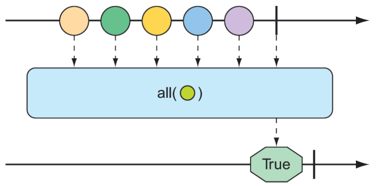

### 11.3.4 Performing logic operations on reactive types

Sometimes you just need to know if the entries published by a `Mono` or `Flux` match some criteria. The `all()` and `any()` operations perform such logic. Figures 11.21 and 11.22 illustrate how `all()` and `any()` work


**Figure 11.21 A `Flux` can be tested to ensure that all messages meet some condition with the `all()` operation.**


**Figure 11.22 A `Flux` can be tested to ensure that at least one message meets some condition with the `any()` operation.**

Suppose you want to know that every `String` published by a `Flux` contains the letter _a_ or the letter _k_. The following test shows how to use `all()` to check for that condition:

```java
@Test
public void all() {
  Flux<String> animalFlux = Flux.just(
    "aardvark", "elephant", "koala", "eagle", "kangaroo");

  Mono<Boolean> hasAMono = animalFlux.all(a -> a.contains("a"));
  StepVerifier.create(hasAMono)
    .expectNext(true)
    .verifyComplete();

  Mono<Boolean> hasKMono = animalFlux.all(a -> a.contains("k"));
  StepVerifier.create(hasKMono)
    .expectNext(false)
    .verifyComplete();
}
```

In the first `StepVerifier`, you check for the letter _a_. The all operation is applied to the source `Flux`, resulting in a `Mono` of type `Boolean`. In this case, all of the animal names contain the letter a, so true is emitted from the resulting `Mono`. But in the second `StepVerifier`, the resulting Mono will emit false because not all of the animal names contain a _k_.

Rather than perform an all-or-nothing check, maybe you’re satisfied if at least one entry matches. In that case, the `any()` operation is what you want. This new test case uses `any()` to check for the letters _t_ and _z_:

```java
@Test
public void any() {
  Flux<String> animalFlux = Flux.just(
    "aardvark", "elephant", "koala", "eagle", "kangaroo");

  Mono<Boolean> hasAMono = animalFlux.any(a -> a.contains("a"));

  StepVerifier.create(hasAMono)
    .expectNext(true)
    .verifyComplete();

  Mono<Boolean> hasZMono = animalFlux.any(a -> a.contains("z"));
  StepVerifier.create(hasZMono)
    .expectNext(false)
    .verifyComplete();
}
```

In the first `StepVerifier`, you see that the resulting `Mono` emits true, because at least
one animal name has the letter t (specifically, _elephant_). In the second case, the resulting `Mono` emits `false`, because none of the animal names contain _z_.
