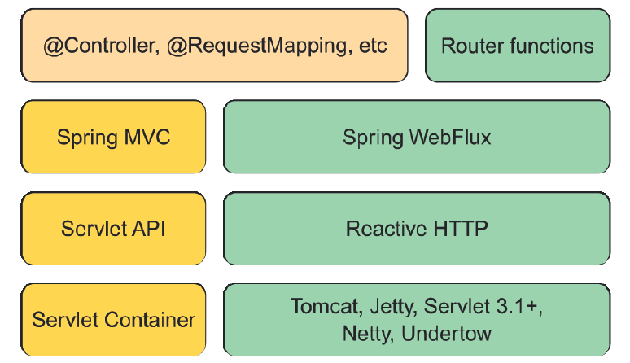

### 12.1.1 Introducing Spring WebFlux

As the Spring team was considering how to add a reactive programming model to the web layer, it quickly became apparent that it would be difficult to do so without a great deal of work in Spring MVC. That would involve branching code to decide whether or not to handle requests reactively. In essence, the result would be two web frameworks packaged as one, with if statements to separate the reactive from the nonreactive.

Instead of trying to shoehorn a reactive programming model into Spring MVC, the Spring team decided to create a separate reactive web framework, borrowing as much from Spring MVC as possible. Spring WebFlux is the result. Figure 12.2 illustrates the complete web development stack available in Spring.


**Figure 12.2 Spring supports reactive web applications with a new web framework called WebFlux, which is a sibling to Spring MVC and shares many of its core components.**

On the left side of figure 12.2, you see the Spring MVC stack that was introduced in version 2.5 of the Spring Framework. Spring MVC (covered in chapters 2 and 7) sits atop the Java Servlet API, which requires a servlet container (such as Tomcat) to execute on.

By contrast, Spring WebFlux (on the right side) doesn’t have ties to the Servlet API, so it builds on top of a Reactive HTTP API, which is a reactive approximation of the same functionality provided by the Servlet API. And because Spring WebFlux isn’t coupled to the Servlet API, it doesn’t require a servlet container to run on. Instead, it can run on any nonblocking web container including Netty, Undertow, Tomcat, Jetty, or any Servlet 3.1 or higher container.

What’s most noteworthy about figure 12.2 is the top-left box, which represents the components that are common between Spring MVC and Spring WebFlux, primarily the annotations used to define controllers. Because Spring MVC and Spring WebFlux share the same annotations, Spring WebFlux is, in many ways, indistinguishable from Spring MVC.

The box in the top-right corner represents an alternative programming model that defines controllers with a functional programming paradigm instead of using annotations. We’ll talk more about Spring’s functional web programming model in section 12.2.

The most significant difference between Spring MVC and Spring WebFlux boils down to which dependency you add to your build. When working with Spring WebFlux, you’ll need to add the Spring Boot WebFlux starter dependency instead of the standard web starter (e.g., `spring-boot-starter-web`). In the project’s pom.xml file, it looks like this:

```xml
<dependency>
  <groupId>org.springframework.boot</groupId>
  <artifactId>spring-boot-starter-webflux</artifactId>
</dependency>
```

> NOTE：As with most of Spring Boot’s starter dependencies, this starter can also be added to a project by checking the Reactive Web check box in the Initializr.

An interesting side effect of using WebFlux instead of Spring MVC is that the default embedded server for WebFlux is Netty instead of Tomcat. Netty is one of a handful of asynchronous, event-driven servers and is a natural fit for a reactive web framework like Spring WebFlux.

Aside from using a different starter dependency, Spring WebFlux controller methods usually accept and return reactive types, like `Mono` and `Flux`, instead of domain types and collections. Spring WebFlux controllers can also deal with RxJava types like `Observable`, `Single`, and `Completable`.

#### REACTIVE Spring MVC？

Although Spring WebFlux controllers typically return `Mono` and `Flux`, that doesn’t mean that Spring MVC doesn’t get to have some fun with reactive types. Spring MVC controller methods can also return a `Mono` or `Flux`, if you’d like.

The difference is in how those types are used. Whereas Spring WebFlux is a truly reactive web framework, allowing for requests to be handled in an event loop, Spring MVC is servlet-based, relying on multithreading to handle multiple requests.

Let’s put Spring WebFlux to work by rewriting some of Taco Cloud’s API controllers to take advantage of Spring WebFlux.
