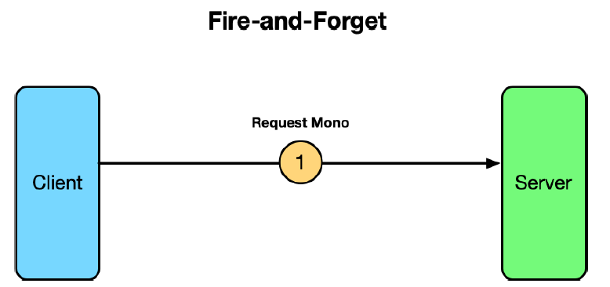

## 14.1 Introducing RSocket

RSocket [https://rsocket.io/](https://rsocket.io/) is a binary application protocol that is asynchronous and based on Reactive Streams. Put another way, RSocket offers asynchronous communication between applications that supports a reactive model consistent with reactive types like Flux and Mono that we learned about in chapter 12.

As an alternative to HTTP-based communication, it is more flexible, providing four distinct communication models: request-response, request-stream, fire-and-forget, and channel.

Request-response is the most familiar communication model from RSocket, mimicking how typical HTTP communication works. In the request-response model, a client issues a single request to the server, and the server responds with a single response. This is illustrated in figure 14.1, using Reactor’s Mono type to define the request and response.

**Figure 14.1 RSocket’s request-response communication model**

Although the request-response model may appear to be equivalent to the communication model offered by HTTP, it’s important to understand that RSocket is fundamentally nonblocking and based on reactive types. Although the client will still wait for a reply from the server, under the covers everything is nonblocking and reactive, making more efficient use of threads.

The _request-stream_ communication model is similar to request-response, except that after the client has sent a single request to the server, the server responds with a stream of zero-to-many values in a stream. Figure 14.2 illustrates the request-stream model using Mono for the request and Flux for the response.

**Figure 14.2  RSocket’s request-stream communication model**

In some cases, the client may need to send data to the server but doesn’t need a response. RSocket provides the fire-and-forget model for those situations, as illustrated in figure 14.3.

**Figure 14.3 RSocket’s fire-and-forget communication mode**

In the fire-and-forget model, a client sends a request to the server, but the server doesn’t send a response back.

Finally, the most flexible of RSocket’s communication models is the channel model. In the channel model, the client opens a bidirectional channel with the server, and each can send data to the other at any time. Figure 14.4 illustrates the channel communication style.

**Figure 14.4 RSocket’s channel communication model**

RSocket is supported on a variety of languages and platforms, including Java, JavaScript, Kotlin, .NET, Go, and C++. Recent versions of Spring offer first-class support for RSocket, making it easy to create servers and clients using familiar Spring idioms.

Let’s dive in and see how to create RSocket servers and clients that work with each of the four communication models.
