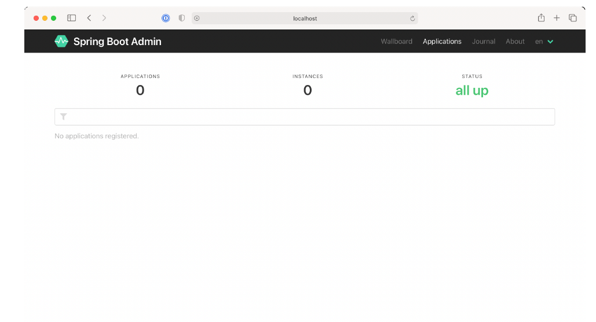

### 16.1.1 Creating an Admin server

To enable the Admin server, you’ll first need to create a new Spring Boot application and add the Admin server dependency to the project’s build. The Admin server is generally used as a standalone application, separate from any other application. Therefore, the easiest way to get started is to use the Spring Boot Initializr to create a new Spring Boot project and select the check box labeled Spring Boot Admin (Server). This results in the following dependency being included in the `<dependencies>` block:

```xml
<dependency>
  <groupId>de.codecentric</groupId>
  <artifactId>spring-boot-admin-starter-server</artifactId>
</dependency>
```

Next, you’ll need to enable the Admin server by annotating the main configuration class with `@EnableAdminServer` as shown here:

```java
package tacos.bootadmin;
import org.springframework.boot.SpringApplication;
import org.springframework.boot.autoconfigure.SpringBootApplication;
import de.codecentric.boot.admin.server.config.EnableAdminServer;

@SpringBootApplication
@EnableAdminServer
public class BootAdminServerApplication {
  public static void main(String[] args) {
    SpringApplication.run(BootAdminServerApplication.class, args);
  }
}
```

Finally, because the Admin server won’t be the only application running locally as it’s developed, you should set it to listen in on a unique port, but one you can easily access (not port 0, for example). Here, I’ve chosen port 9090 as the port for the Spring Boot Admin server:

```yaml
server:
  port: 9090
```

Now your Admin server is ready. If you were to fire it up at this point and navigate to http://localhost:9090 in your web browser, you’d see something like what’s shown in figure 16.2.



**Figure 16.2 A newly created server displayed in the Spring Boot Admin UI. No applications are registered yet.** <br/>

As you can see, the Spring Boot Admin shows that zero instances of zero applications are all up. But that’s meaningless information when you consider the message below those counts that states No Applications Registered. For the Admin server to be useful, you’ll need to register some applications with it.

