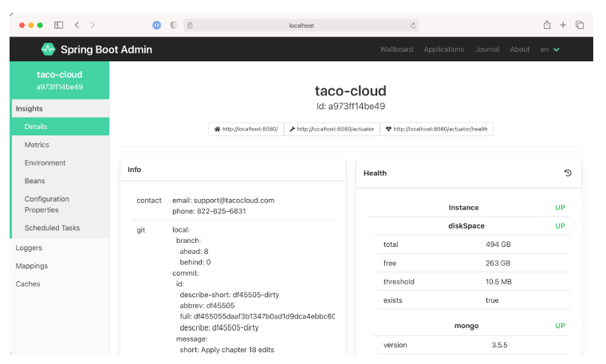

### 16.2.1 Viewing general application health and information

As discussed in section 15, some of the most basic information provided by the Actuator is health and general application information via the /health and /info endpoints.
The Admin server displays that information under the Details menu item as shown in
figure 16.4.

**Figure 16.4 The Details screen of the Spring Boot Admin UI displays general health and information about an application.**

If you scroll past the Health and Info sections in the Details screen, you’ll find useful
statistics from the application’s JVM, including graphs displaying memory, thread, and
processor usage (see figure 16.5).

**Figure 16.5 As you scroll down on the Details screen, you can view additional JVM internal information, including processor, thread, and memory statistics.**

The information displayed in the graphs, as well as the metrics under Processes
and Garbage Collection Pauses, can provide useful insights into how your application
uses JVM resources.
