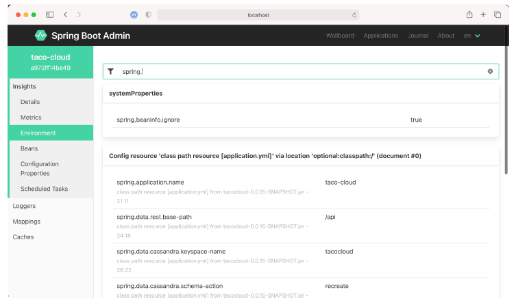

### 16.2.3 Examining environment properties

The Actuator’s /env endpoint returns all environment properties available to a Spring Boot application from all of its property sources. And although the JSON response from the endpoint isn’t all that difficult to read, the Admin server presents it in a much more aesthetically pleasing form under the Environment menu item, shown in figure 16.7.

**Figure 16.7 The Environment screen displays environment properties and includes options to override and filter those values.**

Because there can be hundreds of properties, you can filter the list of available properties by either property name or value. Figure 16.7 shows properties filtered by those whose name and/or values contain the text `"spring."`. The Admin server also allows you to set or override environment properties using the form under the Environment Manager header.
