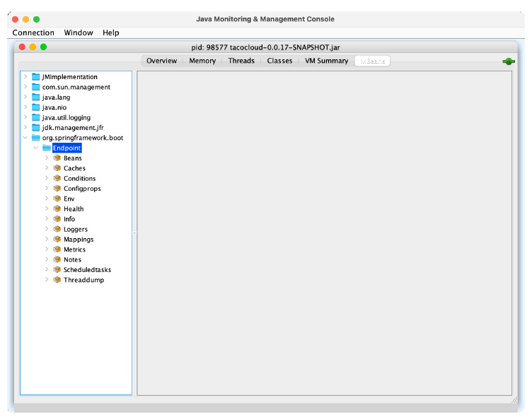
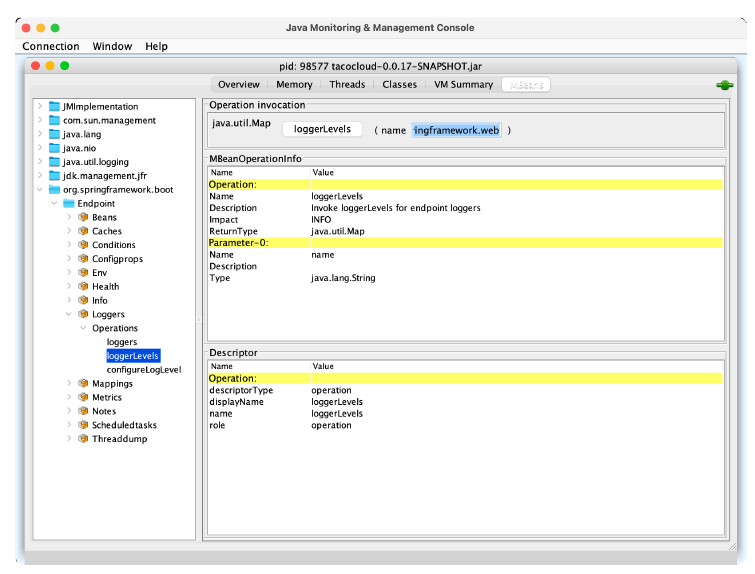
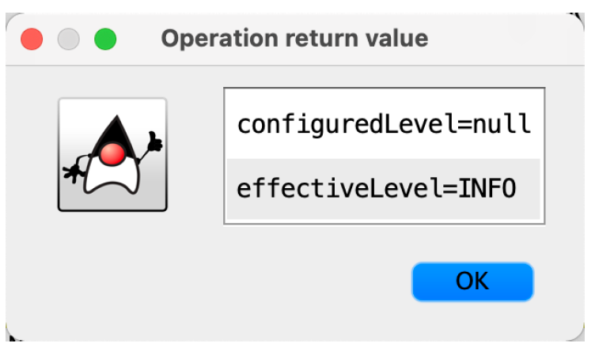

## 17.1 Working with Actuator MBeans

By default, all Actuator endpoints are exposed as MBeans. But, starting with Spring Boot 2.2, JMX itself is disabled by default. To enable JMX in your Spring Boot application, you can set `spring.jmx.enabled` to `true`. In application.yml, this would look like this:

```yaml
spring:
  jmx:
    enabled: true
```

With that property set, Spring support for JMX is enabled. And with it, the Actuator endpoints are all exposed as MBeans. You can use any JMX client you wish to connect with Actuator endpoint MBeans. Using JConsole, which comes with the Java Development Kit, you’ll find Actuator MBeans listed under the `org.springframework.boot` domain, as shown in figure 17.1.



**Figure 17.1 Actuator endpoints are automatically exposed as JMX MBeans** <br/>

One thing that’s nice about Actuator MBean endpoints is that they’re all exposed by default. There’s no need to explicitly include any of them, as you had to do with HTTP. You can, however, choose to narrow down the choices by setting `management.endpoints.jmx.exposure.include` and `management.endpoints.jmx.exposure.exclude`. For example, to limit Actuator endpoint MBeans to only the /health, /info, /bean, and /conditions endpoints, set `management.endpoints.jmx.exposure.include` like this:
.

```yaml
management:
  endpoints:
    jmx:
      exposure:
        include: health,info,bean,conditions
```

Or, if there are only a few you want to exclude, you can set `management.endpoints.jmx.exposure.exclude` like this:

```yaml
management:
  endpoints:
    jmx:
      exposure:
        exclude: env,metrics
```

Here, you use `management.endpoints.jmx.exposure.exclude` to exclude the /env and /metrics endpoints. All other Actuator endpoints will still be exposed as MBeans.

To invoke the managed operations on one of the Actuator MBeans in JConsole, expand the endpoint MBean in the left-hand tree, and then select the desired operation under Operations.

For example, if you’d like to inspect the logging levels for the `tacos.ingredients` package, expand the `Loggers` MBean and click on the operation named `loggerLevels`, as shown in figure 17.2. In the form at the top right, fill in the Name field with the package name (`org.springframework.web`, for example), and then click the `loggerLevels` button.



**Figure 17.2 Using JConsole to display logging levels from a Spring Boot application** <br/>

After you click the `loggerLevels` button, a dialog box will pop up, showing you the response from the /loggers endpoint MBean. It might look a little like figure 17.3.



**Listing 17.3 An MBean that counts how many tacos have been created** <br/>

Although the JConsole UI is a bit clumsy to work with, you should be able to get the hang of it and use it to explore any Actuator endpoint in much the same way. If you don’t like JConsole, that’s fine—there are plenty of other JMX clients to choose from.

