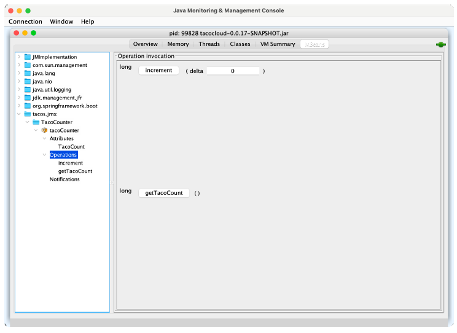

## 17.2 Creating your own MBeans

Spring makes it easy to expose any bean you want as a JMX MBean. All you must do is
annotate the bean class with @ManagedResource and then annotate any methods or
properties with @ManagedOperation or @ManagedAttribute. Spring will take care of
the rest.

For example, suppose you want to provide an MBean that tracks how many tacos
have been ordered through Taco Cloud. You can define a service bean that keeps a
running count of how many tacos have been created. The following listing shows what
such a service might look like.

**Figure 17.1 Actuator endpoints are automatically exposed as JMX MBeans**

```java
package tacos.jmx;
import java.util.concurrent.atomic.AtomicLong;
import org.springframework.data.rest.core.event.AbstractRepositoryEventListener;
import org.springframework.jmx.export.annotation.ManagedAttribute;
import org.springframework.jmx.export.annotation.ManagedOperation;
import org.springframework.jmx.export.annotation.ManagedResource;
import org.springframework.stereotype.Service;
import tacos.Taco;
import tacos.data.TacoRepository;

@Service
@ManagedResource
public class TacoCounter
              extends AbstractRepositoryEventListener<Taco> {

  private AtomicLong counter;
  public TacoCounter(TacoRepository tacoRepo) {
    tacoRepo
        .count()
        .subscribe(initialCount -> {
          this.counter = new AtomicLong(initialCount);
        });
  }

  @Override
  protected void onAfterCreate(Taco entity) {
    counter.incrementAndGet();
  }

  @ManagedAttribute
  public long getTacoCount() {
    return counter.get();
  }

  @ManagedOperation
  public long increment(long delta) {
    return counter.addAndGet(delta);
  }
}
```

The `TacoCounter` class is annotated with `@Service` so that it will be picked up by component scanning and an instance will be registered as a bean in the Spring application context. But it’s also annotated with `@ManagedResource` to indicate that this bean should also be an MBean. As an MBean, it will expose one attribute and one operation. The getTacoCount() method is annotated with `@ManagedAttribute` so that it will be exposed as an MBean attribute, whereas the increment() method is annotated with `@ManagedOperation`, exposing it as an MBean operation. Figure 17.4 shows how the `TacoCounter` MBean appears in JConsole.

**Figure 17.4 TacoCounter'S operations and attributes as seen in JConsole**

Working with MBean operations and attributes is largely a pull operation. That is, even if the value of an MBean attribute changes, you won’t know until you view the attribute through a JMX client. Let’s turn the tables and see how you can push notifications from an MBean to a JMX client.
