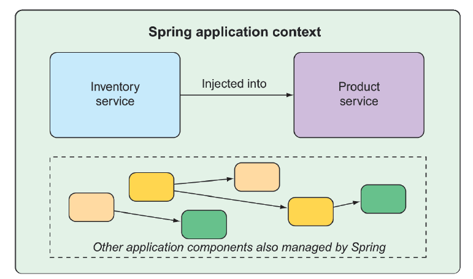

## 1.1 Spring là gì?

Tôi biết bạn có lẽ đang nóng lòng muốn bắt đầu viết một ứng dụng Spring, và tôi đảm bảo rằng trước khi chương này kết thúc, bạn sẽ phát triển được một ứng dụng đơn giản. Nhưng trước hết, hãy bắt đầu với một vài khái niệm cơ bản về Spring để giúp bạn hiểu điều gì tạo nên sức mạnh của Spring.

Bất kỳ ứng dụng không tầm thường nào cũng bao gồm nhiều thành phần, mỗi thành phần chịu trách nhiệm cho một phần chức năng riêng trong toàn bộ ứng dụng, và phối hợp với các thành phần khác để hoàn thành công việc. Khi ứng dụng chạy, các thành phần đó cần được tạo ra và kết nối với nhau bằng cách nào đó.

Cốt lõi của Spring cung cấp một _container_, thường được gọi là _Spring application context_, dùng để tạo và quản lý các thành phần của ứng dụng. Các thành phần này, gọi là _bean_, được liên kết với nhau bên trong Spring application context để tạo nên một ứng dụng hoàn chỉnh, giống như gạch, xi măng, gỗ, đinh, ống nước và hệ thống dây điện được kết hợp lại để tạo thành một ngôi nhà.

Hành động liên kết các bean với nhau dựa trên một mẫu thiết kế gọi là _dependency injection_ (DI - tiêm phụ thuộc). Thay vì để các thành phần tự tạo và quản lý vòng đời của các bean mà chúng phụ thuộc vào, một ứng dụng sử dụng dependency injection sẽ dựa vào một thực thể riêng biệt (container) để tạo và duy trì tất cả các thành phần, sau đó tiêm chúng vào các bean cần sử dụng. Điều này thường được thực hiện thông qua các tham số constructor hoặc phương thức thiết lập thuộc tính.

Ví dụ, giả sử trong số nhiều thành phần của một ứng dụng, bạn sẽ sử dụng hai thành phần: một dịch vụ kiểm kê (để lấy số lượng hàng tồn kho) và một dịch vụ sản phẩm (để cung cấp thông tin cơ bản về sản phẩm). Dịch vụ sản phẩm phụ thuộc vào dịch vụ kiểm kê để có thể cung cấp bộ thông tin đầy đủ về sản phẩm. Hình 1.1 minh họa mối quan hệ giữa các bean này và Spring application context.


**Hình 1.1 Các thành phần ứng dụng được Spring application context quản lý và tiêm vào nhau.**

Ngoài container cốt lõi, Spring và toàn bộ hệ sinh thái thư viện liên quan còn cung cấp framework web, nhiều lựa chọn lưu trữ dữ liệu, framework bảo mật, tích hợp hệ thống, theo dõi runtime, hỗ trợ microservice, mô hình lập trình reactive, và nhiều tính năng cần thiết cho phát triển ứng dụng hiện đại.

Trước đây, cách bạn hướng dẫn Spring application context liên kết các bean với nhau là thông qua một hoặc nhiều file XML mô tả các thành phần và mối quan hệ giữa chúng.

Ví dụ, đoạn mã XML sau khai báo hai bean, một bean `InventoryService` và một bean `ProductService`, và liên kết `InventoryService` vào `ProductService` qua một tham số constructor:

```xml
<bean id="inventoryService"
      class="com.example.InventoryService" />

<bean id="productService"
      class="com.example.ProductService" />
  <constructor-arg ref="inventoryService" />
</bean>
```

Tuy nhiên, trong các phiên bản Spring gần đây, cấu hình dựa trên Java là phổ biến hơn. Lớp cấu hình dựa trên Java dưới đây tương đương với cấu hình XML ở trên:

```java
@Configuration
public class ServiceConfiguration {
  @Bean
  public InventoryService inventoryService() {
    return new InventoryService();
  }
  @Bean

  public ProductService productService() {
    return new ProductService(inventoryService());
  }
}
```

Annotation `@Configuration` cho Spring biết rằng đây là một lớp cấu hình sẽ cung cấp các bean cho Spring application context.

Các phương thức trong lớp cấu hình được đánh dấu bằng `@Bean`, nghĩa là các đối tượng mà chúng trả về sẽ được thêm vào application context như các bean (mặc định, ID của bean sẽ giống với tên của phương thức định nghĩa chúng).

Cấu hình dựa trên Java mang lại một số lợi ích so với cấu hình bằng XML, bao gồm tính an toàn kiểu cao hơn và khả năng tái cấu trúc tốt hơn. Tuy nhiên, việc cấu hình tường minh bằng Java hoặc XML chỉ thực sự cần thiết nếu Spring không thể tự động cấu hình các thành phần.

Tự động cấu hình bắt nguồn từ các kỹ thuật trong Spring được gọi là _autowiring_ và _component scanning_. Với component scanning, Spring có thể tự động phát hiện các thành phần từ classpath của ứng dụng và tạo chúng thành các bean trong Spring application context. Với autowiring, Spring tự động tiêm các bean mà thành phần đó phụ thuộc vào.

Gần đây hơn, với sự ra đời của Spring Boot, khả năng tự động cấu hình đã vượt xa component scanning và autowiring. Spring Boot là một phần mở rộng của Spring Framework, cung cấp nhiều cải tiến giúp tăng năng suất. Cải tiến nổi bật nhất là _autoconfiguration_, trong đó Spring Boot có thể đưa ra các giả định hợp lý về những thành phần cần được cấu hình và kết nối với nhau, dựa trên các mục trong classpath, biến môi trường và các yếu tố khác.

Tôi muốn cho bạn xem một đoạn mã ví dụ để minh họa autoconfiguration, nhưng tôi không thể. Autoconfiguration giống như gió — bạn chỉ thấy tác động của nó, chứ không thể chỉ vào một đoạn mã và nói “Nhìn này! Đây là ví dụ về autoconfiguration!”. Mọi thứ diễn ra, các thành phần được kích hoạt, và chức năng được cung cấp mà không cần viết mã. Chính việc không cần mã này là điểm cốt lõi của autoconfiguration và là điều khiến nó trở nên tuyệt vời.

Spring Boot autoconfiguration đã giúp giảm đáng kể lượng cấu hình tường minh (dù là bằng XML hay Java) cần thiết để xây dựng một ứng dụng. Thực tế, khi bạn hoàn thành ví dụ trong chương này, bạn sẽ có một ứng dụng Spring hoạt động với chỉ một dòng cấu hình Spring

Spring Boot hỗ trợ phát triển với Spring hiệu quả đến mức thật khó tưởng tượng việc xây dựng ứng dụng Spring mà không có nó. Vì lý do đó, cuốn sách này xem Spring và Spring Boot như là một. Chúng ta sẽ sử dụng Spring Boot càng nhiều càng tốt, và chỉ cấu hình tường minh khi thật sự cần thiết. Và bởi vì cấu hình bằng XML là cách làm kiểu cũ trong Spring, nên chúng ta sẽ chủ yếu tập trung vào cấu hình bằng Java.

Nhưng đủ rồi, không nói chuyện dài dòng nữa. Tiêu đề cuốn sách này có cụm từ _in action_, vậy nên hãy bắt đầu hành động, để bạn có thể bắt đầu viết ứng dụng Spring đầu tiên của mình.
