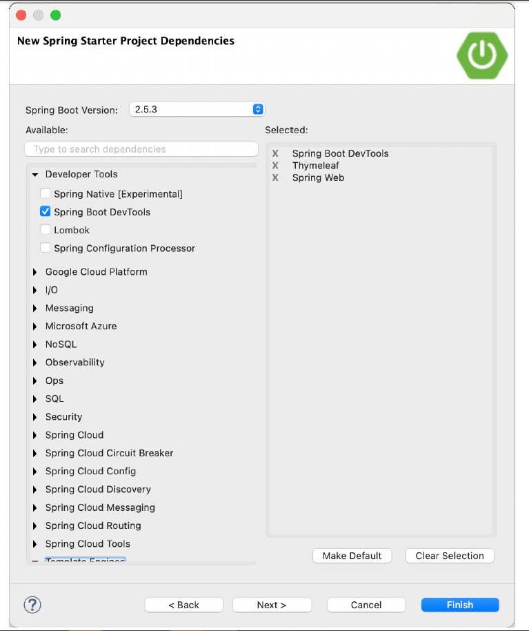
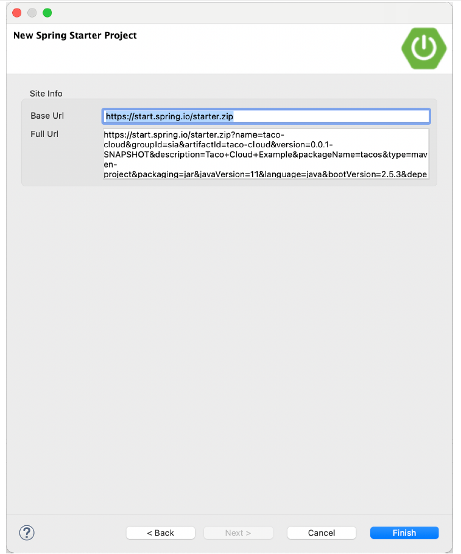

### 1.2.1 Khởi tạo dự án Spring với Spring Tool Suite

Để bắt đầu với một dự án Spring mới trong Spring Tool Suite, hãy vào menu File và chọn New, sau đó chọn Spring Starter Project.Hình 1.2 cho thấy cấu trúc menu cần tìm.

**Hình 1.2 Bắt đầu một dự án mới với Initializr trong Spring Tool Suite**  

Khi bạn chọn Dự án Spring Starter, một hộp thoại trình hướng dẫn dự án mới (hình 1.3) sẽ xuất hiện. Trang đầu tiên trong trình hướng dẫn yêu cầu bạn cung cấp một số thông tin chung về dự án, chẳng hạn như tên dự án, mô tả và các thông tin cần thiết khác. Nếu bạn đã quen thuộc với nội dung của tệp Maven pom.xml, bạn sẽ nhận ra hầu hết các trường là các mục kết thúc trong đặc tả bản dựng Maven. Đối với ứng dụng Taco Cloud, điền vào hộp thoại như trong hình 1.3, sau đó nhấp vào Tiếp theo.

**Hình 1.3 Chỉ định thông tin chung của dự án cho ứng dụng Taco Cloud**  

Trang tiếp theo trong trình hướng dẫn cho phép bạn chọn các phụ thuộc để thêm vào dự án của mình (xem hình 1.4). Lưu ý rằng gần đầu hộp thoại, bạn có thể chọn phiên bản Spring Boot bạn muốn làm cơ sở cho dự án của mình. Phiên bản này mặc định là phiên bản mới nhất hiện có. Nói chung, bạn nên để nguyên như vậy trừ khi bạn cần nhắm mục tiêu một phiên bản khác.

Đối với các phụ thuộc, bạn có thể mở rộng các phần khác nhau và tìm kiếm các phụ thuộc mong muốn theo cách thủ công hoặc tìm kiếm chúng trong hộp tìm kiếm ở đầu danh sách Có sẵn. Đối với ứng dụng Taco Cloud, bạn sẽ bắt đầu với các phụ thuộc được hiển thị trong hình 1.4.

**Hình 1.4 Chọn phụ thuộc khởi động**  

Tại thời điểm này, bạn có thể nhấp vào Hoàn tất để tạo dự án và thêm nó vào không gian làm việc của bạn. Nhưng nếu bạn cảm thấy hơi phiêu lưu, hãy nhấp vào Tiếp theo một lần nữa để xem trang cuối cùng của trình hướng dẫn dự án khởi động mới, như thể hiện trong hình 1.5.

**Hình 1.5 Tùy chọn chỉ định một địa chỉ Initializr thay thế**  

Theo mặc định, trình hướng dẫn dự án mới thực hiện cuộc gọi đến Spring Initializr [tại](http://start.spring.io) <http://start.spring.io> để tạo dự án. Nói chung, không cần phải ghi đè mặc định này, đó là lý do tại sao bạn có thể nhấp vào Kết thúc trên trang thứ hai của trình hướng dẫn. Nhưng nếu vì lý do nào đó bạn đang lưu trữ bản sao Initializr của riêng mình (có thể là bản sao cục bộ trên máy của riêng bạn hoặc bản sao tùy chỉnh chạy bên trong tường lửa của công ty bạn), thì bạn sẽ muốn thay đổi trường URL cơ sở để trỏ đến phiên bản Initializr của mình trước khi nhấp vào Hoàn tất.

Sau khi bạn nhấp vào Kết thúc, dự án sẽ được tải xuống từ Initializr và tải vào không gian làm việc của bạn. Đợi một vài phút để nó tải và xây dựng, và sau đó bạn sẽ sẵn sàng để bắt đầu phát triển chức năng ứng dụng. Nhưng trước tiên, chúng ta hãy xem Initializr đã cung cấp cho bạn những gì.
