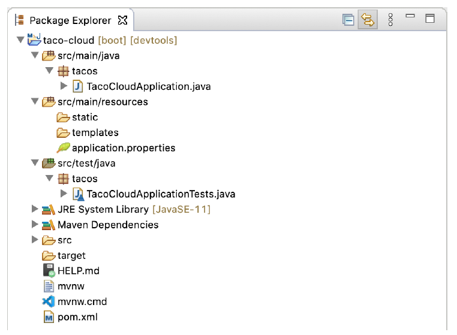

### 1.2.2 Kiểm tra cấu trúc dự án Mùa xuân

Sau khi dự án tải trong iDE, hãy mở rộng nó để xem nó chứa những gì.Hình 1.6 cho thấy dự án Taco Cloud mở rộng trong Spring Tool Suite.


**Hình 1.6 Cấu trúc dự án Spring ban đầu như trong Spring Tool Suite**

Bạn có thể nhận ra đây là cấu trúc dự án Maven hoặc Gradle điển hình, trong đó mã nguồn ứng dụng được đặt trong src/main/java, mã kiểm tra được đặt trong src/test/java và các tài nguyên không phải Java được đặt trong src/main/resources. Trong cấu trúc dự án đó, bạn sẽ muốn lưu ý các mục sau:

* `mvnw` và mvnw.cmd `-` Đây là các tập lệnh bao bọc Maven. Bạn có thể sử dụng các tập lệnh này để xây dựng dự án của mình, ngay cả khi bạn không cài đặt Maven trên máy của mình.
* `pom.xml` — Đây là thông số kỹ thuật của bản dựng Maven. Chúng ta sẽ tìm hiểu sâu hơn về vấn đề này sau.
* `TacoCloudApplication.java` — Đây là lớp chính của Spring Boot khởi động dự án. Chúng ta sẽ xem xét kỹ hơn về lớp học này trong giây lát.
* `application.properties` — Tệp này ban đầu trống nhưng cung cấp nơi bạn có thể chỉ định các thuộc tính cấu hình. Chúng ta sẽ chỉnh sửa tệp này một chút trong chương này, nhưng tôi sẽ hoãn giải thích chi tiết về các thuộc tính cấu hình sang chương 6.
* `static` — Thư mục này là nơi bạn có thể đặt bất kỳ nội dung tĩnh nào (hình ảnh, bảng định kiểu, JavaScript, v.v.) mà bạn muốn phục vụ cho trình duyệt. Ban đầu nó trống.
* `mẫu` — Thư mục này là nơi bạn sẽ đặt các tệp mẫu sẽ được sử dụng để hiển thị nội dung cho trình duyệt. Ban đầu nó trống, nhưng bạn sẽ sớm thêm một mẫu Thymeleaf.
* `TacoCloudApplicationTests.java` — Đây là một lớp thử nghiệm đơn giản đảm bảo rằng bối cảnh ứng dụng Spring được tải thành công. Bạn sẽ thêm các bài kiểm tra khác vào hỗn hợp khi bạn phát triển ứng dụng.

Khi ứng dụng Taco Cloud phát triển, bạn sẽ điền vào cấu trúc dự án xương trần này bằng mã Java, hình ảnh, biểu định kiểu, thử nghiệm và các tài sản thế chấp khác sẽ giúp dự án của bạn hoàn thiện hơn. Nhưng trong thời gian chờ đợi, chúng ta hãy tìm hiểu sâu hơn một chút về một số mặt hàng mà Spring Initializr cung cấp.

#### KHÁM PHÁ ĐẶC ĐIỂM KỸ THUẬT CỦA BẢN DỰNG

Khi bạn điền vào biểu mẫu Initializr, bạn đã chỉ định rằng dự án của bạn nên được xây dựng với Maven. Do đó, Spring Initializr đã cung cấp cho bạn một tệp pom.xml đã được điền với các lựa chọn bạn đã thực hiện. Danh sách sau đây hiển thị toàn bộ tệp pom.xml do Initializr cung cấp

**Nhà/phòng cho thuê 1.1 Đặc điểm kỹ thuật ban đầu của bản dựng Maven**

```xml
<?xml version="1.0" encoding="UTF-8"?>
<project xmlns="http://maven.apache.org/POM/4.0.0"
  xmlns:xsi="http://www.w3.org/2001/XMLSchema-instance"
  xsi:schemaLocation="http://maven.apache.org/POM/4.0.0
    https://maven.apache.org/xsd/maven-4.0.0.xsd">
  <modelVersion>4.0.0</modelVersion>
  <parent>
    <groupId>org.springframework.boot</groupId>
    <artifactId>spring-boot-starter-parent</artifactId>
    <version>2.5.3</version>
    <relativePath />
  </parent>
  <groupId>sia</groupId>
  <artifactId>taco-cloud</artifactId>
  <version>0.0.1-SNAPSHOT</version>
  <name>taco-cloud</name>
  <description>Taco Cloud Example</description>

  <properties>
    <java.version>11</java.version>
  </properties>

  <dependencies>
    <dependency>
      <groupId>org.springframework.boot</groupId>
      <artifactId>spring-boot-starter-thymeleaf</artifactId>
    </dependency>

    <dependency>
      <groupId>org.springframework.boot</groupId>
      <artifactId>spring-boot-starter-web</artifactId>
    </dependency>

    <dependency>
      <groupId>org.springframework.boot</groupId>
      <artifactId>spring-boot-devtools</artifactId>
      <scope>runtime</scope>
      <optional>true</optional>
    </dependency>

    <dependency>
      <groupId>org.springframework.boot</groupId>
      <artifactId>spring-boot-starter-test</artifactId>
      <scope>test</scope>
      <exclusions>
        <exclusion>
          <groupId>org.junit.vintage</groupId>
          <artifactId>junit-vintage-engine</artifactId>
        </exclusion>
      </exclusions>
    </dependency>

  </dependencies>

  <build>
    <plugins>
      <plugin>
        <groupId>org.springframework.boot</groupId>
        <artifactId>spring-boot-maven-plugin</artifactId>
      </plugin>
    </plugins>
  </build>

  <repositories>
    <repository>
      <id>spring-milestones</id>
      <name>Spring Milestones</name>
      <url>https://repo.spring.io/milestone</url>
    </repository>
  </repositories>
  <pluginRepositories>
    <pluginRepository>
      <id>spring-milestones</id>
      <name>Spring Milestones</name>
      <url>https://repo.spring.io/milestone</url>
    </pluginRepository>
  </pluginRepositories>
</project>
```

Điều đầu tiên cần lưu ý là `<parent>` yếu tố và cụ thể hơn là `<version>` con của nó. Điều này chỉ định rằng dự án của bạn có cha `mẹ` khởi nghiệp là POM mẹ của nó. Trong số những thứ khác, POM mẹ này cung cấp quản lý phụ thuộc cho một số thư viện thường được sử dụng trong các dự án Spring. Đối với những thư viện được bao phủ bởi POM mẹ, bạn sẽ không phải chỉ định một phiên bản, bởi vì nó được kế thừa từ thư viện mẹ. Phiên bản, 2.5.6, chỉ ra rằng bạn đang sử dụng Spring Boot 2.5.6 và do đó, sẽ kế thừa quản lý phụ thuộc như được xác định bởi phiên bản Spring Boot đó. Trong số những thứ khác, quản lý phụ thuộc của Spring Boot cho phiên bản 2.5.6 chỉ định rằng phiên bản cơ bản của Spring Framework cốt lõi sẽ là 5.3.12.

Trong khi chúng ta đang nói về chủ đề phụ thuộc, hãy lưu ý rằng có bốn phụ thuộc được khai báo dưới  `<dependencies>` phần tử. Ba cái đầu tiên trông có vẻ quen thuộc với bạn. Chúng tương ứng trực tiếp với các phụ thuộc `Spring Web`, `Thymeleaf` và `Spring Boot DevTools` mà bạn đã chọn trước khi nhấp vào nút Kết thúc trong trình hướng dẫn dự án mới của Spring Tool Suite. Sự phụ thuộc khác là một sự phụ thuộc cung cấp rất nhiều khả năng kiểm tra hữu ích. Bạn không cần phải đánh dấu vào một ô để được đưa vào vì Spring Initializr giả định (hy vọng là chính xác) rằng bạn sẽ viết các bài kiểm tra.

Bạn cũng có thể nhận thấy rằng tất cả các phụ thuộc ngoại trừ phụ thuộc DevTools đều có từ _khởi động_ trong ID tạo tác của chúng. Các phụ thuộc khởi động Spring Boot đặc biệt ở chỗ chúng thường không có bất kỳ mã thư viện nào mà thay vào đó kéo theo các thư viện khác. Những phụ thuộc ban đầu này cung cấp các lợi ích chính sau:

* Tệp bản dựng của bạn sẽ nhỏ hơn đáng kể và dễ quản lý hơn vì bạn sẽ không cần phải khai báo sự phụ thuộc vào mọi thư viện mà bạn có thể cần.
* Bạn có thể nghĩ về sự phụ thuộc của mình về những khả năng mà chúng cung cấp, thay vì tên thư viện của chúng. Nếu bạn đang phát triển một ứng dụng web, bạn sẽ thêm phụ thuộc khởi động web thay vì danh sách các thư viện riêng lẻ cho phép bạn viết một ứng dụng web.
* Bạn được giải phóng khỏi gánh nặng lo lắng về các phiên bản thư viện. Bạn có thể tin tưởng rằng các phiên bản của các thư viện được đưa vào sẽ tương thích với một phiên bản Spring Boot nhất định. Bạn chỉ cần lo lắng về phiên bản Spring Boot bạn đang sử dụng.

Cuối cùng, đặc điểm kỹ thuật xây dựng kết thúc bằng plugin Spring Boot. Plugin này thực hiện một số chức năng quan trọng, được mô tả tiếp theo:

* Nó cung cấp một mục tiêu Maven cho phép bạn chạy ứng dụng bằng cách sử dụng Maven.
* Nó đảm bảo rằng tất cả các thư viện phụ thuộc được bao gồm trong tệp JAR thực thi và có sẵn trên đường dẫn lớp thời gian chạy.
* Nó tạo ra một tệp kê khai trong tệp JAR biểu thị lớp bootstrap (TacoCloudApplication`,` trong trường hợp của bạn) là lớp chính cho JAR thực thi.

Nói về lớp bootstrap, chúng ta hãy mở nó ra và xem xét kỹ hơn.

#### KHỞI ĐỘNG ỨNG DỤNG

Bởi vì bạn sẽ chạy ứng dụng từ một JAR thực thi, điều quan trọng là phải có một lớp chính sẽ được thực thi khi tệp JAR đó được chạy. Bạn cũng sẽ cần ít nhất một lượng cấu hình Spring tối thiểu để khởi động ứng dụng. Đó là những gì bạn sẽ tìm thấy trong lớp `` TacoCloudApplication, được hiển thị trong mục cho thuê sau đây.

**Listing 1.2 Lớp bootstrap Taco Cloud**

```java
package tacos;

import org.springframework.boot.SpringApplication;
import org.springframework.boot.autoconfigure.SpringBootApplication;

@SpringBootApplication
public class TacoCloudApplication {

  public static void main(String[] args) {
    SpringApplication.run(TacoCloudApplication.class, args);
  }

}
```

Mặc dù có rất ít mã trong TacoCloudApplication, `nhưng` những gì có ở đó thực sự là một cú đấm. Một trong những dòng mã mạnh nhất cũng là một trong những dòng ngắn nhất. Chú thích `@SpringBootApplication` rõ ràng biểu thị rằng đây là một ứng dụng Spring Boot. Nhưng `@SpringBootApplication` còn nhiều điều thú vị hơn thế.

`@SpringBootApplication` là một chú thích tổng hợp kết hợp ba chú thích sau:

* `@SpringBootConfiguration` — Chỉ định lớp này làm lớp cấu hình. Mặc dù chưa có nhiều cấu hình trong lớp, nhưng bạn có thể thêm cấu hình Javabased Spring Framework vào lớp này nếu cần. Chú thích này, trên thực tế, là một hình thức chuyên biệt của chú thích `@Configuration`.
* `@EnableAutoConfiguration` — Bật cấu hình tự động Spring Boot. Chúng ta sẽ nói thêm về tự động cấu hình sau. Hiện tại, hãy biết rằng chú thích này cho Spring Boot tự động định cấu hình bất kỳ thành phần nào mà nó nghĩ rằng bạn sẽ cần.
* `@ComponentScan` — Cho phép quét thành phần. Điều này cho phép bạn khai báo các lớp khác với các chú thích như `@Component`, `@Controller` và `@Service` để Spring tự động khám phá và đăng ký chúng dưới dạng các thành phần trong ngữ cảnh ứng dụng Spring.

Phần quan trọng khác của `TacoCloudApplication` là phương thức `main()`. Đây là phương thức sẽ được chạy khi tệp JAR được thực thi. Đối với hầu hết các phần, phương pháp này là mã soạn sẵn; mọi ứng dụng Spring Boot bạn viết sẽ có một phương thức tương tự hoặc giống với phương thức này (mặc dù có sự khác biệt về tên lớp).

Phương thức `main()` gọi một phương thức `run()` tĩnh trên lớp SpringApplication, thực hiện bootstrapping thực tế của ứng dụng, tạo bối cảnh ứng dụng Spring. Hai tham số được chuyển đến phương thức `run()` là một lớp cấu hình và các đối số dòng lệnh. Mặc dù không cần thiết phải chuyển lớp cấu hình để `chạy()` giống như lớp bootstrap, đây là lựa chọn thuận tiện và điển hình nhất.

Rất có thể bạn sẽ không cần phải thay đổi bất cứ điều gì trong lớp bootstrap. Đối với các ứng dụng đơn giản, bạn có thể thấy thuận tiện khi định cấu hình một hoặc hai thành phần khác trong lớp bootstrap, nhưng đối với hầu hết các ứng dụng, bạn nên tạo một lớp cấu hình riêng cho bất kỳ thứ gì không được định cấu hình tự động. Bạn sẽ xác định một số lớp cấu hình trong suốt quá trình của cuốn sách này, vì vậy hãy theo dõi để biết chi tiết.

#### KIỂM TRA ỨNG DỤNG

Kiểm thử là một phần quan trọng của phát triển phần mềm. Bạn luôn có thể kiểm tra dự án của mình theo cách thủ công bằng cách xây dựng nó và sau đó chạy nó từ dòng lệnh như sau:

```bash
$ ./mvnw package
...
$ java -jar target/taco-cloud-0.0.1-SNAPSHOT.jar

```

Hoặc, bởi vì chúng tôi đang sử dụng Spring Boot, plugin Spring Boot Maven làm cho nó dễ dàng hơn, như được hiển thị tiếp theo:

```bash
./mvnw spring-boot:run
```

Nhưng thử nghiệm thủ công ngụ ý rằng có một con người liên quan và do đó có khả năng xảy ra lỗi của con người và thử nghiệm không nhất quán. Các bài kiểm tra tự động nhất quán hơn và có thể lặp lại.

Nhận ra điều này, Spring Initializr cung cấp cho bạn một lớp học thử nghiệm để bắt đầu. Nhà/phòng cho thuê sau đây cho thấy lớp kiểm tra cơ bản.

**Liệt kê 1.3 Một bài kiểm tra ứng dụng cơ bản**

```java
package tacos;

import org.junit.jupiter.api.Test;
import org.springframework.boot.test.context.SpringBootTest;

@SpringBootTest
public class TacoCloudApplicationTests {

  @Test
  public void contextLoads() {
  }

}
```

Không có nhiều thứ để xem trong `TacoCloudApplicationTests`: một phương pháp kiểm tra trong lớp trống. Mặc dù vậy, lớp kiểm thử này thực hiện kiểm tra cần thiết để đảm bảo rằng bối cảnh ứng dụng Spring có thể được tải thành công. Nếu bạn thực hiện bất kỳ thay đổi nào ngăn không cho bối cảnh ứng dụng Spring được tạo, kiểm tra này không thành công và bạn có thể phản ứng bằng cách khắc phục sự cố.

Chú thích `@` SpringBootTest yêu cầu JUnit khởi động thử nghiệm với khả năng Spring Boot. Giống như `@SpringBootApplication`, `@ SpringBootTest là` một chú thích tổng hợp, được chú thích bằng `@ ExtendWith (SpringExtension.class)`, để thêm khả năng kiểm tra Spring vào JUnit 5. Tuy nhiên, bây giờ, đủ để coi đây là lớp thử nghiệm tương đương với việc gọi SpringApplication.run `()` trong một phương thức `main()`. Trong suốt cuốn sách này, bạn sẽ thấy `@ SpringBootTest nhiều lần` và chúng tôi sẽ khám phá một số sức mạnh của nó.

Cuối cùng là phương pháp thử nghiệm. Mặc dù `@SpringBootTest` được giao nhiệm vụ tải bối cảnh ứng dụng Spring cho bài kiểm tra, nhưng nó sẽ không có gì để làm nếu không có bất kỳ phương pháp kiểm tra nào. Ngay cả khi không có bất kỳ xác nhận hoặc mã nào, phương pháp kiểm tra trống này sẽ nhắc hai chú thích thực hiện công việc của họ và tải bối cảnh ứng dụng Spring. Nếu có bất kỳ vấn đề nào khi làm như vậy, bài kiểm tra sẽ thất bại.

Để chạy điều này và bất kỳ lớp kiểm tra nào từ dòng lệnh, bạn có thể sử dụng câu thần chú Maven sau:

```bash
./mvnw test
```

Tại thời điểm này, chúng tôi đã kết thúc việc xem xét mã do Spring Initializr cung cấp. Bạn đã thấy một số nền tảng boilerplate mà bạn có thể sử dụng để phát triển một ứng dụng Spring, nhưng bạn vẫn chưa viết một dòng mã nào. Bây giờ là lúc kích hoạt iDE của bạn, phủi bụi bàn phím và thêm một số mã tùy chỉnh vào ứng dụng Taco Cloud.
