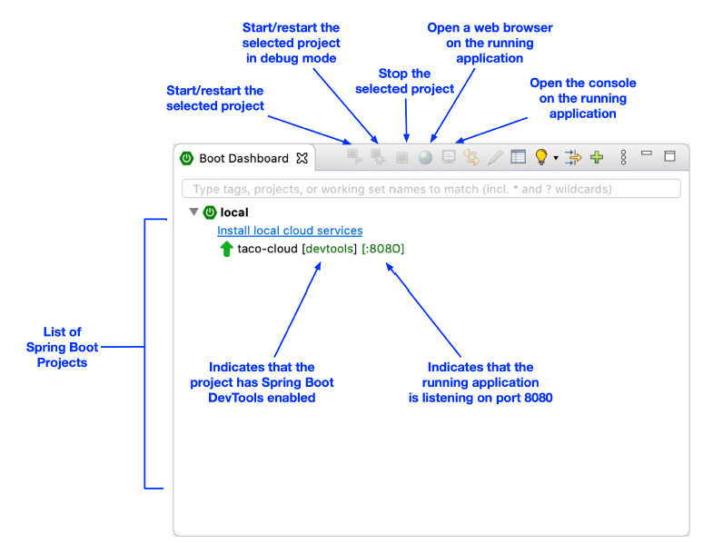

### 1.3.4 Biên dịch và chạy ứng dụng

Cũng giống như chúng ta có nhiều cách để khởi tạo một ứng dụng Spring, chúng ta cũng có nhiều cách để chạy một ứng dụng. Nếu muốn, bạn có thể lật sang phần phụ lục để đọc về một số cách phổ biến nhất để chạy một ứng dụng Spring Boot.

Vì bạn đã chọn sử dụng Spring Tool Suite để khởi tạo và làm việc với dự án, bạn có một tính năng tiện lợi gọi là Spring Boot Dashboard, giúp bạn chạy ứng dụng ngay bên trong IDE. Spring Boot Dashboard xuất hiện dưới dạng một tab, thường nằm gần góc dưới bên trái của cửa sổ IDE. Hình 1.7 hiển thị ảnh chụp màn hình có chú thích của Spring Boot Dashboard.

  
**Hình 1.7 Các điểm nổi bật của Spring Boot Dashboard**

Tôi sẽ không dành nhiều thời gian để nói hết mọi chức năng của Spring Boot Dashboard, mặc dù hình 1.7 đã nêu ra một vài chi tiết hữu ích nhất. Điều quan trọng cần biết lúc này là cách sử dụng nó để chạy ứng dụng Taco Cloud. Hãy đảm bảo ứng dụng `taco-cloud` được chọn trong danh sách các dự án (nó là ứng dụng duy nhất hiển thị trong hình 1.7), sau đó nhấn nút bắt đầu (nút ngoài cùng bên trái có biểu tượng tam giác xanh và hình vuông đỏ). Ứng dụng sẽ bắt đầu chạy.

Khi ứng dụng khởi động, bạn sẽ thấy một số hình ảnh nghệ thuật ASCII của Spring hiện ra trong bảng điều khiển, sau đó là các dòng log mô tả các bước khi ứng dụng được khởi động. Trước khi quá trình log dừng lại, bạn sẽ thấy một dòng log nói rằng Tomcat đã khởi động tại cổng: 8080 (http), điều này có nghĩa là bạn đã sẵn sàng mở trình duyệt và truy cập trang chủ để xem kết quả công việc của mình.

Chờ đã. Tomcat khởi động ư? Khi nào bạn triển khai ứng dụng lên máy chủ web Tomcat vậy?

Các ứng dụng Spring Boot thường tích hợp mọi thứ chúng cần và không cần phải triển khai lên một máy chủ ứng dụng nào. Bạn chưa hề triển khai ứng dụng của mình lên Tomcat — Tomcat là một phần của ứng dụng! (Tôi sẽ mô tả chi tiết cách Tomcat trở thành một phần của ứng dụng trong mục 1.3.6.)

Bây giờ ứng dụng đã được khởi động, hãy mở trình duyệt của bạn và truy cập [http://localhost:8080](http://localhost:8080) (hoặc nhấn vào nút hình quả địa cầu trong Spring Boot Dashboard) và bạn sẽ thấy giao diện như hình 1.8. Kết quả có thể khác một chút nếu bạn đã thiết kế logo riêng, nhưng không nên khác biệt nhiều so với những gì bạn thấy trong hình 1.8.

  
**Hình 1.8 Trang chủ Taco Cloud**

Có thể trông nó không quá bắt mắt. Nhưng đây không phải là một cuốn sách về thiết kế đồ họa. Giao diện đơn giản của trang chủ là quá đủ ở thời điểm này. Và nó cung cấp cho bạn một điểm khởi đầu vững chắc để làm quen với Spring.

Một điều mà tôi đã lướt qua cho đến giờ là DevTools. Bạn đã chọn nó làm một dependency khi khởi tạo dự án. Nó xuất hiện như một dependency trong file `pom.xml` được tạo ra. Và Spring Boot Dashboard cũng hiển thị rằng dự án đã bật DevTools. Vậy DevTools là gì, và nó mang lại lợi ích gì cho bạn? Hãy cùng điểm qua một vài tính năng hữu ích nhất của DevTools.
