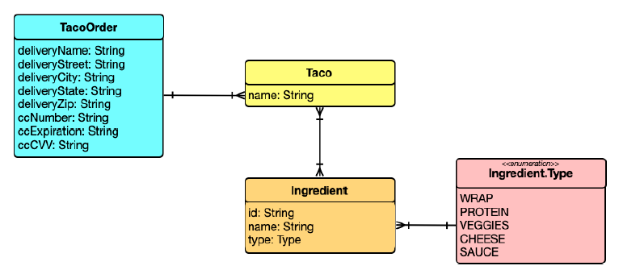

### 2.1.1 Establishing the domain

An application’s domain is the subject area that it addresses—the ideas and concepts that influence the understanding of the application.1 In the Taco Cloud application, the domain includes such objects as taco designs, the ingredients that those designs are composed of, customers, and taco orders placed by the customers. Figure 2.2 shows these entities and how they are related.


**Figure 2.2 The Taco Cloud domain** <br/>

To get started, we’ll focus on taco ingredients. In your domain, taco ingredients are fairly simple objects. Each has a name as well as a type so that it can be visually categorized (proteins, cheeses, sauces, and so on). Each also has an ID by which it can easily and unambiguously be referenced. The following Ingredient class defines the domain object you need.

**Listing 2.1 Defining taco ingredients**

```java
package tacos;

import lombok.Data;

@Data
public class Ingredient {

  private final String id;
  private final String name;
  private final Type type;

  public enum Type {
    WRAP, PROTEIN, VEGGIES, CHEESE, SAUCE
  }

}
```

As you can see, this is a run-of-the-mill Java domain class, defining the three properties needed to describe an ingredient. Perhaps the most unusual thing about the `Ingredient` class as defined in listing 2.1 is that it seems to be missing the usual set of getter and setter methods, not to mention useful methods like `equals()`, `hashCode()`, `toString()`, and others.

You don’t see them in the listing partly to save space, but also because you’re using an amazing library called Lombok to automatically generate those methods at compile time so that they will be available at run time. In fact, the `@Data` annotation at the class level is provided by Lombok and tells Lombok to generate all of those missing methods as well as a constructor that accepts all `final` properties as arguments. By using Lombok, you can keep the code for `Ingredient` slim and trim.

Lombok isn’t a Spring library, but it’s so incredibly useful that I find it hard to develop without it. Plus, it’s a lifesaver when I need to keep code examples in a book short and sweet.

To use Lombok, you’ll need to add it as a dependency in your project. If you’re using Spring Tool Suite, it’s an easy matter of right-clicking on the pom.xml file and selecting Add Starters from the Spring context menu. The same selection of dependencies you were given in chapter 1 (in figure 1.4) will appear, giving you a chance to add or change your selected dependencies. Find Lombok under Developer Tools, make sure it’s selected, and click OK; Spring Tool Suite automatically adds it to your build specification.

Alternatively, you can manually add it with the following entry in pom.xml:

```xml
<dependency>
  <groupId>org.projectlombok</groupId>
  <artifactId>lombok</artifactId>
</dependency>
```

If you decide to manually add Lombok to your build, you’ll also want to exclude it from the Spring Boot Maven plugin in the `<build>` section of the pom.xml file:

```xml
<build>
  <plugins>
    <plugin>
      <groupId>org.springframework.boot</groupId>
      <artifactId>spring-boot-maven-plugin</artifactId>
      <configuration>
        <excludes>
          <exclude>
            <groupId>org.projectlombok</groupId>
            <artifactId>lombok</artifactId>
          </exclude>
        </excludes>
      </configuration>
    </plugin>
  </plugins>
</build>

```

Lombok’s magic is applied at compile time, so there’s no need for it to be available at run time. Excluding it like this keeps it out of the resulting JAR or WAR file.

The Lombok dependency provides you with Lombok annotations (such as `@Data`) at development time and with automatic method generation at compile time. But you’ll also need to add Lombok as an extension in your IDE, or your IDE will complain, with errors about missing methods and `final` properties that aren’t being set. Visit  [https://projectlombok.org/](https://projectlombok.org/) to find out how to install Lombok in your IDE of choice.

>Why are there so many errors in my code?
>
>It bears repeating that when using Lombok, you must install the Lombok plugin into your IDE. Without it, your IDE won’t be aware that Lombok is providing getters, setters, and other methods and will complain that they are missing.
>
>Lombok is supported in a number of popular IDEs, including Eclipse, Spring Tool Suite, IntelliJ IDEA, and Visual Studio Code. Visit [https://projectlombok.org/](https://projectlombok.org/) for more information on how to install the Lombok plugin into your IDE.

I think you’ll find Lombok to be very useful, but know that it’s optional. You don’t need it to develop Spring applications, so if you’d rather not use it, feel free to write those missing methods by hand. Go ahead … I’ll wait.

Ingredients are the essential building blocks of a taco. To capture how those ingredients are brought together, we’ll define the Taco domain class, as shown next.

**Listing 2.2 A domain object defining a taco design**

```java
package tacos;
import java.util.List;
import lombok.Data;

@Data
public class Taco {

  private String name;

  private List<Ingredient> ingredients;

}
```

As you can see, `Taco` is a straightforward Java domain object with a couple of properties. Like `Ingredient`, the Taco class is annotated with `@Data` to have Lombok automatically generate essential JavaBean methods for you at compile time.

Now that we have defined `Ingredient` and `Taco`, we need one more domain class that defines how customers specify the tacos that they want to order, along with payment and delivery information. That’s the job of the `TacoOrder` class, shown here.

**Listing 2.3 A domain object for taco orders**

```java
package tacos;
import java.util.List;
import java.util.ArrayList;
import lombok.Data;

@Data
public class TacoOrder {

  private String deliveryName;
  private String deliveryStreet;
  private String deliveryCity;
  private String deliveryState;
  private String deliveryZip;
  private String ccNumber;
  private String ccExpiration;
  private String ccCVV;

  private List<Taco> tacos = new ArrayList<>();

  public void addTaco(Taco taco) {
    this.tacos.add(taco);
  }
}
```

Aside from having more properties than either `Ingredient` or `Taco`, there’s nothing particularly new to discuss about `TacoOrder`. It’s a simple domain class with nine properties: five for delivery information, three for payment information, and one that is the list of `Taco` objects that make up the order. There’s also an `addTaco()` method that’s added for the convenience of adding tacos to the order.

Now that the domain types are defined, we’re ready to put them to work. Let’s add a few controllers to handle web requests in the application.


