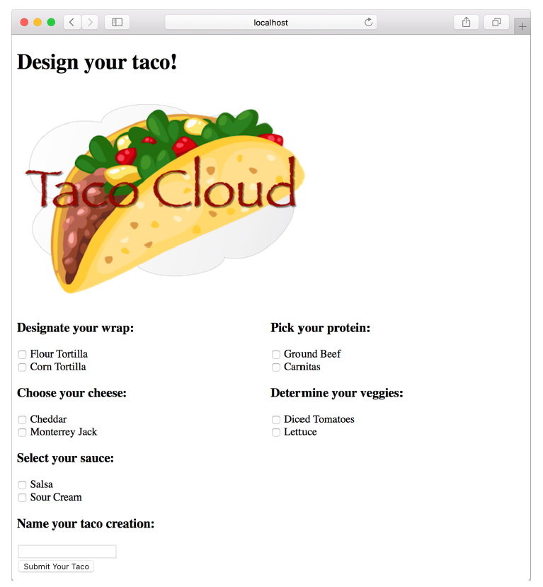

### 2.1.3 Thiết kế view

Sau khi controller hoàn tất công việc của nó, đến lượt view bắt đầu thực thi. Spring cung cấp một số lựa chọn tuyệt vời để định nghĩa các view, bao gồm JavaServer Pages (JSP), Thymeleaf, FreeMarker, Mustache và các mẫu dựa trên Groovy. Hiện tại, chúng ta sẽ sử dụng Thymeleaf — lựa chọn mà ta đã đưa ra trong chương 1 khi bắt đầu dự án. Chúng ta sẽ xem xét thêm một số tùy chọn khác ở phần 2.5.

Chúng ta đã thêm Thymeleaf làm dependency trong chương 1. Khi chạy ứng dụng, Spring Boot autoconfiguration sẽ phát hiện Thymeleaf có trong classpath và tự động tạo các bean hỗ trợ cho các view sử dụng Thymeleaf trong Spring MVC.

Các thư viện view như Thymeleaf được thiết kế để tách biệt với bất kỳ framework web cụ thể nào. Do đó, chúng không biết đến abstraction model của Spring và không thể làm việc trực tiếp với dữ liệu mà controller đặt trong đối tượng `Model`. Tuy nhiên, chúng có thể làm việc với các thuộc tính của servlet request. Vì vậy, trước khi Spring chuyển tiếp yêu cầu đến view, nó sẽ sao chép dữ liệu từ `Model` vào các thuộc tính của request để Thymeleaf và các công cụ tạo view khác có thể dễ dàng truy cập.

Các template Thymeleaf thực chất là HTML với một số thuộc tính phần tử bổ sung, dùng để hướng dẫn template render dữ liệu từ request. Ví dụ, nếu có một thuộc tính trong request với key là `"message"` và bạn muốn render nó vào trong một thẻ HTML `<p>` bằng Thymeleaf, bạn sẽ viết như sau trong template Thymeleaf:

```html
<p th:text="${message}">placeholder message</p>
```

Khi template được render thành HTML, nội dung bên trong thẻ `<p>` sẽ được thay thế bằng giá trị của thuộc tính servlet request có key là `"message"`. Thuộc tính `th:text` là một thuộc tính không gian tên (namespace attribute) của Thymeleaf dùng để thực hiện việc thay thế. Toán tử `${}` cho biết Thymeleaf nên lấy giá trị từ thuộc tính request (`"message"` trong trường hợp này).

Thymeleaf cũng cung cấp một thuộc tính khác là `th:each`, dùng để lặp qua một tập hợp phần tử, render HTML một lần cho mỗi phần tử trong tập hợp. Thuộc tính này sẽ rất hữu ích khi bạn thiết kế view để liệt kê các nguyên liệu taco từ Model. Ví dụ, để render danh sách nguyên liệu có loại `"wrap"`, bạn có thể dùng đoạn HTML sau:

```html
<h3>Designate your wrap:</h3>
<div th:each="ingredient : ${wrap}">
  <input th:field="*{ingredients}" type="checkbox"
      th:value="${ingredient.id}"/>
  <span th:text="${ingredient.name}">INGREDIENT</span><br/>
</div>
```

Ở đây, bạn sử dụng thuộc tính th:each trên thẻ `<div>` để lặp lại việc render `<div>` một lần cho mỗi phần tử trong tập hợp `wrap` từ request. Trong mỗi vòng lặp, phần tử nguyên liệu được gán vào một biến Thymeleaf tên là ingredient.

Bên trong phần tử `<div>` là một input checkbox và một thẻ `<span>` để hiển thị nhãn cho checkbox. Checkbox sử dụng `th:value` của Thymeleaf để đặt giá trị thuộc tính value của phần tử `<input>` bằng giá trị của thuộc tính id của nguyên liệu. Thuộc tính `th:field` sẽ tự động thiết lập tên (name) cho phần tử `<input>` và giúp ghi nhớ trạng thái checkbox (được chọn hay không). Khi chúng ta thêm xử lý validation sau này, điều này sẽ đảm bảo rằng checkbox giữ lại trạng thái của nó nếu biểu mẫu cần được hiển thị lại sau lỗi xác thực. Thẻ `<span>` sử dụng `th:text` để thay thế đoạn văn bản `"INGREDIENT"` bằng giá trị của thuộc tính name của nguyên liệu.

Khi được render với dữ liệu thực tế từ model, một vòng lặp của `<div>` phía trên có thể trông như sau:

```html
<div>
  <input name="ingredients" type="checkbox" value="FLTO" />
  <span>Flour Tortilla</span><br/>
</div>
```

Cuối cùng, đoạn Thymeleaf phía trên chỉ là một phần của một biểu mẫu HTML lớn hơn, nơi người dùng (nghệ sĩ taco) sẽ gửi tác phẩm taco ngon lành của họ. Template Thymeleaf hoàn chỉnh, bao gồm tất cả các loại nguyên liệu và biểu mẫu, sẽ được trình bày trong đoạn mã tiếp theo.

**Liệt kê 2.5 Trang thiết kế taco hoàn chỉnh**

```html
<!DOCTYPE html>
<html xmlns="http://www.w3.org/1999/xhtml"
      xmlns:th="http://www.thymeleaf.org">
    <head>
        <title>Taco Cloud</title>
        <link rel="stylesheet" th:href="@{/styles.css}" />
    </head>
    
    <body>
        <h1>Design your taco!</h1>
        
        <form method="POST" th:object="${taco}">
            <div class="grid">
                <div class="ingredient-group" id="wraps">
                    <h3>Designate your wrap:</h3>
                    <div th:each="ingredient : ${wrap}">
                        <input name="ingredients" type="checkbox" th:value="${ingredient.id}"/>
                        <span th:text="${ingredient.name}">INGREDIENT</span><br/>
                    </div>
                </div>
                <div class="ingredient-group" id="proteins">
                    <h3>Pick your protein:</h3>
                    <div th:each="ingredient : ${protein}">
                        <input name="ingredients" type="checkbox" th:value="${ingredient.id}" />
                        <span th:text="${ingredient.name}">INGREDIENT</span><br/>
                    </div>
                </div>
                <div class="ingredient-group" id="cheeses">
                    <h3>Choose your cheese:</h3>
                    <div th:each="ingredient : ${cheese}">
                        <input name="ingredients" type="checkbox" th:value="${ingredient.id}"/>
                        <span th:text="${ingredient.name}">INGREDIENT</span><br/>
                    </div>
                </div>
                <div class="ingredient-group" id="veggies">
                    <h3>Determine your veggies:</h3>
                    <div th:each="ingredient : ${veggies}">
                        <input name="ingredients" type="checkbox" th:value="${ingredient.id}"/>
                        <span th:text="${ingredient.name}">INGREDIENT</span><br/>
                    </div>
                </div>
                <div class="ingredient-group" id="sauces">
                    <h3>Select your sauce:</h3>
                    <div th:each="ingredient : ${sauce}">
                        <input name="ingredients" type="checkbox" th:value="${ingredient.id}"/>
                        <span th:text="${ingredient.name}">INGREDIENT</span><br/>
                    </div>
                </div>
            </div>
            <div>
                <h3>Name your taco creation:</h3>
                <input type="text" th:field="*{name}"/><br/>
                <button>Submit your taco</button>
            </div>
        </form>
    </body>
</html>
```

Như bạn có thể thấy, bạn lặp lại đoạn mã `<div>` cho từng loại nguyên liệu, và bạn cũng bao gồm một nút Submit và một trường nơi người dùng có thể đặt tên cho tác phẩm của họ.

Cũng đáng chú ý rằng mẫu hoàn chỉnh bao gồm hình ảnh logo Taco Cloud và một thẻ `<link>` tham chiếu đến một stylesheet.² Trong cả hai trường hợp, toán tử `@{}` của Thymeleaf được sử dụng để tạo đường dẫn tương đối theo ngữ cảnh đến các tài nguyên tĩnh mà các thẻ này đang tham chiếu. Như bạn đã học trong chương 1, nội dung tĩnh trong một ứng dụng Spring Boot được phục vụ từ thư mục /static ở gốc classpath.

Bây giờ controller và view của bạn đã hoàn thành, bạn có thể khởi động ứng dụng để xem thành quả lao động của mình. Có nhiều cách để chạy một ứng dụng Spring Boot. Trong chương 1, tôi đã chỉ cho bạn cách chạy ứng dụng bằng cách nhấn nút Start trong Spring Boot Dashboard.

Bất kể bạn khởi động ứng dụng Taco Cloud bằng cách nào, khi ứng dụng đã chạy, hãy mở trình duyệt và truy cập [http://localhost:8080/design](http://localhost:8080/design). Bạn sẽ thấy một trang trông giống như hình 2.3.

  
**Hình 2.3 Trang thiết kế taco được render**

Trông rất ổn! Một nghệ sĩ taco truy cập trang web của bạn sẽ được cung cấp một biểu mẫu chứa bảng nguyên liệu taco để họ có thể tạo nên kiệt tác của riêng mình. Nhưng điều gì sẽ xảy ra khi họ nhấn nút Submit Your Taco?

Controller `DesignTacoController` của bạn hiện vẫn chưa sẵn sàng để nhận tác phẩm taco. Nếu biểu mẫu thiết kế được gửi đi, người dùng sẽ gặp lỗi. (Cụ thể, đó sẽ là lỗi HTTP 405: Request Method “POST” Not Supported.) Hãy sửa điều đó bằng cách viết thêm mã controller để xử lý việc gửi biểu mẫu.
