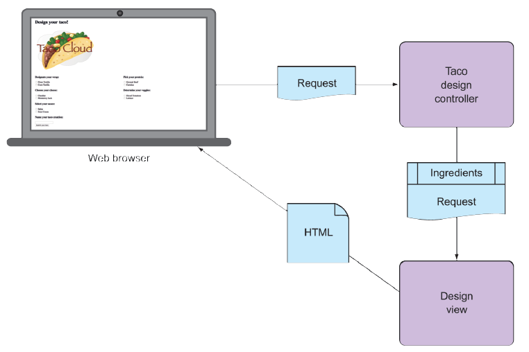

## 2.1 Hiển thị thông tin

Về cơ bản, Taco Cloud là một nơi nơi bạn có thể đặt taco trực tuyến. Nhưng hơn thế nữa, Taco Cloud muốn cho phép khách hàng thể hiện khía cạnh sáng tạo của họ bằng cách thiết kế những chiếc taco tùy chỉnh từ một bảng nguyên liệu phong phú.

Vì vậy, ứng dụng web Taco Cloud cần có một trang hiển thị danh sách các nguyên liệu để những nghệ sĩ taco có thể lựa chọn. Các lựa chọn nguyên liệu này có thể thay đổi bất kỳ lúc nào, vì vậy chúng không nên được mã hóa cứng trong một trang HTML. Thay vào đó, danh sách nguyên liệu có sẵn nên được lấy từ cơ sở dữ liệu và chuyển giao cho trang web để hiển thị cho khách hàng.

Trong một ứng dụng web Spring, công việc của controller là truy xuất và xử lý dữ liệu. Còn công việc của view là hiển thị dữ liệu đó thành HTML để hiển thị trong trình duyệt. Bạn sẽ tạo ra các thành phần sau để hỗ trợ trang tạo taco:

* Một lớp miền định nghĩa các thuộc tính của một nguyên liệu taco
* Một lớp controller của Spring MVC để truy xuất thông tin nguyên liệu và chuyển nó đến view
* Một template view hiển thị danh sách nguyên liệu trên trình duyệt của người dùng

Mối quan hệ giữa các thành phần này được minh họa trong hình 2.1.

  
**Hình 2.1 Luồng yêu cầu điển hình trong Spring MVC**

Vì chương này tập trung vào framework web của Spring, chúng ta sẽ tạm hoãn phần làm việc với cơ sở dữ liệu đến chương 3. Hiện tại, controller sẽ chỉ chịu trách nhiệm cung cấp nguyên liệu cho view. Trong chương 3, bạn sẽ chỉnh sửa lại controller để nó làm việc với một repository nhằm truy xuất dữ liệu nguyên liệu từ cơ sở dữ liệu.

Trước khi bạn viết controller và view, hãy định nghĩa kiểu miền đại diện cho một nguyên liệu. Điều này sẽ tạo nền tảng để bạn phát triển các thành phần web.
