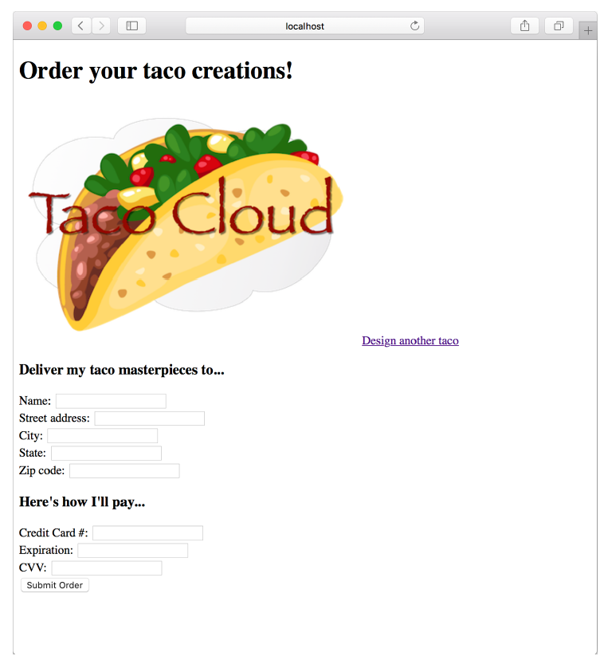

## 2.2 Processing form submission

If you take another look at the `<form>` tag in your view, you can see that its method attribute is set to `POST`. Moreover, the `<form>` doesn’t declare an `action` attribute. This means that when the form is submitted, the browser will gather all the data in the form and send it to the server in an HTTP `POST` request to the same path for which a `GET` request displayed the form — the /design path.

Therefore, you need a controller handler method on the receiving end of that `POST` request. You need to write a new handler method in `DesignTacoController` that handles a `POST` request for /design.

In listing 2.4, you used the `@GetMapping` annotation to specify that the `showDesignForm()` method should handle HTTP `GET` requests for /design. Just like `@GetMapping` handles `GET` requests, you can use `@PostMapping` to handle `POST` requests. For handling taco design submissions, add the `processTaco()` method in the following listing to DesignTacoController.

**Listing 2.6 Handling POST requests with @PostMapping**

```java
@PostMapping
public String processTaco(Taco taco) {
  // Save the taco...
  // We'll do this in chapter 3
  log.info("Processing taco: " + taco);

  return "redirect:/orders/current";
}
```

As applied to the `processTaco()` method, `@PostMapping` coordinates with the class-level `@RequestMapping` to indicate that `processTaco()` should handle `POST` requests for /design. This is precisely what you need to process a taco artist’s submitted creations.

When the form is submitted, the fields in the form are bound to properties of a `Taco` object (whose class is shown in the next listing) that’s passed as a parameter into `processTaco()`. From there, the `processTaco()` method can do whatever it wants with the Taco object. In this case, it adds the `Taco` to the `TacoOrder` object passed as a parameter to the method and then logs it. The `@ModelAttribute` applied to the `TacoOrder` parameter indicates that it should use the `TacoOrder` object that was placed into the model via the `@ModelAttribute-annotated order()` method shown earlier in listing 2.4.

If you look back at the form in listing 2.5, you’ll see several `checkbox` elements, all with the name `ingredients`, and a text input element named `name`. Those fields in the form correspond directly to the `ingredients` and `name` properties of the Taco class.

The `name` field on the form needs to capture only a simple textual value. Thus the `name` property of `Taco` is of type `String`. The ingredients check boxes also have textual values, but because zero or many of them may be selected, the `ingredients` property that they’re bound to is a `List<Ingredient>` that will capture each of the chosen ingredients.

But wait. If the ingredients check boxes have textual (e.g., `String`) values, but the `Taco` object represents a list of ingredients as `List<Ingredient>`, then isn’t there a mismatch? How can a textual list like `["FLTO", "GRBF", "LETC"]` be bound to a list of `Ingredient` objects that are richer objects containing not only an ID but also a descriptive name and ingredient type?

That’s where a converter comes in handy. A converter is any class that implements Spring’s `Converter` interface and implements its `convert()` method to take one value and convert it to another. To convert a `String` to an `Ingredient`, we’ll use the `IngredientByIdConverter` as follows.

**Listing 2.7 Converting strings to ingredients**

```java
package tacos.web;

import java.util.HashMap;
import java.util.Map;

import org.springframework.core.convert.converter.Converter;
import org.springframework.stereotype.Component;

import tacos.Ingredient;
import tacos.Ingredient.Type;

@Component
public class IngredientByIdConverter implements Converter<String, Ingredient> {

  private Map<String, Ingredient> ingredientMap = new HashMap<>();
  
  public IngredientByIdConverter() {
    ingredientMap.put("FLTO",
        new Ingredient("FLTO", "Flour Tortilla", Type.WRAP));
    ingredientMap.put("COTO",
        new Ingredient("COTO", "Corn Tortilla", Type.WRAP));
    ingredientMap.put("GRBF",
        new Ingredient("GRBF", "Ground Beef", Type.PROTEIN));
    ingredientMap.put("CARN",
        new Ingredient("CARN", "Carnitas", Type.PROTEIN));
    ingredientMap.put("TMTO",
        new Ingredient("TMTO", "Diced Tomatoes", Type.VEGGIES));
    ingredientMap.put("LETC",
        new Ingredient("LETC", "Lettuce", Type.VEGGIES));
    ingredientMap.put("CHED",
        new Ingredient("CHED", "Cheddar", Type.CHEESE));
    ingredientMap.put("JACK",
        new Ingredient("JACK", "Monterrey Jack", Type.CHEESE));
    ingredientMap.put("SLSA",
        new Ingredient("SLSA", "Salsa", Type.SAUCE));
    ingredientMap.put("SRCR",
        new Ingredient("SRCR", "Sour Cream", Type.SAUCE));
  }
  
  @Override
  public Ingredient convert(String id) {
    return ingredientMap.get(id);
  }

}

```

Because we don’t yet have a database from which to pull Ingredient objects, the constructor of `IngredientByIdConverter` creates a `Map` keyed on a `String` that is the ingredient ID and whose values are `Ingredient` objects. In chapter 3, we’ll adapt this converter to pull the ingredient data from a database instead of being hardcoded like this. The `convert()` method then simply takes a String that is the ingredient ID and uses it to look up the `Ingredient` from the map.

Notice that the `IngredientByIdConverter` is annotated with `@Component` to make it discoverable as a bean in the Spring application context. Spring Boot autoconfiguration will discover this, and any other `Converter` beans, and will automatically register them with Spring MVC to be used when the conversion of request parameters to bound properties is needed.

For now, the `processTaco()` method does nothing with the `Taco` object. In fact, it doesn’t do much of anything at all. That’s OK. In chapter 3, you’ll add some persistence logic that will save the submitted Taco to a database.

Just as with the `showDesignForm()` method, `processTaco()` finishes by returning a `String` value. And just like `showDesignForm()`, the value returned indicates a view that will be shown to the user. But what’s different is that the value returned from `processTaco()` is prefixed with `"redirect:"`, indicating that this is a redirect view. More specifically, it indicates that after `processTaco()` completes, the user’s browser should be redirected to the relative path /orders/current.

The idea is that after creating a taco, the user will be redirected to an order form from which they can place an order to have their taco creations delivered. But you don’t yet have a controller that will handle a request for /orders/current.

Given what you now know about `@Controller`, `@RequestMapping`, and `@GetMapping`, you can easily create such a controller. It might look something like the following listing.

**Listing 2.8 A controller to present a taco order form**

```java
package tacos.web;
import org.springframework.stereotype.Controller;
import org.springframework.ui.Model;
import org.springframework.web.bind.annotation.GetMapping;
import org.springframework.web.bind.annotation.RequestMapping;

import lombok.extern.slf4j.Slf4j;
import tacos.TacoOrder;

@Slf4j
@Controller
@RequestMapping("/orders")
public class OrderController {

  @GetMapping("/current")
  public String orderForm(Model model) {
    model.addAttribute("tacoOrder", new TacoOrder());
    return "orderForm";
  }

}
```

Once again, you use Lombok’s `@Slf4j` annotation to create a free SLF4J `Logger` object at compile time. You’ll use this `Logger` in a moment to log the details of the order that’s submitted.

The class-level `@RequestMapping` specifies that any request-handling methods in this controller will handle requests whose path begins with /orders. When combined with the method-level `@GetMapping`, it specifies that the `orderForm()` method will handle HTTP `GET` requests for /orders/current.

As for the `orderForm()` method itself, it’s extremely basic, only returning a logical view name of `orderForm`. Once you have a way to persist taco creations to a database in chapter 3, you’ll revisit this method and modify it to populate the model with a list of Taco objects to be placed in the order.

The `orderForm` view is provided by a Thymeleaf template named orderForm.html, which is shown next.

**Listing 2.9 A taco order form view**

```html
<!DOCTYPE html>
<html xmlns="http://www.w3.org/1999/xhtml"
      xmlns:th="http://www.thymeleaf.org">
    <head>
        <title>Taco Cloud</title>
        <link rel="stylesheet" th:href="@{/styles.css}" />
    </head>

    <body>
        <form method="POST" th:action="@{/orders}" th:object="${tacoOrder}">
            <h1>Order your taco creations!</h1>
            
            <a th:href="@{/design}" id="another">Design another taco</a><br/>
            <div th:if="${#fields.hasErrors()}">
                <span class="validationError">
                    Please correct the problems below and resubmit.
                </span>
            </div>
            <h3>Deliver my taco masterpieces to...</h3>

            <label for="name">Name: </label>
            <input type="text" th:field="*{deliveryName}"/>
            <br/>

            <label for="street">Street address: </label>
            <input type="text" th:field="*{deliveryStreet}"/>
            <br/>

            <label for="city">City: </label>
            <input type="text" th:field="*{deliveryCity}"/>
            <br/>

            <label for="state">State: </label>
            <input type="text" th:field="*{deliveryState}"/>
            <br/>

            <label for="zip">Zip code: </label>
            <input type="text" th:field="*{deliveryZip}"/>
            <br/>

            <h3>Here's how I'll pay...</h3>

            <label for="ccNumber">Credit Card #: </label>
            <input type="text" th:field="*{ccNumber}"/>
            <br/>

            <label for="ccExpiration">Expiration: </label>
            <input type="text" th:field="*{ccExpiration}"/>
            <br/>

            <label for="ccCVV">CVV: </label>
            <input type="text" th:field="*{ccCVV}"/>
            <br/>

            <input type="submit" value="Submit order"/>
        </form>
    </body>
</html>
```

For the most part, the orderForm.html view is typical HTML/Thymeleaf content, with very little of note. It starts by listing the tacos that were added to the order. It uses Thymeleaf’s `th:each` to cycle through the order’s tacos property as it creates the list. Then it renders the order form.

But notice that the `<form>` tag here is different from the `<form>` tag used in listing 2.5 in that it also specifies a form action. Without an action specified, the form would submit an HTTP `POST` request back to the same URL that presented the form. But here, you specify that the form should be POSTed to /orders (using Thymeleaf’s @{…} operator for a context-relative path).

Therefore, you’re going to need to add another method to your `OrderController` class that handles `POST` requests for /orders. You won’t have a way to persist orders until the next chapter, so you’ll keep it simple here — something like what you see in the next listing.

**Listing 2.10 Handling a taco order submission**

```java
@PostMapping
public String processOrder(TacoOrder order) {
  log.info("Order submitted: " + order);
  return "redirect:/";
}
```

When the `processOrder()` method is called to handle a submitted order, it’s given a `TacoOrder` object whose properties are bound to the submitted form fields. `TacoOrder`, much like Taco, is a fairly straightforward class that carries order information.

In the case of this `processOrder()` method, the `TacoOrder` object is simply logged. We’ll see how to persist it to a database in the next chapter. But before `processOrder()` is done, it also calls `setComplete()` on the `SessionStatus` object passed in as a parameter. The TacoOrder object was initially created and placed into the session when the user created their first taco. By calling `setComplete()`, we are ensuring that the session is cleaned up and ready for a new order the next time the user creates a taco.

Now that you’ve developed an OrderController and the order form view, you’re ready to try it out. Open your browser to [http://localhost:8080/design](http://localhost:8080/design), select some ingredients for your taco, and click the Submit Your Taco button. You should see a form similar to what’s shown in figure 2.4.


**Figure 2.4 The taco order form**

Fill in some fields in the form, and press the Submit Order button. As you do, keep an eye on the application logs to see your order information. When I tried it, the log entry looked something like this (reformatted to fit the width of this page):

```text
Order submitted: TacoOrder(deliveryName=Craig Walls, deliveryStreet=1234 7th
Street, deliveryCity=Somewhere, deliveryState=Who knows?, deliveryZip=zipzap,
ccNumber=Who can guess?, ccExpiration=Some day, ccCVV=See-vee-vee, tacos=[])
```

It appears that the processOrder() method did its job, handling the form submission by logging details about the order. But if you look carefully at the log entry from my test order, you can see that it let a little bit of bad information get in. Most of the fields in the form contained data that couldn’t possibly be correct. Let’s add some validation to ensure that the data provided at least resembles the kind of information required.
