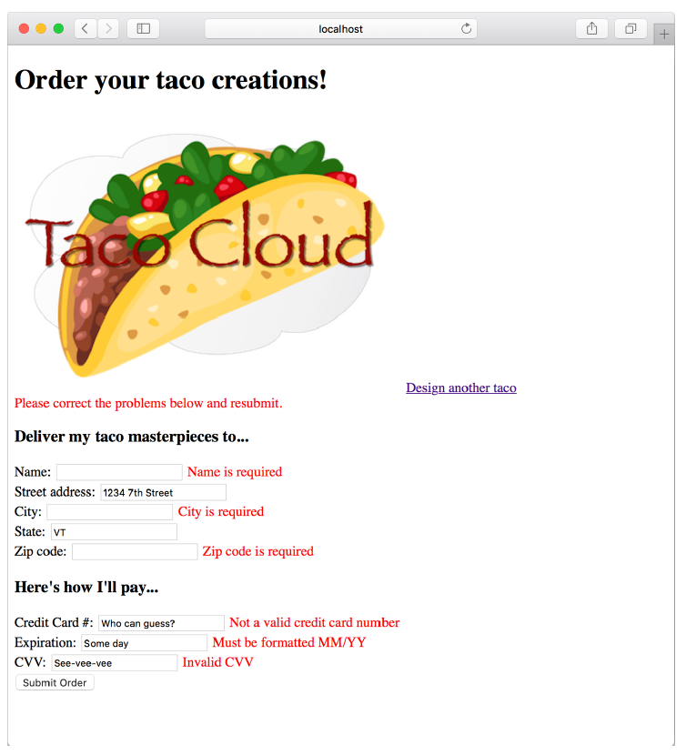

### 2.3.3 Hiển thị lỗi xác thực

Thymeleaf cung cấp quyền truy cập thuận tiện vào đối tượng `Errors` thông qua thuộc tính `fields` và với thuộc tính `th:errors`. Ví dụ, để hiển thị các lỗi xác thực trên trường số thẻ tín dụng, bạn có thể thêm một phần tử `<span>` sử dụng các tham chiếu lỗi này vào mẫu biểu mẫu đặt hàng như sau.

**Liệt kê 2.15 Hiển thị lỗi xác thực**

```html
<<label for="ccNumber">Credit Card #: </label>
<input type="text" th:field="*{ccNumber}"/>
<span class="validationError"
      th:if="${#fields.hasErrors('ccNumber')}"
      th:errors="*{ccNumber}">CC Num Error</span>
```

Ngoài thuộc tính class có thể được dùng để định kiểu cho lỗi nhằm thu hút sự chú ý của người dùng, phần tử `<span>` sử dụng thuộc tính `th:if` để quyết định có hiển thị `<span>` hay không. Phương thức `hasErrors()` của thuộc tính fields sẽ kiểm tra xem có lỗi nào trong trường `ccNumber` không. Nếu có, phần tử `<span>` sẽ được hiển thị.

Thuộc tính `th:errors` tham chiếu đến trường `ccNumber` và, giả sử có lỗi tồn tại cho trường đó, nó sẽ thay thế nội dung giữ chỗ của phần tử `<span>` bằng thông báo xác thực.

Nếu bạn chèn các thẻ `<span>` tương tự xung quanh biểu mẫu đặt hàng cho các trường khác, bạn có thể thấy một biểu mẫu như hình 2.5 khi bạn gửi thông tin không hợp lệ. Các lỗi hiển thị cho biết rằng các trường tên, thành phố và mã ZIP đã bị bỏ trống và tất cả các trường thanh toán không đáp ứng tiêu chí xác thực.

  
**Hình 2.5 Các lỗi xác thực được hiển thị trên biểu mẫu đặt hàng**

Giờ đây, các controller Taco Cloud của bạn không chỉ hiển thị và thu nhận đầu vào, mà còn xác thực rằng thông tin đó tuân theo một số quy tắc xác thực cơ bản. Hãy lùi lại một bước và xem xét lại `HomeController` từ chương 1, với một cách triển khai thay thế.
