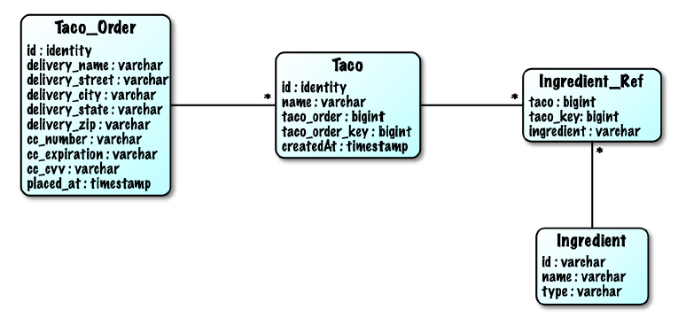

### 3.1.3 Định nghĩa lược đồ và tải trước dữ liệu

Ngoài bảng `Ingredient`, bạn cũng sẽ cần một số bảng để lưu trữ thông tin về đơn hàng và thiết kế taco. Hình 3.1 minh họa các bảng bạn sẽ cần, cũng như mối quan hệ giữa các bảng đó.

  
**Hình 3.1 Các bảng trong lược đồ Taco Cloud**

Các bảng trong hình 3.1 phục vụ các mục đích sau:

* `Taco_Order` - Chứa thông tin chi tiết cơ bản về đơn hàng  
* `Taco` - Chứa thông tin chính về thiết kế taco  
* `Ingredient_Ref` - Chứa một hoặc nhiều hàng tương ứng với mỗi hàng trong bảng Taco, ánh xạ taco với các nguyên liệu cấu thành taco đó  
* `Ingredient` - Chứa thông tin về nguyên liệu  

Trong ứng dụng của chúng ta, một Taco không thể tồn tại bên ngoài ngữ cảnh của một `Taco_Order`. Do đó, `Taco_Order` và `Taco` được xem là các thành viên của một aggregate, trong đó `Taco_Order` là **aggregate root** (gốc tập hợp). Ngược lại, các đối tượng Ingredient là các thành viên riêng lẻ trong tập hợp riêng của chúng và được tham chiếu bởi `Taco` thông qua bảng `Ingredient_Ref`.

> **LƯU Ý**: Các aggregate và aggregate root là những khái niệm cốt lõi trong _domain-driven design_ (thiết kế hướng miền), một phương pháp thiết kế phần mềm đề cao việc cấu trúc và ngôn ngữ của mã nguồn cần phản ánh đúng miền nghiệp vụ. Mặc dù chúng ta đang áp dụng một chút thiết kế hướng miền (DDD) trong các đối tượng miền của Taco Cloud, nhưng DDD còn nhiều khái niệm hơn chỉ aggregate và aggregate root. Để tìm hiểu sâu hơn, hãy đọc tác phẩm kinh điển: _Domain-Driven Design: Tackling Complexity in the Heart of Software_ (<https://www.dddcommunity.org/book/evans_2003/>).

Đoạn mã sau đây hiển thị SQL để tạo các bảng:

**Listing 3.9 Định nghĩa lược đồ Taco Cloud**

```sql
create table if not exists Taco_Order (
  id identity,
  delivery_Name varchar(50) not null,
  delivery_Street varchar(50) not null,
  delivery_City varchar(50) not null,
  delivery_State varchar(2) not null,
  delivery_Zip varchar(10) not null,
  cc_number varchar(16) not null,
  cc_expiration varchar(5) not null,
  cc_cvv varchar(3) not null,
  placed_at timestamp not null
);

create table if not exists Taco (
  id identity,
  name varchar(50) not null,
  taco_order bigint not null,
  taco_order_key bigint not null,
  created_at timestamp not null
);

create table if not exists Ingredient_Ref (
  ingredient varchar(4) not null,
  taco bigint not null,
  taco_key bigint not null
);


create table if not exists Ingredient (
  id varchar(4) not null,
  name varchar(25) not null,
  type varchar(10) not null
);

alter table Taco
    add foreign key (taco_order) references Taco_Order(id);
alter table Ingredient_Ref
    add foreign key (ingredient) references Ingredient(id);
```

Câu hỏi lớn là nên đặt định nghĩa lược đồ này ở đâu? Rất may, Spring Boot đã có câu trả lời.

Nếu có một tập tin tên là `schema.sql` nằm trong thư mục gốc của classpath ứng dụng, thì SQL trong tập tin đó sẽ được thực thi với cơ sở dữ liệu khi ứng dụng khởi động. Do đó, bạn nên đặt nội dung của listing 3.9 vào dự án của mình dưới dạng một tập tin tên là `schema.sql` trong thư mục `src/main/resources`.

Bạn cũng cần tải trước dữ liệu nguyên liệu vào cơ sở dữ liệu. May mắn thay, Spring Boot cũng sẽ thực thi một tập tin có tên `data.sql` từ thư mục gốc của classpath khi ứng dụng khởi động. Do đó, bạn có thể nạp dữ liệu nguyên liệu bằng các câu lệnh insert trong đoạn mã sau, được đặt trong `src/main/resources/data.sql`.

**Listing 3.10 Tải trước dữ liệu vào cơ sở dữ liệu với data.sql**  

```sql
delete from Ingredient_Ref;
delete from Taco;
delete from Taco_Order;

delete from Ingredient;
insert into Ingredient (id, name, type)
        values ('FLTO', 'Flour Tortilla', 'WRAP');
insert into Ingredient (id, name, type)
        values ('COTO', 'Corn Tortilla', 'WRAP');
insert into Ingredient (id, name, type)
        values ('GRBF', 'Ground Beef', 'PROTEIN');
insert into Ingredient (id, name, type)
        values ('CARN', 'Carnitas', 'PROTEIN');
insert into Ingredient (id, name, type)
        values ('TMTO', 'Diced Tomatoes', 'VEGGIES');
insert into Ingredient (id, name, type)
        values ('LETC', 'Lettuce', 'VEGGIES');
insert into Ingredient (id, name, type)
        values ('CHED', 'Cheddar', 'CHEESE');
insert into Ingredient (id, name, type)
        values ('JACK', 'Monterrey Jack', 'CHEESE');
insert into Ingredient (id, name, type)
        values ('SLSA', 'Salsa', 'SAUCE');
insert into Ingredient (id, name, type)
        values ('SRCR', 'Sour Cream', 'SAUCE');
```

Mặc dù hiện tại bạn mới chỉ phát triển một repository cho dữ liệu nguyên liệu, bạn vẫn có thể khởi chạy ứng dụng Taco Cloud ngay lúc này và truy cập trang thiết kế để thấy `JdbcIngredientRepository` hoạt động. Hãy thử chạy nó đi... Khi quay lại, bạn sẽ tiếp tục viết các repository để lưu trữ dữ liệu của Taco và `TacoOrder`.
