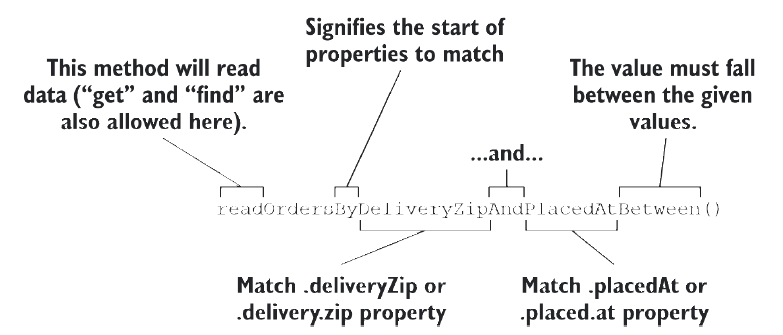

### 3.3.4 Customizing repositories

Imagine that in addition to the basic CRUD operations provided by `CrudRepository`, you also need to fetch all the orders delivered to a given ZIP code. As it turns out, this can easily be addressed by adding the following method declaration to `OrderRepository`:

```java
List<TacoOrder> findByDeliveryZip(String deliveryZip);
```

When generating the repository implementation, Spring Data examines each method in the repository interface, parses the method name, and attempts to understand the method’s purpose in the context of the persisted object (a `TacoOrder`, in this case). In essence, Spring Data defines a sort of miniature domain-specific language (DSL), where persistence details are expressed in repository method signatures.

Spring Data knows that this method is intended to find `Orders`, because you’ve parameterized `CrudRepository` with `TacoOrder`. The method name, `findByDeliveryZip()`, makes it clear that this method should find all `TacoOrder` entities by matching their `deliveryZip` property with the value passed in as a parameter to the method.

The `findByDeliveryZip()` method is simple enough, but Spring Data can handle even more interesting method names as well. Repository methods are composed of a verb, an optional subject, the word By, and a predicate. In the case of findByDeliveryZip(), the verb is find and the predicate is DeliveryZip; the subject isn’t
specified and is implied to be a TacoOrder.

Let’s consider another, more complex example. Suppose that you need to query for all orders delivered to a given ZIP code within a given date range. In that case, the following method, when added to `OrderRepository`, might prove useful:

```java
List<TacoOrder> readOrdersByDeliveryZipAndPlacedAtBetween(
      String deliveryZip, Date startDate, Date endDate);
```

Figure 3.2 illustrates how Spring Data parses and understands the `readOrdersByDeliveryZipAndPlacedAtBetween()` method when generating the repository implementation. As you can see, the verb in `readOrdersByDeliveryZipAndPlacedAtBetween()` is read. Spring Data also understands `find`, read, and get as synonymous for fetching one or more entities. Alternatively, you can also use count as the verb if you want the method to return only an int with the count of matching entities.


**Figure 3.2 Spring Data parses repository method signatures to determine the query that should be performed**

Although the subject of the method is optional, here it says `Orders`. Spring Data ignores most words in a subject, so you could name the method `readPuppiesBy`… and it would still find `TacoOrder` entities, because that is the type that `CrudRepository` is parameterized with.

The predicate follows the word By in the method name and is the most interesting part of the method signature. In this case, the predicate refers to two TacoOrder properties: `deliveryZip` and `placedAt`. The `deliveryZip` property must be equal to the value passed into the first parameter of the method. The keyword `Between` indicates that the value of `deliveryZip` must fall between the values passed into the last two parameters of the method.

In addition to an implicit `Equals` operation and the `Between` operation, Spring Data method signatures can also include any of the following operators:

* IsAfter, After, IsGreaterThan, GreaterThan
* IsGreaterThanEqual, GreaterThanEqual
* IsBefore, Before, IsLessThan, LessThan
* IsLessThanEqual, LessThanEqual
* IsBetween, Between
* IsNull, Null
* IsNotNull, NotNull
* IsIn, In
* IsNotIn, NotIn
* IsStartingWith, StartingWith, StartsWith
* IsEndingWith, EndingWith, EndsWith
* IsContaining, Containing, Contains
* IsLike, Like
* IsNotLike, NotLike
* IsTrue, True
* IsFalse, False
* Is, Equals
* IsNot, Not
* IgnoringCase, IgnoresCase

As alternatives for `IgnoringCase` and `IgnoresCase`, you can place either `AllIgnoringCase` or `AllIgnoresCase` on the method to ignore case for all `String` comparisons. For example, consider the following method:

```java
List<TacoOrder> findByDeliveryToAndDeliveryCityAllIgnoresCase(
      String deliveryTo, String deliveryCity);
```

Finally, you can also place `OrderBy` at the end of the method name to sort the results by a specified column. For example, to order by the `deliveryTo` property, use the following

```java
List<TacoOrder> findByDeliveryCityOrderByDeliveryTo(String city);
```

Although the naming convention can be useful for relatively simple queries, it doesn’t take much imagination to see that method names could get out of hand for more complex queries. In that case, feel free to name the method anything you want and annotate it with @Query to explicitly specify the query to be performed when the method is called, as this example shows:

```java
@Query("select o from TacoOrder o where o.deliveryCity='Seattle'")
List<TacoOrder> readOrdersDeliveredInSeattle();
```

In this simple usage of `@Query`, you ask for all orders delivered in Seattle. But you can use `@Query` to perform virtually any JPA query you can dream up, even when it’s difficult or impossible to achieve the query by following the naming convention.

Custom query methods also work with Spring Data JDBC but with the following key differences:

* All custom query methods require `@Query`. This is because, unlike JPA, there’s no mapping metadata to help Spring Data JDBC automatically infer the query from the method name.
* All queries specified in `@Query` must be SQL queries, not JPA queries.

In the next chapter, we’ll expand our use of Spring Data to work with nonrelational databases. When we do, you’ll see that custom query methods work very similarly, although the query language used in @Query will be specific to the underlying database.