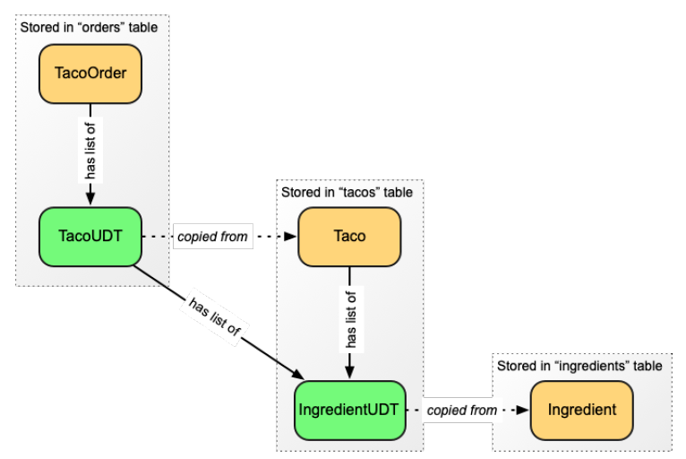

### 4.1.3 Ánh xạ các kiểu miền để lưu trữ trong Cassandra

Trong chương 3, bạn đã đánh dấu các kiểu miền của mình (`Taco`, `Ingredient`, `TacoOrder`, v.v.) bằng các annotation được cung cấp bởi đặc tả JPA. Những annotation này ánh xạ các kiểu miền của bạn như các entity để được lưu trữ vào cơ sở dữ liệu quan hệ. Mặc dù những annotation đó sẽ không hoạt động với Cassandra, Spring Data Cassandra cung cấp một tập hợp các annotation ánh xạ riêng để phục vụ mục đích tương tự.

Hãy bắt đầu với lớp `Ingredient`, vì đây là lớp đơn giản nhất để ánh xạ cho Cassandra. Lớp `Ingredient` đã sẵn sàng cho Cassandra trông như sau:

```java
package tacos;

import org.springframework.data.cassandra.core.mapping.PrimaryKey;
import org.springframework.data.cassandra.core.mapping.Table;

import lombok.AccessLevel;
import lombok.AllArgsConstructor;
import lombok.Data;
import lombok.NoArgsConstructor;
import lombok.RequiredArgsConstructor;

@Data
@AllArgsConstructor
@NoArgsConstructor(access=AccessLevel.PRIVATE, force=true)
@Table("ingredients")
public class Ingredient {

  @PrimaryKey
  private String id;
  private String name;
  private Type type;

  public static enum Type {
    WRAP, PROTEIN, VEGGIES, CHEESE, SAUCE
  }

}
```

Lớp `Ingredient` có vẻ mâu thuẫn với những gì tôi đã nói về việc không chỉ đơn giản là thay thế một vài annotation. Thay vì đánh dấu lớp bằng `@Entity` như bạn đã làm với JPA, lần này bạn đánh dấu bằng `@Table` để chỉ định rằng các nguyên liệu (ingredients) sẽ được lưu vào một bảng tên là `ingredients`. Và thay vì đánh dấu thuộc tính `id` bằng `@Id`, bạn sử dụng `@PrimaryKey`. Cho đến thời điểm này, có vẻ như bạn chỉ đang thay thế một vài annotation.

Nhưng đừng để ánh xạ của `Ingredient` đánh lừa bạn. Lớp `Ingredient` là một trong những kiểu miền đơn giản nhất. Mọi thứ trở nên thú vị hơn khi bạn ánh xạ lớp `Taco` để lưu trữ với Cassandra, như được minh họa trong listing tiếp theo.

**Listing 4.1 Đánh dấu annotation cho lớp Taco để lưu trữ với Cassandra**

```java
package tacos;
import java.util.ArrayList;
import java.util.Date;
import java.util.List;
import java.util.UUID;

import javax.validation.constraints.NotNull;
import javax.validation.constraints.Size;

import org.springframework.data.cassandra.core.cql.Ordering;
import org.springframework.data.cassandra.core.cql.PrimaryKeyType;
import org.springframework.data.cassandra.core.mapping.Column;
import org.springframework.data.cassandra.core.mapping.PrimaryKeyColumn;
import org.springframework.data.cassandra.core.mapping.Table;

import com.datastax.oss.driver.api.core.uuid.Uuids;

import lombok.Data;

@Data
@Table("tacos")
public class Taco {

  @PrimaryKeyColumn(type=PrimaryKeyType.PARTITIONED)
  private UUID id = Uuids.timeBased();

  @NotNull
  @Size(min = 5, message = "Name must be at least 5 characters long")
  private String name;

  @PrimaryKeyColumn(type=PrimaryKeyType.CLUSTERED,
            ordering=Ordering.DESCENDING)
  private Date createdAt = new Date();

  @Size(min=1, message="You must choose at least 1 ingredient")
  @Column("ingredients")
  private List<IngredientUDT> ingredients = new ArrayList<>();

  public void addIngredient(Ingredient ingredient) {
    this.ingredients.add(TacoUDRUtils.toIngredientUDT(ingredient));
  }
}
```

Như bạn thấy, ánh xạ cho lớp `Taco` phức tạp hơn một chút. Giống như `Ingredient`, annotation `@Table` được sử dụng để xác định `tacos` là tên bảng nơi các bản ghi `Taco` sẽ được ghi vào. Nhưng đó là điểm tương đồng duy nhất với `Ingredient`.

Thuộc tính `id` vẫn là khóa chính của bạn, nhưng lần này nó chỉ là một trong hai cột khóa chính. Cụ thể hơn, thuộc tính `id` được đánh dấu với `@PrimaryKeyColumn` và có kiểu `PrimaryKeyType.PARTITIONED`. Điều này xác định rằng `id` sẽ được dùng làm khóa phân vùng, giúp Cassandra biết hàng dữ liệu taco sẽ được ghi vào phân vùng nào.

Bạn cũng sẽ nhận thấy rằng thuộc tính `id` bây giờ là kiểu `UUID` thay vì `Long`. Mặc dù không bắt buộc, nhưng các thuộc tính giữ giá trị ID được sinh tự động thường dùng kiểu `UUID`. Hơn nữa, `UUID` này được khởi tạo với một giá trị UUID dựa theo thời gian cho các đối tượng `Taco` mới (nhưng có thể được ghi đè khi đọc `Taco` hiện có từ cơ sở dữ liệu).

Ở phần tiếp theo, bạn sẽ thấy thuộc tính `createdAt` được ánh xạ như một cột khóa chính khác. Nhưng lần này, thuộc tính `type` của `@PrimaryKeyColumn` được đặt là `PrimaryKeyType.CLUSTERED`, điều này đánh dấu `createdAt` là một khóa sắp xếp (clustering key). Như đã đề cập trước đó, các khóa sắp xếp được sử dụng để xác định thứ tự của các hàng _trong một phân vùng_. Cụ thể, thứ tự được đặt là giảm dần—do đó, trong một phân vùng nhất định, các hàng mới hơn sẽ xuất hiện trước trong bảng `tacos`.

Cuối cùng, thuộc tính `ingredients` bây giờ là một `List` các đối tượng `IngredientUDT` thay vì `List` các `Ingredient`. Như bạn đã biết, các bảng Cassandra thường bị phi chuẩn hóa cao và có thể chứa dữ liệu bị trùng lặp từ các bảng khác. Mặc dù bảng `ingredient` sẽ là bảng chính ghi lại tất cả các nguyên liệu khả dụng, các nguyên liệu được chọn cho một taco sẽ được sao chép trong cột `ingredients`. Thay vì chỉ tham chiếu đến một hoặc nhiều hàng trong bảng `ingredients`, thuộc tính `ingredients` sẽ chứa toàn bộ dữ liệu của từng nguyên liệu được chọn.

Nhưng tại sao bạn cần tạo một lớp mới là `IngredientUDT`? Tại sao không tái sử dụng lớp `Ingredient`? Đơn giản là vì các cột chứa tập hợp dữ liệu, như cột `ingredients`, phải là tập hợp của các kiểu dữ liệu nguyên thủy (số nguyên, chuỗi, v.v.) hoặc các kiểu do người dùng định nghĩa (user-defined types - UDT).

Trong Cassandra, các kiểu do người dùng định nghĩa cho phép bạn khai báo các cột bảng phức tạp hơn các kiểu nguyên thủy thông thường. Chúng thường được dùng như một dạng phi chuẩn hóa thay thế cho khóa ngoại trong hệ quản trị quan hệ. Khác với khóa ngoại chỉ chứa tham chiếu đến một hàng ở bảng khác, các cột với kiểu do người dùng định nghĩa thực sự mang dữ liệu có thể được sao chép từ một hàng ở bảng khác. Trong trường hợp của cột `ingredients` trong bảng `tacos`, nó sẽ chứa một tập hợp cấu trúc dữ liệu mô tả từng nguyên liệu.

Bạn không thể dùng lớp `Ingredient` như một kiểu do người dùng định nghĩa, vì annotation `@Table` đã ánh xạ nó như một entity để lưu trữ trong Cassandra. Do đó, bạn phải tạo một lớp mới để định nghĩa cách các nguyên liệu sẽ được lưu trong cột `ingredients` của bảng taco. `IngredientUDT` (nơi `UDT` nghĩa là _kiểu do người dùng định nghĩa_) là lớp phù hợp cho công việc này, như được trình bày dưới đây:

```java
package tacos;

import org.springframework.data.cassandra.core.mapping.UserDefinedType;

import lombok.AccessLevel;
import lombok.Data;
import lombok.NoArgsConstructor;
import lombok.RequiredArgsConstructor;

@Data
@RequiredArgsConstructor
@NoArgsConstructor(access = AccessLevel.PRIVATE, force = true)
@UserDefinedType("ingredient")
public class IngredientUDT {

  private final String name;

  private final Ingredient.Type type;

}
```

Mặc dù `IngredientUDT` trông rất giống với `Ingredient`, nhưng yêu cầu ánh xạ của nó đơn giản hơn nhiều. Nó được đánh dấu bằng annotation `@UserDefinedType` để xác định rằng đây là một kiểu do người dùng định nghĩa trong Cassandra. Ngoài ra, nó chỉ là một lớp đơn giản với một vài thuộc tính.

Bạn cũng sẽ nhận thấy rằng lớp `IngredientUDT` không bao gồm thuộc tính `id`. Mặc dù nó có thể bao gồm bản sao của thuộc tính `id` từ `Ingredient` gốc, nhưng điều đó không cần thiết. Trên thực tế, kiểu do người dùng định nghĩa có thể bao gồm bất kỳ thuộc tính nào bạn muốn—nó không cần phải ánh xạ một-một với bất kỳ định nghĩa bảng nào.

Tôi hiểu rằng có thể sẽ khó để hình dung cách mà dữ liệu trong kiểu do người dùng định nghĩa liên quan đến dữ liệu được lưu trong bảng. Hình 4.1 hiển thị mô hình dữ liệu cho toàn bộ cơ sở dữ liệu Taco Cloud, bao gồm cả các kiểu do người dùng định nghĩa.

  
**Hình 4.1 Thay vì sử dụng khóa ngoại và phép nối, các bảng Cassandra được phi chuẩn hóa, với các kiểu do người dùng định nghĩa chứa dữ liệu sao chép từ các bảng liên quan.**

Cụ thể với kiểu do người dùng định nghĩa mà bạn vừa tạo, hãy chú ý cách mà `Taco` có một danh sách các đối tượng `IngredientUDT`, chứa dữ liệu được sao chép từ các đối tượng `Ingredient`. Khi một `Taco` được lưu trữ, chính đối tượng `Taco` và danh sách các đối tượng `IngredientUDT` sẽ được lưu vào bảng `tacos`. Danh sách các `IngredientUDT` sẽ được lưu toàn bộ trong cột `ingredients`.

Một cách khác để nhìn nhận điều này (và giúp bạn hiểu rõ hơn cách sử dụng các kiểu do người dùng định nghĩa) là thực hiện truy vấn cơ sở dữ liệu để lấy các hàng từ bảng `tacos`. Sử dụng CQL và công cụ `cqlsh` đi kèm với Cassandra, bạn sẽ thấy kết quả như sau:

```sql
cqlsh:tacocloud> select id, name, createdAt, ingredients from tacos;

id       | name      | createdat | ingredients
---------+-----------+-----------+----------------------------------------
827390...| Carnivore | 2018-04...| [{name: 'Flour Tortilla', type: 'WRAP'},
                                    {name: 'Carnitas', type: 'PROTEIN'},
                                    {name: 'Sour Cream', type: 'SAUCE'},
                                    {name: 'Salsa', type: 'SAUCE'},
                                    {name: 'Cheddar', type: 'CHEESE'}]

(1 rows)
```

Như bạn thấy, các cột `id`, `name` và `createdat` chứa các giá trị đơn giản. Về mặt này, chúng không khác mấy so với những gì bạn mong đợi từ một truy vấn tương tự trong cơ sở dữ liệu quan hệ. Nhưng cột `ingredients` thì khác một chút. Bởi vì nó được định nghĩa là chứa một tập hợp của kiểu nguyên liệu do người dùng định nghĩa (được định nghĩa bởi `IngredientUDT`), nên giá trị của nó xuất hiện như một mảng JSON chứa các đối tượng JSON.

Có thể bạn cũng đã chú ý đến các kiểu do người dùng định nghĩa khác trong hình 4.1. Bạn chắc chắn sẽ tạo thêm một vài kiểu nữa khi tiếp tục ánh xạ miền của mình sang các bảng Cassandra, bao gồm một số kiểu sẽ được sử dụng bởi lớp `TacoOrder`. Listing tiếp theo hiển thị lớp `TacoOrder` đã được sửa đổi để lưu trữ trong Cassandra.

**Listing 4.2 Ánh xạ lớp TacoOrder sang bảng orders trong Cassandra**

```java
package tacos;
import java.io.Serializable;
import java.util.ArrayList;
import java.util.Date;
import java.util.List;
import java.util.UUID;

import javax.validation.constraints.Digits;
import javax.validation.constraints.NotBlank;
import javax.validation.constraints.Pattern;

import org.hibernate.validator.constraints.CreditCardNumber;
import org.springframework.data.cassandra.core.mapping.Column;
import org.springframework.data.cassandra.core.mapping.PrimaryKey;
import org.springframework.data.cassandra.core.mapping.Table;

import com.datastax.oss.driver.api.core.uuid.Uuids;

import lombok.Data;

@Data
@Table("orders")
public class TacoOrder implements Serializable {

  private static final long serialVersionUID = 1L;

  @PrimaryKey
  private UUID id = Uuids.timeBased();

  private Date placedAt = new Date();

  // delivery and credit card properties omitted for brevity's sake

  @Column("tacos")
  private List<TacoUDT> tacos = new ArrayList<>();

  public void addTaco(TacoUDT taco) {
    this.tacos.add(taco);
  }
}
```

Listing 4.2 cố ý loại bỏ nhiều thuộc tính của `TacoOrder` mà không liên quan đến mô hình dữ liệu Cassandra. Phần còn lại là một vài thuộc tính và ánh xạ, tương tự như cách mà `Taco` đã được định nghĩa. Annotation `@Table` được sử dụng để ánh xạ `TacoOrder` sang bảng `orders`, giống như cách đã dùng với các bảng trước. Trong trường hợp này, bạn không cần quan tâm đến việc sắp xếp, nên thuộc tính `id` được đánh dấu đơn giản với `@PrimaryKey`, điều này mặc định cho nó vai trò cả khóa phân vùng và khóa sắp xếp.

Thuộc tính `tacos` khá đáng chú ý vì nó là một `List<TacoUDT>` thay vì danh sách các đối tượng `Taco`. Mối quan hệ giữa `TacoOrder` và `Taco/TacoUDT` ở đây tương tự như mối quan hệ giữa `Taco` và `Ingredient/IngredientUDT`. Tức là, thay vì nối dữ liệu từ nhiều hàng ở một bảng riêng thông qua khóa ngoại, bảng `orders` sẽ chứa toàn bộ dữ liệu cần thiết của taco, giúp tối ưu bảng này cho các truy vấn đọc nhanh chóng.

Lớp `TacoUDT` khá giống với lớp `IngredientUDT`, mặc dù nó bao gồm một tập hợp tham chiếu đến một kiểu do người dùng định nghĩa khác, như sau:

```java
package tacos;

import java.util.List;
import org.springframework.data.cassandra.core.mapping.UserDefinedType;
import lombok.Data;

@Data
@UserDefinedType("taco")
public class TacoUDT {

  private final String name;
  private final List<IngredientUDT> ingredients;

}
```

Mặc dù sẽ rất tiện nếu có thể tái sử dụng các lớp miền mà bạn đã tạo ở chương 3, hoặc cùng lắm chỉ thay một vài annotation JPA bằng annotation Cassandra, nhưng bản chất của việc lưu trữ trong Cassandra là yêu cầu bạn phải suy nghĩ lại cách mô hình hóa dữ liệu của mình. Nhưng giờ đây, khi bạn đã ánh xạ xong các kiểu miền của mình, bạn đã sẵn sàng để viết repository.
