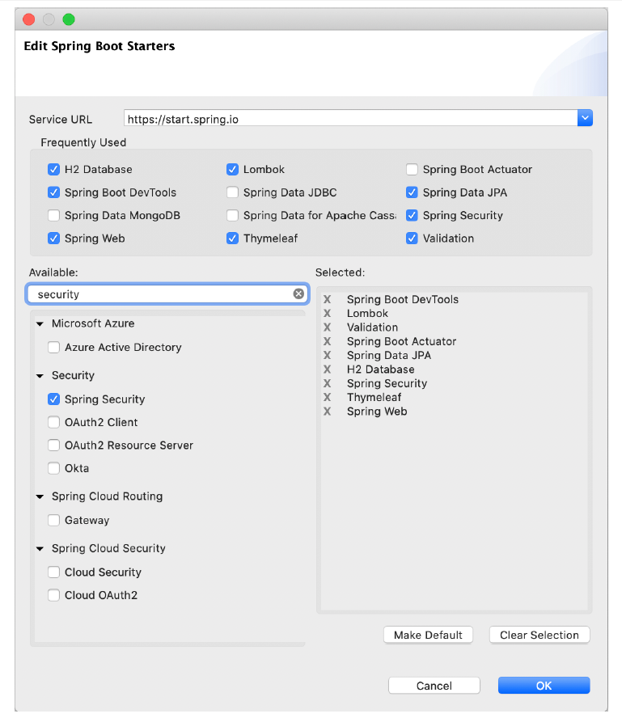
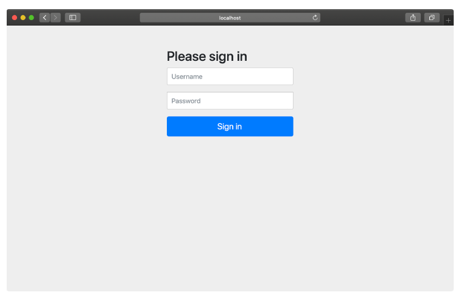

## 5.1 Kích hoạt Spring Security

Bước đầu tiên để bảo mật ứng dụng Spring của bạn là thêm dependency Spring Boot Security Starter vào file build. Trong file `pom.xml` của dự án, thêm đoạn `<dependency>` sau:  

```xml
<dependency>
    <groupId>org.springframework.boot</groupId>
    <artifactId>spring-boot-starter-security</artifactId>
</dependency>
```

Nếu bạn đang sử dụng Spring Tool Suite, thao tác này còn dễ hơn nữa. Nhấp chuột phải vào file `pom.xml` và chọn **Edit Starters** từ menu ngữ cảnh của Spring. Trong hộp thoại starter dependencies, chọn mục **Spring Security** dưới danh mục **Security**, như hiển thị trong hình 5.1.

  
**Hình 5.1 Thêm starter bảo mật bằng Spring Tool Suite**

Tin hay không thì tùy, nhưng chỉ cần dependency đó là đủ để bảo vệ một ứng dụng. Khi ứng dụng khởi động, tính năng cấu hình tự động sẽ phát hiện rằng Spring Security đã có trong classpath và sẽ thiết lập cấu hình bảo mật cơ bản.

Nếu bạn muốn thử nghiệm, hãy chạy ứng dụng và truy cập vào trang chủ (hoặc bất kỳ trang nào). Bạn sẽ được yêu cầu xác thực với một trang đăng nhập đơn giản như hình 5.2.

  
**Hình 5.2 Spring Security cung cấp sẵn cho bạn một trang đăng nhập đơn giản**

>**Duyệt ẩn danh:** Bạn có thể thấy hữu ích khi đặt trình duyệt của mình ở chế độ riêng tư hoặc ẩn danh khi kiểm tra bảo mật thủ công. Điều này đảm bảo rằng bạn có một phiên mới mỗi lần mở cửa sổ riêng tư/ẩn danh. Bạn sẽ phải đăng nhập lại mỗi lần, nhưng sẽ đảm bảo rằng mọi thay đổi về bảo mật bạn đã thực hiện đều được áp dụng và không có tàn dư của phiên cũ nào gây ảnh hưởng.

Để vượt qua trang đăng nhập, bạn cần cung cấp tên người dùng và mật khẩu. Tên người dùng là `user`. Còn mật khẩu thì được tạo ngẫu nhiên và ghi vào file log của ứng dụng. Dòng log sẽ trông như sau:  

```text
Using generated security password: 087cfc6a-027d-44bc-95d7-cbb3a798a1ea
```

Miễn là bạn nhập đúng tên người dùng và mật khẩu, bạn sẽ được cấp quyền truy cập vào ứng dụng.

Có vẻ như bảo mật ứng dụng Spring là việc khá dễ dàng. Với ứng dụng Taco Cloud đã được bảo vệ, có lẽ tôi có thể kết thúc chương này tại đây và chuyển sang chủ đề tiếp theo. Nhưng trước khi đi quá xa, hãy xem xét kỹ hơn những gì cấu hình tự động đã cung cấp cho chúng ta.

Chỉ bằng cách thêm starter security vào cấu hình build của dự án, bạn đã có được các tính năng bảo mật sau:

* Tất cả các đường dẫn HTTP yêu cầu xác thực.
* Không yêu cầu vai trò (role) hoặc quyền hạn (authority) cụ thể.
* Khi cần xác thực, sẽ hiện một trang đăng nhập đơn giản.
* Chỉ có một người dùng; tên đăng nhập là _user_.

Đây là một khởi đầu tốt, nhưng tôi cho rằng hầu hết các ứng dụng (bao gồm Taco Cloud) sẽ có nhu cầu bảo mật khác biệt hơn so với các tính năng cơ bản trên.

Bạn cần phải làm thêm một số việc nếu muốn bảo mật đúng cách cho ứng dụng Taco Cloud. Cụ thể, bạn cần cấu hình Spring Security để:

* Cung cấp một trang đăng nhập được thiết kế phù hợp với giao diện website.
* Hỗ trợ nhiều người dùng, và có trang đăng ký để khách hàng mới đăng ký tài khoản Taco Cloud.
* Áp dụng các quy tắc bảo mật khác nhau cho từng đường dẫn. Ví dụ: trang chủ và trang đăng ký không nên yêu cầu xác thực.

Để đáp ứng các yêu cầu bảo mật cho Taco Cloud, bạn sẽ cần viết cấu hình rõ ràng, ghi đè lại những gì cấu hình tự động đã thiết lập. Bắt đầu bằng cách cấu hình nơi lưu trữ người dùng phù hợp để có thể hỗ trợ nhiều tài khoản.
