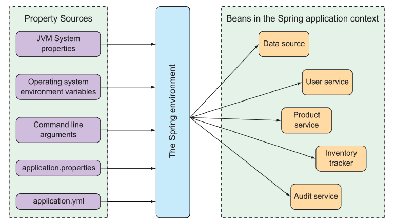

### 6.1.1 Hiểu về lớp trừu tượng môi trường (environment) của Spring

Lớp trừu tượng môi trường (environment abstraction) của Spring là nơi tập trung cho mọi thuộc tính có thể cấu hình. Nó trừu tượng hóa nguồn gốc của các thuộc tính để các bean cần sử dụng chúng có thể lấy trực tiếp từ Spring. Spring Environment sẽ lấy dữ liệu từ nhiều nguồn thuộc tính khác nhau, bao gồm:

* Thuộc tính hệ thống JVM
* Biến môi trường của hệ điều hành
* Tham số dòng lệnh
* Các tệp cấu hình thuộc tính của ứng dụng

Sau đó, Spring sẽ tổng hợp tất cả các thuộc tính đó thành một nguồn duy nhất để tiêm vào các bean trong ứng dụng. Hình 6.1 minh họa cách các thuộc tính từ nhiều nguồn được chuyển qua lớp trừu tượng môi trường của Spring để đến với các bean.

  
**Hình 6.1 Môi trường Spring lấy các thuộc tính từ các nguồn khác nhau và cung cấp cho các bean trong application context.**

Các bean được Spring Boot cấu hình tự động đều có thể được điều chỉnh bằng các thuộc tính lấy từ môi trường của Spring. Ví dụ đơn giản, giả sử bạn muốn container servlet bên dưới của ứng dụng lắng nghe yêu cầu trên một cổng khác thay vì cổng mặc định 8080. Để làm điều đó, bạn chỉ cần chỉ định một cổng khác bằng cách thiết lập thuộc tính `server.port` trong tệp `src/main/resources/application.properties` như sau:

```xml
server.port=9090
```

Cá nhân tôi thích dùng YAML hơn khi cấu hình các thuộc tính. Vì vậy, thay vì dùng `application.properties`, tôi có thể thiết lập giá trị `server.port` trong tệp `src/main/resources/application.yml` như sau:

```yaml
server:
  port: 9090
```

Nếu bạn muốn cấu hình thuộc tính này từ bên ngoài, bạn cũng có thể chỉ định cổng khi khởi động ứng dụng bằng một tham số dòng lệnh như sau:

```bash
java -jar tacocloud-0.0.5-SNAPSHOT.jar --server.port=9090
```

Nếu bạn muốn ứng dụng luôn luôn khởi động trên một cổng cụ thể, bạn có thể thiết lập nó một lần duy nhất dưới dạng biến môi trường của hệ điều hành, ví dụ:

```bash
export SERVER_PORT=9090
```

Lưu ý rằng khi thiết lập thuộc tính dưới dạng biến môi trường, kiểu đặt tên hơi khác một chút để phù hợp với giới hạn đặt tên của hệ điều hành. Không sao cả. Spring hoàn toàn có thể xử lý điều đó và hiểu `SERVER_PORT` là `server.port` mà không gặp vấn đề gì.

Như tôi đã đề cập, có nhiều cách khác nhau để thiết lập các thuộc tính cấu hình. Trên thực tế, bạn có thể sử dụng hàng trăm thuộc tính cấu hình khác nhau để tinh chỉnh và điều chỉnh hành vi của các bean trong Spring. Bạn đã từng thấy một vài thuộc tính như: `server.port` trong chương này, cũng như `spring.datasource.name` và `spring.thymeleaf.cache` ở các chương trước.

Việc xem xét tất cả các thuộc tính cấu hình khả dụng trong một chương là điều không thể. Tuy vậy, hãy cùng xem một số thuộc tính phổ biến và hữu ích mà bạn thường sẽ gặp. Chúng ta sẽ bắt đầu với một vài thuộc tính giúp bạn tinh chỉnh cấu hình tự động cho `DataSource`.
