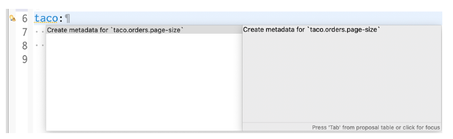
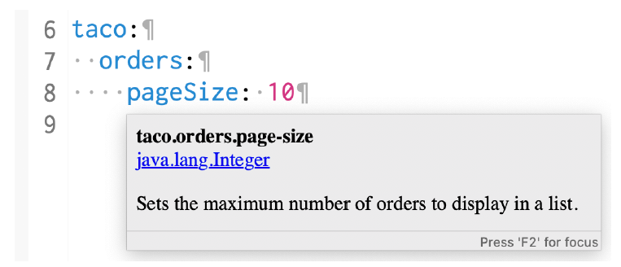
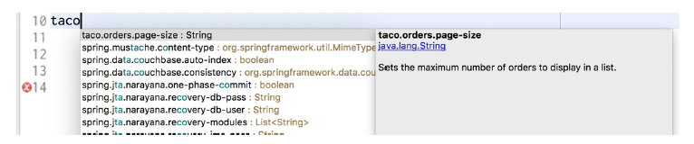

### 6.2.2 Khai báo metadata cho thuộc tính cấu hình

Tùy thuộc vào IDE của bạn, bạn có thể đã nhận thấy rằng mục `taco.orders.pageSize` trong application.yml (hoặc application.properties) có cảnh báo kiểu như Unknown Property ‘taco’. Cảnh báo này xuất hiện vì thiếu metadata liên quan đến thuộc tính cấu hình bạn vừa tạo. Hình 6.2 minh họa điều này khi tôi di chuột qua phần taco của thuộc tính trong Spring Tool Suite.


**Hình 6.2 Cảnh báo về thiếu metadata cho thuộc tính cấu hình**

Metadata cho thuộc tính cấu hình là hoàn toàn tùy chọn và không ngăn cản thuộc tính hoạt động. Nhưng metadata có thể hữu ích trong việc cung cấp một số tài liệu tối thiểu liên quan đến các thuộc tính cấu hình, đặc biệt là trong IDE. Ví dụ, khi tôi di chuột qua thuộc tính `spring.security.user.password`, tôi thấy những gì được hiển thị trong hình 6.3. Mặc dù thông tin hỗ trợ hiển thị không nhiều, nhưng có thể đủ để hiểu thuộc tính này được dùng để làm gì và cách sử dụng nó.


**Hình 6.3 Tài liệu hiển thị khi di chuột qua các thuộc tính cấu hình trong Spring Tool Suite**

Để giúp những người khác (hoặc chính bạn trong tương lai) sử dụng các thuộc tính cấu hình bạn định nghĩa, thường là một ý tưởng hay khi tạo metadata cho những thuộc tính đó. Ít nhất thì điều này cũng giúp loại bỏ những cảnh báo màu vàng khó chịu trong IDE.

Để tạo metadata cho các thuộc tính cấu hình tùy chỉnh, bạn cần tạo một tệp trong thư mục META-INF (ví dụ: trong dự án tại `src/main/resources/META-INF`) có tên là `additional-spring-configuration-metadata.json`.

#### SỬA NHANH VIỆC THIẾU METADATA

Nếu bạn đang sử dụng Spring Tool Suite, có một tùy chọn sửa nhanh (quick-fix) để tạo metadata bị thiếu cho thuộc tính. Đặt con trỏ tại dòng có cảnh báo thiếu metadata và mở hộp thoại quick-fix bằng cách nhấn CMD-1 trên Mac hoặc Ctrl-1 trên Windows và Linux (xem hình 6.4).


**Hình 6.4 Tạo metadata cho thuộc tính cấu hình bằng quick-fix trong Spring Tool Suite**

Sau đó chọn tùy chọn “Create Metadata for …” để thêm metadata cho thuộc tính đó. Nếu tệp chưa tồn tại, thao tác quick-fix này sẽ tạo ra tệp `META-INF/additional-spring-configuration-metadata.json` và điền vào đó một số metadata cho thuộc tính `pageSize`, như được hiển thị trong đoạn mã tiếp theo.

```json
{"properties": [{
  "name": "taco.orders.page-size",
  "type": "java.lang.String",
  "description": "A description for 'taco.orders.page-size'"
}]}
```

Lưu ý rằng tên thuộc tính được tham chiếu trong metadata là `taco.orders.page-size`, trong khi tên thuộc tính thực tế trong application.yml là `pageSize`. Spring Boot hỗ trợ đặt tên thuộc tính linh hoạt, cho phép các biến thể như `taco.orders.page-size` tương đương với `taco.orders.pageSize`, vì vậy không quá quan trọng việc bạn sử dụng hình thức nào.

Metadata ban đầu được ghi vào `additional-spring-configuration-metadata.json` là một khởi đầu tốt, nhưng bạn có thể muốn chỉnh sửa nó một chút. Trước hết, thuộc tính `pageSize` không phải là kiểu `java.lang.String`, nên bạn sẽ muốn đổi nó thành `java.lang.Integer`. Và thuộc tính `description` nên được thay đổi để mô tả rõ ràng hơn về mục đích của `pageSize`. Đoạn mã JSON sau đây là ví dụ về metadata sau khi được chỉnh sửa:

```json
{"properties": [{
  "name": "taco.orders.page-size",
  "type": "java.lang.Integer",
  "description": "Sets the maximum number of orders to display in a list."
}]}
```

Khi metadata này đã được thêm vào, các cảnh báo sẽ biến mất. Hơn nữa, nếu bạn di chuột qua thuộc tính `taco.orders.pageSize`, bạn sẽ thấy phần mô tả như được hiển thị trong hình 6.5.


**Hình 6.5 Hỗ trợ hiển thị mô tả khi di chuột qua các thuộc tính cấu hình tùy chỉnh**

Ngoài ra, như được minh họa trong hình 6.6, bạn còn nhận được tính năng tự động hoàn thành thuộc tính trong IDE, giống như các thuộc tính do Spring cung cấp.


**Hình 6.6 Metadata của thuộc tính cấu hình cho phép gợi ý tự động khi viết mã**

Như bạn đã thấy, thuộc tính cấu hình rất hữu ích để điều chỉnh cả các thành phần được tự động cấu hình và các chi tiết được tiêm vào các bean trong ứng dụng của bạn. Nhưng nếu bạn cần cấu hình các thuộc tính khác nhau cho các môi trường triển khai khác nhau thì sao? Hãy cùng xem cách sử dụng các profile của Spring để thiết lập cấu hình theo môi trường cụ thể.
