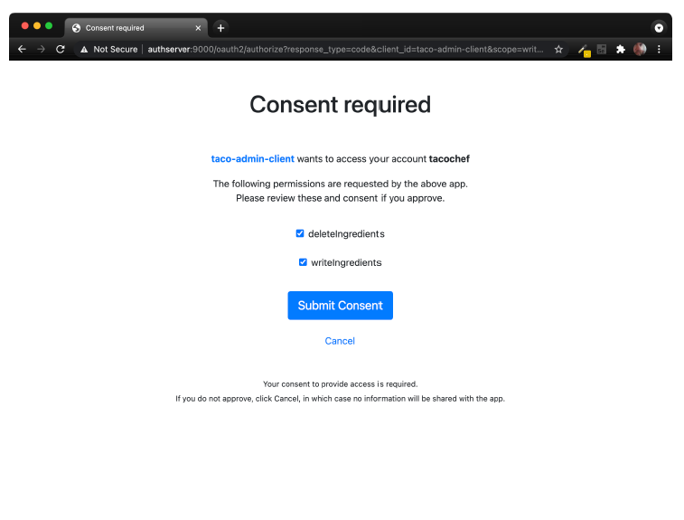
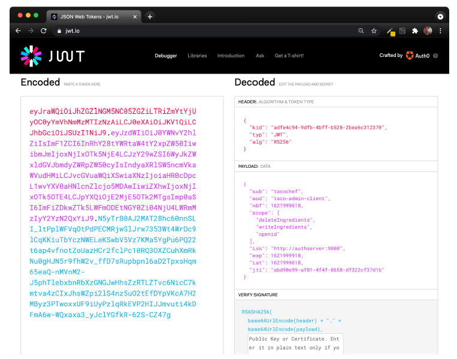

## 8.2 Tạo máy chủ cấp quyền (authorization server)

Nhiệm vụ chính của một máy chủ cấp quyền là phát hành **access token** thay mặt người dùng. Như đã đề cập trước đó, chúng ta có một số cách triển khai máy chủ cấp quyền để lựa chọn, nhưng trong dự án này, chúng ta sẽ sử dụng **Spring Authorization Server**. Spring Authorization Server hiện đang trong giai đoạn thử nghiệm và chưa triển khai đầy đủ tất cả các loại ủy quyền của OAuth 2, nhưng nó có hỗ trợ **authorization code grant** và **client credentials grant**.

Máy chủ cấp quyền là một ứng dụng riêng biệt với bất kỳ ứng dụng nào cung cấp API và cũng riêng biệt với client. Do đó, để bắt đầu với Spring Authorization Server, bạn cần tạo một **dự án Spring Boot mới**, lựa chọn ít nhất các **starter web và security**. Đối với máy chủ cấp quyền của chúng ta, người dùng sẽ được lưu trữ trong cơ sở dữ liệu quan hệ sử dụng **JPA**, vì vậy hãy chắc chắn thêm các phụ thuộc **starter JPA** và **H2**. Ngoài ra, nếu bạn đang dùng **Lombok** để xử lý getter, setter, constructor, v.v..., hãy thêm phụ thuộc này vào dự án luôn.

Spring Authorization Server **(chưa được hỗ trợ)** trực tiếp từ Spring Initializr. Vì vậy, sau khi tạo dự án, bạn cần **thêm thủ công phụ thuộc Spring Authorization Server** vào tệp build của mình. Ví dụ, sau đây là đoạn mã Maven bạn cần thêm vào `pom.xml`:

```xml
<dependency>
  <groupId>org.springframework.security.experimental</groupId>
  <artifactId>spring-security-oauth2-authorization-server</artifactId>
  <version>0.1.2</version>
</dependency>
```

Tiếp theo, vì chúng ta sẽ chạy toàn bộ trên máy phát triển (ít nhất là hiện tại), bạn cần đảm bảo rằng **không có xung đột cổng** giữa ứng dụng Taco Cloud chính và máy chủ cấp quyền. Thêm cấu hình sau vào tệp `application.yml` của dự án để đặt máy chủ cấp quyền sử dụng cổng `9000`:

```yaml
server:
  port: 9000
```

Giờ hãy đi sâu vào cấu hình bảo mật cơ bản sẽ được sử dụng bởi máy chủ cấp quyền. Đoạn mã sau đây trình bày một lớp cấu hình Spring Security rất đơn giản sử dụng **form-based login** và yêu cầu tất cả các request phải được xác thực.

**Listing 8.2 Cấu hình bảo mật cơ bản cho đăng nhập bằng form**

```java
package tacos.authorization;
import org.springframework.context.annotation.Bean;
import org.springframework.security.config.annotation.web.builders.
              HttpSecurity;
import org.springframework.security.config.annotation.web.configuration.
              EnableWebSecurity;
import org.springframework.security.core.userdetails.UserDetailsService;
import org.springframework.security.crypto.bcrypt.BCryptPasswordEncoder;
import org.springframework.security.crypto.password.PasswordEncoder;
import org.springframework.security.web.SecurityFilterChain;

import tacos.authorization.users.UserRepository;

@EnableWebSecurity
public class SecurityConfig {

  @Bean
  SecurityFilterChain defaultSecurityFilterChain(HttpSecurity http)
          throws Exception {
    return http
      .authorizeRequests(authorizeRequests ->
          authorizeRequests.anyRequest().authenticated()
      )

      .formLogin()

      .and().build();
  }

  @Bean
  UserDetailsService userDetailsService(UserRepository userRepo) {
    return username -> userRepo.findByUsername(username);
  }

  @Bean
  public PasswordEncoder passwordEncoder() {
    return new BCryptPasswordEncoder();
  }
}
```

Lưu ý rằng bean `UserDetailsService` hoạt động cùng với `TacoUserRepository` để tìm kiếm người dùng theo username. Để tiếp tục cấu hình máy chủ cấp quyền, chúng ta sẽ bỏ qua chi tiết của `TacoUserRepository`, nhưng có thể nói rằng nó trông rất giống với các repository sử dụng Spring Data mà chúng ta đã tạo từ chương 3 đến giờ.

Điểm đáng chú ý duy nhất về `TacoUserRepository` là (để thuận tiện khi kiểm thử) bạn có thể sử dụng nó trong một bean `CommandLineRunner` để **khởi tạo cơ sở dữ liệu với một vài người dùng thử nghiệm** như sau:

```java
@Bean
public ApplicationRunner dataLoader(
          UserRepository repo, PasswordEncoder encoder) {
  return args -> {
    repo.save(
      new User("habuma", encoder.encode("password"), "ROLE_ADMIN"));
    repo.save(
      new User("tacochef", encoder.encode("password"), "ROLE_ADMIN"));
  };
}
```

Giờ chúng ta có thể bắt đầu cấu hình để kích hoạt máy chủ cấp quyền. Bước đầu tiên là tạo một lớp cấu hình mới và import các cấu hình dùng chung cho máy chủ cấp quyền. Mã sau đây cho `AuthorizationServerConfig` là một khởi đầu tốt:

```java
@Configuration(proxyBeanMethods = false)
public class AuthorizationServerConfig {

  @Bean
  @Order(Ordered.HIGHEST_PRECEDENCE)
  public SecurityFilterChain authorizationServerSecurityFilterChain(HttpSecurity http)
    throws Exception {
    OAuth2AuthorizationServerConfiguration
        .applyDefaultSecurity(http);
    return http
        .formLogin(Customizer.withDefaults())
        .build();
  }

  ...
}
```

Phương thức bean `authorizationServerSecurityFilterChain()` định nghĩa một `SecurityFilterChain` thiết lập một số hành vi mặc định cho máy chủ ủy quyền OAuth 2 và một trang đăng nhập bằng biểu mẫu mặc định. Annotation `@Order` được gán giá trị `Ordered.HIGHEST_PRECEDENCE` để đảm bảo rằng nếu vì lý do nào đó có các bean khác cùng loại được khai báo, thì bean này sẽ được ưu tiên hơn các bean khác.

Phần lớn đây là cấu hình mẫu sẵn (boilerplate). Nếu bạn muốn, có thể đi sâu và tùy chỉnh cấu hình. Nhưng hiện tại, chúng ta sẽ giữ nguyên cấu hình mặc định.

Một thành phần không phải là boilerplate, và do đó không được cung cấp sẵn bởi `OAuth2-AuthorizationServerConfiguration`, là kho lưu trữ client (client repository). Một client repository tương tự như một dịch vụ chi tiết người dùng (user details service) hoặc kho người dùng (user repository), ngoại trừ việc thay vì lưu thông tin người dùng, nó lưu thông tin về các client có thể yêu cầu cấp quyền thay mặt người dùng. Nó được định nghĩa bởi interface `RegisteredClientRepository`, trông như sau:

```java
public interface RegisteredClientRepository {

  @Nullable
  RegisteredClient findById(String id);

  @Nullable
  RegisteredClient findByClientId(String clientId);

}
```

Trong môi trường sản xuất, bạn có thể viết một triển khai tùy chỉnh của `RegisteredClientRepository` để truy xuất thông tin client từ cơ sở dữ liệu hoặc từ một nguồn nào đó khác. Nhưng mặc định, Spring Authorization Server cung cấp một triển khai lưu trữ trong bộ nhớ (in-memory) rất phù hợp cho mục đích trình diễn và kiểm thử. Bạn được khuyến khích triển khai `RegisteredClientRepository` theo cách phù hợp nhất với bạn. Nhưng với mục đích của chúng ta, ta sẽ sử dụng phiên bản in-memory để đăng ký một client duy nhất với máy chủ ủy quyền. Hãy thêm phương thức bean sau vào `AuthorizationServerConfig`:

```java
@Bean
public RegisteredClientRepository registeredClientRepository(
        PasswordEncoder passwordEncoder) {
  RegisteredClient registeredClient =
    RegisteredClient.withId(UUID.randomUUID().toString())
      .clientId("taco-admin-client")
      .clientSecret(passwordEncoder.encode("secret"))
      .clientAuthenticationMethod(
            ClientAuthenticationMethod.BASIC)
      .authorizationGrantType(AuthorizationGrantType.AUTHORIZATION_CODE)
      .authorizationGrantType(AuthorizationGrantType.REFRESH_TOKEN)
      .redirectUri(
            "http://127.0.0.1:9090/login/oauth2/code/taco-admin-client")
      .scope("writeIngredients")
      .scope("deleteIngredients")
      .scope(OidcScopes.OPENID)
      .clientSettings(
            clientSettings -> clientSettings.requireUserConsent(true))
      .build();
  return new InMemoryRegisteredClientRepository(registeredClient);
}
```

Như bạn có thể thấy, có rất nhiều chi tiết trong một `RegisteredClient`. Nhưng từ trên xuống dưới, đây là cách client của chúng ta được định nghĩa:

* **ID** — Một định danh ngẫu nhiên, duy nhất.
* **Client ID** — Tương tự như tên người dùng, nhưng thay vì là người dùng thì đây là client. Trong trường hợp này là `"taco-admin-client"`.
* **Client secret** — Tương tự như mật khẩu cho client. Ở đây chúng ta sử dụng từ `"secret"` làm client secret.
* **Authorization grant type** — Các loại cấp quyền OAuth 2 mà client này sẽ hỗ trợ. Trong trường hợp này, chúng ta bật cấp mã ủy quyền và cấp làm mới token (authorization code và refresh token).
* **Redirect URL** — Một hoặc nhiều URL đã đăng ký mà máy chủ ủy quyền có thể chuyển hướng đến sau khi cấp quyền. Điều này thêm một lớp bảo mật, ngăn không cho ứng dụng tùy ý nhận được mã ủy quyền để đổi lấy token.
* **Scope** — Một hoặc nhiều phạm vi (scope) OAuth 2 mà client này được phép yêu cầu. Ở đây, chúng ta đặt ba scope: `"writeIngredients"`, `"deleteIngredients"` và hằng số `OidcScopes.OPENID`, được chuyển thành `"openid"`. Phạm vi `"openid"` sẽ cần thiết sau này khi chúng ta sử dụng máy chủ ủy quyền như một giải pháp đăng nhập một lần (SSO) cho ứng dụng quản trị Taco Cloud.
* **Client settings** — Đây là một lambda cho phép chúng ta tùy chỉnh cài đặt client. Trong trường hợp này, chúng ta yêu cầu người dùng đồng ý rõ ràng trước khi cấp phạm vi được yêu cầu. Nếu không có điều này, phạm vi sẽ được cấp ngầm định sau khi người dùng đăng nhập.

Cuối cùng, vì máy chủ ủy quyền của chúng ta sẽ tạo ra các token JWT, các token này cần được ký bằng một chữ ký được tạo từ một JSON Web Key (JWK). Do đó, chúng ta cần một vài bean để tạo ra JWK. Hãy thêm phương thức bean sau (và các phương thức trợ giúp riêng tư) vào `AuthorizationServerConfig` để xử lý việc này:

```java
@Bean
public JWKSource<SecurityContext> jwkSource() {
  RSAKey rsaKey = generateRsa();
  JWKSet jwkSet = new JWKSet(rsaKey);
  return (jwkSelector, securityContext) -> jwkSelector.select(jwkSet);
}
private static RSAKey generateRsa() {
  KeyPair keyPair = generateRsaKey();
  RSAPublicKey publicKey = (RSAPublicKey) keyPair.getPublic();
  RSAPrivateKey privateKey = (RSAPrivateKey) keyPair.getPrivate();
  return new RSAKey.Builder(publicKey)
    .privateKey(privateKey)
    .keyID(UUID.randomUUID().toString())
    .build();
}
private static KeyPair generateRsaKey() {
  try {
    KeyPairGenerator keyPairGenerator = KeyPairGenerator.getInstance("RSA");
    keyPairGenerator.initialize(2048);
    return keyPairGenerator.generateKeyPair();
  } catch (Exception e) {
    return null;
  }
}
@Bean
public JwtDecoder jwtDecoder(JWKSource<SecurityContext> jwkSource) {
  return OAuth2AuthorizationServerConfiguration.jwtDecoder(jwkSource);
}
```

Trông có vẻ khá nhiều thứ diễn ra ở đây. Nhưng tóm lại, `JWKSource` tạo ra một cặp khóa RSA 2048-bit sẽ được dùng để ký token. Token sẽ được ký bằng khóa riêng. Máy chủ tài nguyên (resource server) sau đó có thể xác minh rằng token nhận được trong một yêu cầu là hợp lệ bằng cách lấy khóa công khai từ máy chủ ủy quyền. Chúng ta sẽ nói thêm về điều này khi tạo resource server.

Tất cả các thành phần của máy chủ ủy quyền của chúng ta hiện đã được thiết lập. Việc còn lại là khởi chạy và thử nghiệm nó. Hãy build và chạy ứng dụng, và bạn sẽ có một máy chủ ủy quyền lắng nghe ở cổng 9000.

Vì chúng ta chưa có client, bạn có thể giả vờ là một client bằng trình duyệt web của mình và công cụ dòng lệnh `curl`. Hãy bắt đầu bằng cách truy cập trình duyệt tại: <http://localhost:9000/oauth2/authorize?response_type=code&client_id=tacoadmin-client&redirect_uri=http://127.0.0.1:9090/login/oauth2/code/taco-admin-client&-scope=writeIngredients+deleteIngredients.4>. Bạn sẽ thấy một trang đăng nhập giống như hình 8.2.

  
**Hình 8.2 Trang đăng nhập của máy chủ ủy quyền**

Sau khi đăng nhập (với “tacochef” và “password,” hoặc một cặp tên người dùng/mật khẩu trong cơ sở dữ liệu được quản lý bởi `TacoUserRepository`), bạn sẽ được yêu cầu chấp thuận các scope đã yêu cầu trong một trang giống như hình 8.3.

  
**Hình 8.3 Trang đồng ý của máy chủ ủy quyền**

Sau khi đồng ý, trình duyệt sẽ được chuyển hướng trở lại URL của client. Chúng ta vẫn chưa có client, vì vậy có thể sẽ không có gì ở đó và bạn sẽ gặp lỗi. Nhưng không sao cả — chúng ta đang giả vờ là client, vì vậy chúng ta sẽ tự lấy mã ủy quyền từ URL.

Hãy nhìn vào thanh địa chỉ trình duyệt, bạn sẽ thấy URL có một tham số `code`. Hãy sao chép toàn bộ giá trị của tham số đó, và sử dụng nó trong dòng lệnh `curl` sau thay cho `$code`:

```bash
$ curl localhost:9000/oauth2/token \
  -H"Content-type: application/x-www-form-urlencoded" \
  -d"grant_type=authorization_code" \
  -d"redirect_uri=http://127.0.0.1:9090/login/oauth2/code/taco-admin-client" \
  -d"code=$code" \
  -u taco-admin-client:secret
```

Tại đây, chúng ta đang trao đổi mã ủy quyền (authorization code) mà ta nhận được để lấy một access token. Phần thân của payload được định dạng theo kiểu “application/x-www-form-urlencoded” và gửi đi grant type ("authorization_code"), URI chuyển hướng (để tăng bảo mật), và chính mã ủy quyền đó. Nếu mọi thứ diễn ra suôn sẻ, bạn sẽ nhận được một phản hồi JSON mà (khi được định dạng) trông như sau:

```json
{
  "access_token":"eyJraWQ...",
  "refresh_token":"HOzHA5s...",
  "scope":"deleteIngredients writeIngredients",
  "token_type":"Bearer",
  "expires_in":"299"
}
```

Thuộc tính `"access_token"` chứa token truy cập mà client có thể sử dụng để gửi các yêu cầu đến API. Trên thực tế, token này dài hơn nhiều so với bản hiển thị ở đây. Tương tự, `"refresh_token"` cũng đã được rút gọn để tiết kiệm không gian. Nhưng giờ đây, access token có thể được gửi trong các yêu cầu đến resource server để truy cập vào các tài nguyên yêu cầu scope `"writeIngredients"` hoặc `"deleteIngredients"`. Token truy cập này sẽ hết hạn sau 299 giây (chưa đầy 5 phút), vì vậy ta cần hành động nhanh nếu muốn sử dụng nó. Nhưng nếu nó hết hạn, bạn có thể sử dụng refresh token để nhận được một access token mới mà không cần thực hiện lại toàn bộ quy trình cấp quyền.

Vậy, làm thế nào để sử dụng access token? Giả định rằng chúng ta sẽ gửi nó trong yêu cầu đến Taco Cloud API như một phần của header `"Authorization"`—có thể giống như sau:

```bash
$ curl localhost:8080/ingredients \
  -H"Content-type: application/json" \
  -H"Authorization: Bearer eyJraWQ..." \
  -d'{"id":"FISH","name":"Stinky Fish", "type":"PROTEIN"}'
```

Tại thời điểm này, token sẽ chưa có tác dụng gì. Đó là vì API của Taco Cloud chưa được cấu hình để hoạt động như một resource server. Nhưng thay vì cần một resource server và một client thực thụ, bạn vẫn có thể kiểm tra access token bằng cách sao chép nó và dán vào biểu mẫu tại [https://jwt.io](https://jwt.io). Kết quả sẽ trông giống như hình 8.4.


**Hình 8.4 Giải mã một JWT token tại jwt.io**

Như bạn có thể thấy, token được giải mã thành ba phần: header, payload, và chữ ký (signature). Nếu nhìn kỹ vào phần payload, bạn sẽ thấy token này được cấp cho người dùng có tên là `tacochef`, và token chứa các scope `"writeIngredients"` và `"deleteIngredients"`, đúng như những gì chúng ta đã yêu cầu.

Sau khoảng 5 phút, access token sẽ hết hạn. Bạn vẫn có thể kiểm tra nó trên công cụ debug ở [https://jwt.io](https://jwt.io), nhưng nếu sử dụng nó trong một yêu cầu thực tế đến API, nó sẽ bị từ chối. Tuy nhiên, bạn có thể yêu cầu một access token mới mà không cần phải lặp lại quy trình cấp mã ủy quyền. Tất cả những gì bạn cần làm là gửi một yêu cầu mới đến máy chủ ủy quyền sử dụng grant `"refresh_token"` và truyền refresh token vào tham số `"refresh_token"`. Sử dụng `curl`, yêu cầu đó sẽ trông như sau:

```bash
$ curl localhost:9000/oauth2/token \
  -H"Content-type: application/x-www-form-urlencoded" \
  -d"grant_type=refresh_token&refresh_token=HOzHA5s..." \
  -u taco-admin-client:secret
```

Phản hồi của yêu cầu này sẽ giống như phản hồi từ lần yêu cầu đầu tiên khi bạn trao đổi authorization code để lấy access token, chỉ khác là lần này bạn sẽ nhận được một access token mới hoàn toàn.

Mặc dù việc dán access token vào [https://jwt.io](https://jwt.io) để kiểm tra khá thú vị, nhưng mục tiêu và sức mạnh thực sự của access token là để truy cập vào API. Vì vậy, chúng ta hãy tìm hiểu cách bật một resource server trên API của Taco Cloud.
