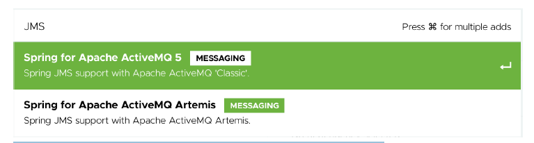

### 9.1.1 Thiết lập JMS

Trước khi có thể sử dụng JMS, bạn cần thêm một client JMS vào cấu hình build của dự án. Với Spring Boot, việc này vô cùng đơn giản. Tất cả những gì bạn cần làm là thêm một dependency starter vào cấu hình build. Tuy nhiên, trước tiên, bạn cần quyết định xem sẽ sử dụng Apache ActiveMQ hay trình môi giới mới hơn là Apache ActiveMQ Artemis.

Nếu bạn chọn ActiveMQ, hãy thêm dependency sau vào tệp `pom.xml` của dự án:  

```xml
<dependency>
    <groupId>org.springframework.boot</groupId>
    <artifactId>spring-boot-starter-activemq</artifactId>
</dependency>
```

Nếu bạn chọn ActiveMQ Artemis, dependency starter sẽ trông như sau:

```xml
<dependency>
    <groupId>org.springframework.boot</groupId>
    <artifactId>spring-boot-starter-artemis</artifactId>
</dependency>
```

Khi sử dụng Spring Initializr (hoặc công cụ giao diện của IDE với Initializr), bạn cũng có thể chọn một trong hai tùy chọn này làm starter dependency cho dự án của mình. Chúng được liệt kê là “Spring for Apache ActiveMQ 5” và “Spring for Apache ActiveMQ Artemis”, như trong ảnh chụp màn hình hình 9.1 từ [https://start.spring.io](https://start.spring.io).

  
**Hình 9.1 Các tùy chọn ActiveMQ và Artemis có sẵn trong Spring Initializr**

Artemis là một bản tái hiện thế hệ tiếp theo của ActiveMQ, về cơ bản khiến ActiveMQ trở thành một tùy chọn cũ. Vì vậy, với Taco Cloud, bạn sẽ chọn Artemis. Tuy nhiên, sự lựa chọn này gần như không ảnh hưởng đến cách bạn viết mã gửi và nhận tin nhắn. Sự khác biệt chính duy nhất là cách bạn cấu hình Spring để tạo kết nối đến broker.

>CHẠY TRÌNH ARTEMIS BROKER
>
>Bạn sẽ cần một broker Artemis đang chạy để có thể chạy được mã trong chương này. Nếu bạn chưa có một instance Artemis đang hoạt động, hãy làm theo hướng dẫn trong tài liệu Artemis tại [https://activemq.apache.org/.../latest/using-server.html](https://activemq.apache.org/.../latest/using-server.html)。

Theo mặc định, Spring giả định rằng broker Artemis của bạn đang lắng nghe trên localhost tại cổng 61616. Điều này phù hợp cho mục đích phát triển, nhưng khi bạn sẵn sàng đưa ứng dụng vào môi trường production, bạn sẽ cần thiết lập một vài thuộc tính để Spring biết cách kết nối đến broker. Các thuộc tính hữu ích nhất được liệt kê trong bảng 9.1.

**Bảng 9.1  Các thuộc tính cấu hình vị trí và thông tin xác thực của broker Artemis**

| Property | Description |
| :--- | :--- |
| `spring.artemis.host` | The broker’s host |
| `spring.artemis.port` | The broker’s port |
| `spring.artemis.user` | The user for accessing the broker (optional) |
| `spring.artemis.password` | The password for accessing the broker (optional) |

Ví dụ, hãy xem cấu hình sau trong tệp `application.yml`, có thể được sử dụng trong môi trường không phải phát triển:

```yaml
spring:
  artemis:
    host: artemis.tacocloud.com
    port: 61617
    user: tacoweb
    password: 13tm31n
```

Cấu hình này thiết lập Spring để tạo kết nối đến một broker Artemis lắng nghe tại `artemis.tacocloud.com`, cổng 61617. Nó cũng cấu hình thông tin đăng nhập cho ứng dụng sẽ tương tác với broker đó. Thông tin đăng nhập là tùy chọn, nhưng được khuyến nghị trong các bản triển khai production.

Nếu bạn sử dụng ActiveMQ thay vì Artemis, bạn sẽ cần dùng các thuộc tính riêng cho ActiveMQ được liệt kê trong bảng 9.2.

**Table 9.2 Properties for configuring the location and credentials of an ActiveMQ broker**

| Property | Description |
| :--- | :--- |
| `spring.activemq.broker-url` | The URL of the broker |
| `spring.activemq.user` | The user for accessing the broker (optional) |
| `spring.activemq.password` | The password for accessing the broker (optional) |
| `spring.activemq.in-memory` | Whether to start an in-memory broker (default: `true`) |

Lưu ý rằng thay vì cung cấp các thuộc tính riêng biệt cho hostname và port, địa chỉ của broker ActiveMQ được xác định bằng một thuộc tính duy nhất là `spring.activemq.broker-url`. URL này nên là một URL tcp://, như trong đoạn YAML sau:

```yaml
spring:
  activemq:
    broker-url: tcp://activemq.tacocloud.com
    user: tacoweb
    password: 13tm31n
```

Dù bạn chọn Artemis hay ActiveMQ, bạn sẽ không cần cấu hình các thuộc tính này trong quá trình phát triển khi broker đang chạy cục bộ.

Tuy nhiên, nếu bạn dùng ActiveMQ, bạn cần thiết lập thuộc tính `spring.activemq.in-memory` thành `false` để ngăn Spring khởi tạo một broker trong bộ nhớ. Một broker trong bộ nhớ có vẻ tiện lợi, nhưng nó chỉ hữu ích khi bạn gửi và nhận tin nhắn trong cùng một ứng dụng (trường hợp này khá hạn chế).

Thay vì dùng một broker nhúng, bạn nên cài đặt và khởi động một broker Artemis (hoặc ActiveMQ) trước khi tiếp tục. Thay vì lặp lại hướng dẫn cài đặt ở đây, bạn có thể xem chi tiết tại tài liệu chính thức của các broker:

* _Artemis_ —— [https://activemq.apache.org/artemis/docs/latest/using-server.html](https://activemq.apache.org/artemis/docs/latest/using-server.html)
* _ActiveMQ_ —— [http://activemq.apache.org/getting-started.html\#GettingStarted-PreInstallationRequirements](http://activemq.apache.org/getting-started.html#GettingStarted-PreInstallationRequirements)

Khi bạn đã thêm starter JMS vào cấu hình build và có một broker sẵn sàng truyền tải các tin nhắn từ ứng dụng này đến ứng dụng khác, bạn đã sẵn sàng bắt đầu gửi tin nhắn.
