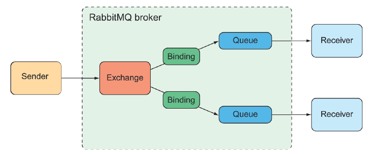

## 9.2 Làm việc với RabbitMQ và AMQP

Là một trong những triển khai nổi bật nhất của AMQP, RabbitMQ cung cấp chiến lược định tuyến thông điệp tiên tiến hơn so với JMS. Trong khi JMS định địa chỉ thông điệp bằng tên của một đích đến mà người nhận sẽ lấy thông điệp từ đó, thì AMQP định địa chỉ thông điệp bằng tên của một *exchange* và một *routing key*, vốn được tách rời khỏi *queue* mà người nhận đang lắng nghe. Mối quan hệ giữa *exchange* và *queue* này được minh họa trong hình 9.2.

  
**Hình 9.2 Các thông điệp gửi đến một exchange trong RabbitMQ sẽ được định tuyến đến một hoặc nhiều hàng đợi (queues), dựa trên routing key và các liên kết (binding).**

Khi một thông điệp đến RabbitMQ broker, nó sẽ đi đến *exchange* mà nó được định địa chỉ. *Exchange* chịu trách nhiệm định tuyến thông điệp đó đến một hoặc nhiều *queue*, tùy thuộc vào loại exchange, các liên kết giữa exchange và queue, và giá trị của *routing key* của thông điệp.

Có một số loại *exchange* khác nhau, bao gồm:

* *Default* —— Là một exchange đặc biệt được tạo tự động bởi broker. Nó định tuyến thông điệp đến *queue* có tên trùng với *routing key* của thông điệp. Tất cả *queue* sẽ tự động được liên kết với exchange mặc định này.
* *Direct* —— Định tuyến thông điệp đến *queue* có khóa liên kết (binding key) trùng với *routing key* của thông điệp.
* *Topic* —— Định tuyến một thông điệp đến một hoặc nhiều *queue* mà binding key (có thể chứa ký tự đại diện) khớp với *routing key* của thông điệp.
* *Fanout* —— Định tuyến thông điệp đến tất cả các *queue* đã liên kết, không quan tâm đến binding key hoặc routing key.
* *Headers* —— Tương tự như exchange loại *topic*, ngoại trừ việc định tuyến dựa trên giá trị của các header trong thông điệp thay vì *routing key*.
* *Dead letter* —— Là nơi chứa tất cả những thông điệp không thể gửi được (nghĩa là không khớp với bất kỳ binding nào đã được định nghĩa từ exchange đến queue).

Các loại *exchange* đơn giản nhất là *default* và *fanout* — chúng tương ứng một cách gần đúng với *queue* và *topic* trong JMS. Tuy nhiên, các loại exchange khác cho phép bạn định nghĩa các sơ đồ định tuyến linh hoạt hơn.

Điều quan trọng nhất cần hiểu là: thông điệp được gửi đến *exchange* kèm theo *routing key*, và được tiêu thụ từ các *queue*. Cách chúng đi từ *exchange* đến *queue* phụ thuộc vào các định nghĩa binding và những gì phù hợp nhất với trường hợp sử dụng của bạn.

Loại *exchange* mà bạn sử dụng và cách bạn định nghĩa các liên kết từ exchange đến queue không ảnh hưởng nhiều đến cách gửi và nhận thông điệp trong các ứng dụng Spring của bạn. Do đó, chúng ta sẽ tập trung vào cách viết mã để gửi và nhận thông điệp với Rabbit.

>**LƯU Ý**  
>Để có thảo luận chi tiết hơn về cách liên kết queue với exchange một cách tốt nhất, bạn có thể tham khảo *RabbitMQ in Depth* của Gavin Roy (Manning, 2017) hoặc *RabbitMQ in Action* của Alvaro Videla và Jason J. W. Williams (Manning, 2012).
