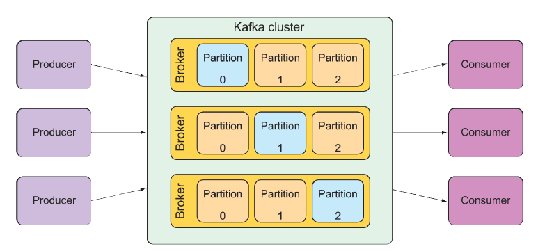

## 9.3 Gửi và nhận tin nhắn với Kafka

Apache Kafka là lựa chọn nhắn tin mới nhất mà chúng ta đang xem xét trong chương này. Nhìn sơ qua, Kafka là một bộ trung gian tin nhắn (message broker) giống như ActiveMQ, Artemis, hay Rabbit. Nhưng Kafka có một vài "bí kíp" độc đáo riêng.

Kafka được thiết kế để chạy trong một cụm (cluster), mang lại khả năng mở rộng tuyệt vời. Và bằng cách phân vùng (partitioning) các chủ đề (topic) của nó trên tất cả các nút trong cụm, Kafka rất bền vững. Trong khi RabbitMQ chủ yếu làm việc với hàng đợi (queue) trong các bộ trao đổi (exchange), thì Kafka chỉ sử dụng các chủ đề để cung cấp mô hình nhắn tin xuất bản/đăng ký (pub/sub).

Các chủ đề trong Kafka được sao chép trên tất cả các broker trong cụm. Mỗi nút trong cụm đóng vai trò là "leader" cho một hoặc nhiều chủ đề, chịu trách nhiệm cho dữ liệu của các chủ đề đó và sao chép dữ liệu đến các nút khác trong cụm.

Đi xa hơn một bước nữa, mỗi chủ đề có thể được chia thành nhiều phân vùng (partition). Trong trường hợp đó, mỗi nút trong cụm là leader của một hoặc nhiều phân vùng của một chủ đề, nhưng không phải toàn bộ chủ đề. Trách nhiệm đối với chủ đề được phân chia giữa tất cả các nút. Hình 9.3 minh họa cách hoạt động này.

  
**Hình 9.3 Kafka: Một cụm Kafka bao gồm nhiều broker, mỗi broker đóng vai trò là leader cho các phân vùng của các chủ đề.**

Do kiến trúc độc đáo của Kafka, tôi khuyến khích bạn đọc thêm trong cuốn _Kafka in Action_ của Dylan Scott, Viktor Gamov, và Dave Klein (Manning, 2021). Trong phạm vi của chúng ta, ta sẽ tập trung vào cách gửi và nhận tin nhắn từ Kafka bằng Spring.
