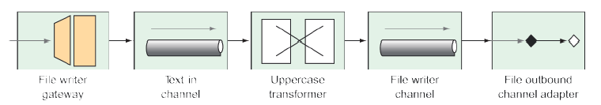

### 10.1.1 Định nghĩa luồng tích hợp bằng XML

Mặc dù tôi đã tránh sử dụng cấu hình XML trong cuốn sách này, nhưng Spring Integration có một lịch sử lâu dài với các luồng tích hợp được định nghĩa bằng XML. Do đó, tôi nghĩ rằng việc đưa ra ít nhất một ví dụ về luồng tích hợp được định nghĩa bằng XML là điều đáng làm. Danh sách sau đây cho thấy cách cấu hình luồng mẫu của bạn bằng XML.

**Danh sách 10.2 Định nghĩa một luồng tích hợp bằng cấu hình XML của Spring**  

```xml
<?xml version="1.0" encoding="UTF-8"?>
<beans xmlns="http://www.springframework.org/schema/beans"
  xmlns:xsi="http://www.w3.org/2001/XMLSchema-instance"
  xmlns:int="http://www.springframework.org/schema/integration"
  xmlns:int-file="http://www.springframework.org/schema/integration/file"
  xsi:schemaLocation="http://www.springframework.org/schema/beans
    http://www.springframework.org/schema/beans/spring-beans.xsd
    http://www.springframework.org/schema/integration
    http://www.springframework.org/schema/integration/spring-integration.xsd
    http://www.springframework.org/schema/integration/file
    http://www.springframework.org/schema/integration/file/spring-integration-file.xsd">

  <int:channel id="textInChannel" />

  <int:transformer id="upperCase"
    input-channel="textInChannel"
    output-channel="fileWriterChannel"
    expression="payload.toUpperCase()" />

  <int:channel id="fileWriterChannel" />

  <int-file:outbound-channel-adapter id="writer"
    channel="fileWriterChannel"
    directory="/tmp/sia6/files"
    mode="APPEND"
    append-new-line="true" />
</beans>
```

Phân tích đoạn XML trong danh sách 10.2, chúng ta có những điều sau:

* Bạn đã cấu hình một kênh tên là `textInChannel`. Bạn sẽ nhận ra đây là cùng một kênh được thiết lập làm kênh yêu cầu cho `FileWriterGateway`. Khi phương thức `writeToFile()` được gọi trên `FileWriterGateway`, thông điệp kết quả sẽ được gửi tới kênh này.
* Bạn đã cấu hình một bộ chuyển đổi (transformer) để nhận các thông điệp từ `textInChannel`. Nó sử dụng một biểu thức SpEL (Spring Expression Language) để gọi `toUpperCase()` trên payload của thông điệp. Kết quả của thao tác chuyển sang chữ in hoa sau đó được gửi tới `fileWriterChannel`.
* Bạn đã cấu hình một kênh tên là `fileWriterChannel`. Kênh này đóng vai trò là đường dẫn kết nối giữa bộ chuyển đổi và bộ tiếp hợp kênh đi (outbound channel adapter).
* Cuối cùng, bạn đã cấu hình một bộ tiếp hợp kênh đi sử dụng không gian tên `int-file`. Không gian tên XML này được cung cấp bởi mô-đun file của Spring Integration để ghi tệp. Như bạn đã cấu hình, nó nhận thông điệp từ `fileWriterChannel` và ghi payload của thông điệp đó vào một tệp có tên được chỉ định trong header `"file_name"` của thông điệp, trong thư mục được chỉ định bởi thuộc tính `directory`. Nếu tệp đã tồn tại, nội dung mới sẽ được nối thêm vào với một dòng mới thay vì ghi đè.

Luồng này được minh họa trong hình 10.1 sử dụng các yếu tố đồ họa theo phong cách trong _Enterprise Integration Patterns_.

  
**Hình 10.1 Luồng tích hợp ghi tệp**

Luồng này bao gồm năm thành phần: một gateway, hai kênh, một bộ chuyển đổi và một bộ tiếp hợp kênh. Đây chỉ là một vài trong số các thành phần có thể được kết hợp vào một luồng tích hợp. Chúng ta sẽ khám phá các thành phần này và các thành phần khác được hỗ trợ bởi Spring Integration trong mục 10.2.

Nếu bạn muốn sử dụng cấu hình XML trong một ứng dụng Spring Boot, bạn cần nhập XML đó như một resource vào ứng dụng Spring. Cách dễ nhất để làm điều này là sử dụng annotation `@ImportResource` của Spring, như được hiển thị trong ví dụ mã tiếp theo, trên một trong các lớp cấu hình Java của ứng dụng bạn:

```java
@Configuration
@ImportResource("classpath:/filewriter-config.xml")
public class FileWriterIntegrationConfig { ... }
```

Mặc dù cấu hình dựa trên XML đã phục vụ Spring Integration rất tốt trong quá khứ, hầu hết các lập trình viên hiện nay đều trở nên e ngại khi sử dụng XML. (Và như tôi đã nói, tôi tránh sử dụng cấu hình XML trong cuốn sách này.) Hãy tạm gác lại các dấu ngoặc nhọn đó và chuyển sự chú ý sang phong cách cấu hình Java của Spring Integration.
