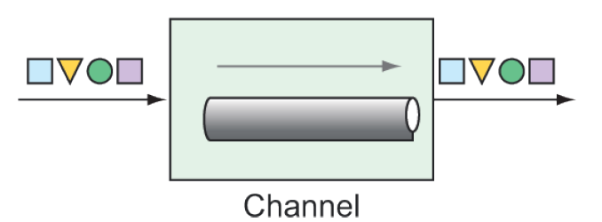

### 10.2.1 Cấu hình luồng tích hợp bằng Java

Các kênh thông điệp (message channel) là phương tiện mà thông điệp di chuyển qua trong một pipeline tích hợp, như minh họa trong hình 10.2. Chúng là “đường ống” kết nối tất cả các phần còn lại trong hệ thống đường ống Spring Integration.



**Hình 10.2 Các kênh thông điệp là ống dẫn dữ liệu giữa các thành phần khác nhau trong một luồng tích hợp.**

Spring Integration cung cấp một số triển khai kênh khác nhau, bao gồm:

* _`PublishSubscribeChannel`_ —— Thông điệp được publish vào `PublishSubscribeChannel` sẽ được gửi đến một hoặc nhiều consumer. Nếu có nhiều consumer, tất cả đều nhận được thông điệp.
* _`QueueChannel`_ —— Thông điệp được publish vào `QueueChannel` sẽ được lưu trong hàng đợi cho đến khi một consumer kéo ra theo thứ tự vào trước, ra trước (FIFO). Nếu có nhiều consumer, chỉ một người nhận được thông điệp.
* _`PriorityChannel`_ —— Giống như `QueueChannel` nhưng thay vì theo FIFO, thông điệp sẽ được lấy dựa trên header `priority` của thông điệp.
* _`RendezvousChannel`_ —— Giống như `QueueChannel` nhưng sender sẽ bị block cho đến khi có consumer nhận được thông điệp, đồng bộ hóa quá trình gửi và nhận.
* _`DirectChannel`_ —— Giống như `PublishSubscribeChannel`, nhưng chỉ gửi thông điệp cho một consumer bằng cách gọi trực tiếp trong cùng luồng với sender. Điều này cho phép giao dịch (transaction) có thể trải qua kênh.
* _`ExecutorChannel`_ —— Tương tự như `DirectChannel`, nhưng việc gửi thông điệp sẽ thông qua `TaskExecutor`, thực hiện trên một luồng khác với sender. Loại kênh này không hỗ trợ giao dịch xuyên kênh.
* _`FluxMessageChannel`_ —— Một kênh thông điệp dựa trên Reactive Streams Publisher sử dụng `Flux` của Project Reactor. (Chúng ta sẽ nói thêm về Reactive Streams, Reactor và `Flux` trong chương 11.)

Trong cả cấu hình Java thuần và Java DSL, các kênh đầu vào được tạo tự động, với `DirectChannel` là mặc định. Nhưng nếu bạn muốn sử dụng một triển khai kênh khác, bạn sẽ cần khai báo rõ ràng kênh đó dưới dạng một bean và tham chiếu nó trong định nghĩa luồng tích hợp. Ví dụ, để khai báo một `PublishSubscribeChannel`, bạn có thể tạo phương thức `@Bean` như sau:

```java
@Bean
public MessageChannel orderChannel() {
  return new PublishSubscribeChannel();
}
```

Sau đó bạn tham chiếu đến kênh này theo tên trong định nghĩa luồng tích hợp. Ví dụ, nếu kênh này được sử dụng bởi một bean service activator, bạn có thể tham chiếu nó trong thuộc tính `inputChannel` của `@ServiceActivator` như sau:

```java
@ServiceActovator(inputChannel="orderChannel")
```

Hoặc, nếu bạn đang dùng cấu hình theo phong cách Java DSL, bạn có thể tham chiếu kênh đó bằng cách gọi `channel()` như sau:

```java
@Bean
public IntegrationFlow orderFlow() {
  return IntegrationFlows
    ...
    .channel("orderChannel")
    ...
    .get();
}
```

Một điều quan trọng cần lưu ý là nếu bạn sử dụng `QueueChannel`, các consumer phải được cấu hình với poller. Ví dụ, giả sử bạn khai báo một bean `QueueChannel` như sau:

```java
@Bean
public MessageChannel orderChannel() {
    return new QueueChannel();
}
```

Bạn cần đảm bảo rằng consumer được cấu hình để poll kênh và lấy thông điệp. Trong trường hợp sử dụng service activator, annotation `@ServiceActivator` có thể trông như thế này:

```java
@ServiceActivator(inputChannel="orderChannel",
        poller=@Poller(fixedRate="1000"))
```

Trong ví dụ này, service activator sẽ poll từ kênh có tên là `orderChannel` mỗi 1 giây (hoặc 1.000 mili giây).
