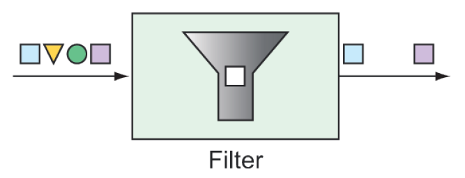

### 10.2.2 Filters

You can place filters in the midst of an integration pipeline to allow or disallow messages from proceeding to the next step in the flow, as shown in figure 10.3.



**Figure 10.3 Filters based on some criteria allow or disallow messages from proceeding in the pipeline.**

For example, suppose that messages containing integer values are published through a channel named `numberChannel`, but you want only even numbers to pass on to the channel named `evenNumberChannel`. In that case, you could declare a filter with the `@Filter` annotation like this:

```java
@Filter(inputChannel="numberChannel",
    outputChannel="evenNumberChannel")
public boolean evenNumberFilter(Integer number) {
  return number % 2 == 0;
}
```

Alternatively, if you’re using the Java DSL configuration style to define your integration flow, you could make a call to `filter()` like this:

```java
@Bean
public IntegrationFlow evenNumberFlow(AtomicInteger integerSource) {
  return IntegrationFlows
    ...
    .<Integer>filter((p) -> p % 2 == 0)
    ...
    .get();
}
```

In this case, you use a lambda to implement the filter. But, in truth, the `filter()` method accepts a `GenericSelector` as an argument. This means that you can implement the `GenericSelector` interface instead, should your filtering needs be too involved for a simple lambda.

