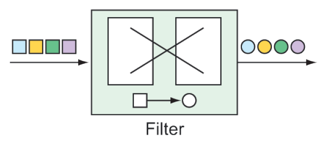

### 10.2.3 Transformers

Transformers perform some operation on messages, typically resulting in a different message and, possibly, with a different payload type (see figure 10.4). The transformation can be something simple, such as performing mathematic operations on a number or manipulating a `String` value. Or the transformation can be more complex, such as using a `String` value representing an ISBN to look up and return details of the corresponding book.



**Figure 10.4 Transformers morph messages as they flow through an integration flow.**

For example, suppose that integer values are being published on a channel named `numberChannel`, and you want to convert those numbers to a `String` containing the Roman numeral equivalent. In that case, you can declare a bean of type `GenericTransformer` and annotate it with `@Transformer` as follows:

```java
@Bean
@Transformer(inputChannel="numberChannel",
      outputChannel="romanNumberChannel")
public GenericTransformer<Integer, String> romanNumTransformer() {
  return RomanNumbers::toRoman;
}
```

The `@Transformer` annotation designates this bean as a transformer bean that receives `Integer` values from the channel named `numberChannel` and uses a static method named `toRoman()` to do the conversion. (The `toRoman()` method is statically defined in a class named `RomanNumbers` and referenced here with a method reference.) The result is published to the channel named `romanNumberChannel`.

In the Java DSL configuration style, it’s even easier with a call to transform(), passing in the method reference to the toRoman() method as follows:

```java
@@Bean
public IntegrationFlow transformerFlow() {
  return IntegrationFlows
    ...
    .transform(RomanNumbers::toRoman)
    ...
    .get();
}
```

Although you’ve used a method reference in both of the transformer code samples, know that the transformer can also be specified as a lambda. Or, if the transformer is complex enough to warrant a separate Java class, you can inject it as a bean into the flow configuration and pass the reference to the `transform()` method like so:

```java
@Bean
public RomanNumberTransformer romanNumberTransformer() {
  return new RomanNumberTransformer();
}
@Bean
public IntegrationFlow transformerFlow(
          RomanNumberTransformer romanNumberTransformer) {
  return IntegrationFlows
    ...
    .transform(romanNumberTransformer)
    ...
    .get();
}
```

Here, you declare a bean of type `RomanNumberTransformer`, which itself is an implementation of Spring Integration’s `Transformer` or `GenericTransformer` interfaces. The bean is injected into the `transformerFlow()` method and passed to the `transform()` method when defining the integration flow.

