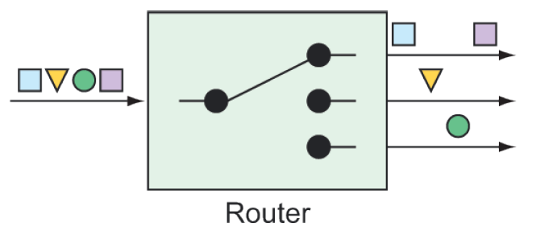

### 10.2.4 Routers

Routers, based on some routing criteria, allow for branching in an integration flow, directing messages to different channels (see figure 10.5).



**Figure 10.5 Routers direct messages to different channels, based on some criteria applied to the messages.**

For example, suppose that you have a channel named `numberChannel` through which integer values flow. And let’s say that you want to direct all messages with even numbers to a channel named `evenChannel`, whereas messages with odd numbers are routed to a channel named `oddChannel`. To create such a routing in your integration flow, you can declare a bean of type `AbstractMessageRouter` and annotate the bean with `@Router`, as shown next:

```java
@Bean
@Router(inputChannel="numberChannel")
public AbstractMessageRouter evenOddRouter() {
  return new AbstractMessageRouter() {
    @Override
    protected Collection<MessageChannel>
          determineTargetChannels(Message<?> message) {
      Integer number = (Integer) message.getPayload();
      if (number % 2 == 0) {
        return Collections.singleton(evenChannel());
      }
      return Collections.singleton(oddChannel());
      }
  };
}
@Bean
public MessageChannel evenChannel() {
  return new DirectChannel();
}
@Bean
public MessageChannel oddChannel() {
  return new DirectChannel();
}
```

The `AbstractMessageRouter` bean declared here accepts messages from an input channel named `numberChannel`. The implementation, defined as an anonymous inner class, examines the message payload, and, if it’s an even number, returns the channel named `evenChannel` (declared as a bean after the router bean). Otherwise, the number in the channel payload must be odd, in which case, the channel named `oddChannel` is returned (also declared in a bean declaration method).

In Java DSL form, routers are declared by calling `route()` in the course of a flow definition, as shown here:

```java
@Bean
public IntegrationFlow numberRoutingFlow(AtomicInteger source) {
  return IntegrationFlows
    ...
      .<Integer, String>route(n -> n%2==0 ? "EVEN":"ODD", mapping -> mapping
        .subFlowMapping("EVEN", sf -> sf
          .<Integer, Integer>transform(n -> n * 10)
          .handle((i,h) -> { ... })
          )
        .subFlowMapping("ODD", sf -> sf
          .transform(RomanNumbers::toRoman)
          .handle((i,h) -> { ... })
          )
        )
      .get();
}
```

Although it’s still possible to declare an `AbstractMessageRouter` and pass it into `route()`, this example uses a lambda to determine whether a message payload is odd or even. If it’s even, then a `String` value of `EVEN` is returned. If it’s odd, then `ODD` is returned. These values are then used to determine which submapping will handle the message.


