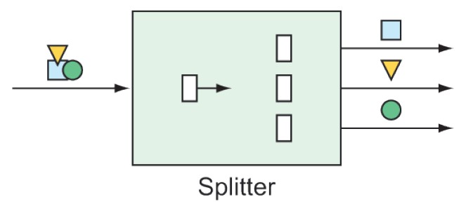

### 10.2.5 Splitters

At times in an integration flow, it can be useful to split a message into multiple messages to be handled independently. Splitters, as illustrated in figure 10.6, will split and handle those messages for you.



**Figure 10.6 Splitters break down messages into two or more separate messages that can be handled by separate subflows.** <br/>

Splitters are useful in many circumstances, but you might use a splitter for the following two essential use cases:

* _A message payload contains a collection of items of the same type that you’d like to process as individual message payloads_. For example, a message carrying a list of products might be split into multiple messages with payloads of one product each.
* _A message payload carries information that, although related, can be split into two or more messages of different types_. For example, a purchase order might carry delivery, billing, and line-item information. The delivery details might be processed by one subflow, billing by another, and line items in yet another. In this use case, the splitter is typically followed by a router that routes messages by payload type to ensure that the data is handled by the right subflow.

When splitting a message payload into two or more messages of different types, it’s usually sufficient to define a POJO that extracts the individual pieces of the incoming payload and returns them as elements of a collection.

For example, suppose that you want to split a message carrying a purchase order into two messages: one carrying the billing information and another carrying a list of line items. The following `OrderSplitter` will do the job:

```java
public class OrderSplitter {
  public Collection<Object> splitOrderIntoParts(PurchaseOrder po) {
    ArrayList<Object> parts = new ArrayList<>();
    parts.add(po.getBillingInfo());
    parts.add(po.getLineItems());
    return parts;
  }
}
```

You can then declare an OrderSplitter bean as part of the integration flow by annotating it with `@Splitter` like this:

```java
@Bean
@Splitter(inputChannel="poChannel",
      outputChannel="splitOrderChannel")
public OrderSplitter orderSplitter() {
  return new OrderSplitter();
}
```

Here, purchase orders arrive on the channel named `poChannel` and are split by `OrderSplitter`. Then, each item in the returned collection is published as a separate message in the integration flow to a channel named `splitOrderChannel`. At this point in the flow, you can declare a `PayloadTypeRouter` to route the billing information and the line items to their own subflow as follows:

```java
@Bean
@Router(inputChannel="splitOrderChannel")
public MessageRouter splitOrderRouter() {
  PayloadTypeRouter router = new PayloadTypeRouter();
  router.setChannelMapping(
      BillingInfo.class.getName(), "billingInfoChannel");
  router.setChannelMapping(
      List.class.getName(), "lineItemsChannel");
  return router;
}
```

As its name implies, `PayloadTypeRouter` routes messages to different channels based on their payload type. As configured here, messages whose payload is of type `BillingInfo` are routed to a channel named `billingInfoChannel` for further processing. As for the line items, they’re in a `java.util.List` collection; therefore, you map payloads of type `List` to be routed to a channel named `lineItemsChannel`.

As things stand, the flow splits into two subflows: one through which `BillingInfo` objects flow and another through which a `List<LineItem>` flows. But what if you want to break it down further such that instead of dealing with a `List` of `LineItem` objects, you process each `LineItem` separately? All you need to do to split the line-item list into multiple messages, one for each line item, is write a method (not a bean) that’s annotated with `@Splitter` and returns a collection of `LineItem` objects, perhaps something like this:

```java
@Splitter(inputChannel="lineItemsChannel", outputChannel="lineItemChannel")
public List<LineItem> lineItemSplitter(List<LineItem> lineItems) {
  return lineItems;
}
```

When a message carrying a payload of `List<LineItem>` arrives in the channel named `lineItemsChannel`, it passes into the `lineItemSplitter()` method. Per the rules of a splitter, the method must return a collection of the items to be split. In this case, you already have a collection of `LineItem` objects, so you just return the collection directly. As a result, each `LineItem` in the collection is published in a message of its own to the channel named `lineItemChannel`.

If you’d rather use the Java DSL to declare the same splitter/router configuration, you can do so with calls to `split()` and `route()` as shown here:

```java
return IntegrationFlows
  ...
    .split(orderSplitter())
    .<Object, String> route(
      p -> {
        if (p.getClass().isAssignableFrom(BillingInfo.class)) {
          return "BILLING_INFO";
        } else {
          return "LINE_ITEMS";
        }
      }, mapping -> mapping
        .subFlowMapping("BILLING_INFO", sf -> sf
          .<BillingInfo> handle((billingInfo, h) -> {
          ...
        }))
        .subFlowMapping("LINE_ITEMS", sf -> sf
          .split()
          .<LineItem> handle((lineItem, h) -> {
           ...
        }))
      )
    .get();
```

The DSL form of the flow definition is certainly terser, if not arguably a bit more difficult to follow. We could clean this up a bit by extracting the lambdas to methods. For example, we could use the following three methods to replace the lambdas used in the flow definition:

```java
private String route(Object p) {
  return p.getClass().isAssignableFrom(BillingInfo.class)
    ? "BILLING_INFO"
    : "LINE_ITEMS";
}
private BillingInfo handleBillingInfo(
    BillingInfo billingInfo, MessageHeaders h) {
  // ...
}
private LineItem handleLineItems(
    LineItem lineItem, MessageHeaders h) {
  // ...
}
```

Then, we could rewrite the integration flow with method references like this:

```java
return IntegrationFlows
  ...
    .split()
    .route(
      this::route,
      mapping -> mapping
        .subFlowMapping("BILLING_INFO", sf -> sf
          .<BillingInfo> handle(this::handleBillingInfo))
        .subFlowMapping("LINE_ITEMS", sf -> sf
          .split()
          .<LineItem> handle(this::handleLineItems)));
```

Either way, this uses the same `OrderSplitter` to split the order as the Java configuration example. After the order is split, it’s routed by its type to two separate subflows.

